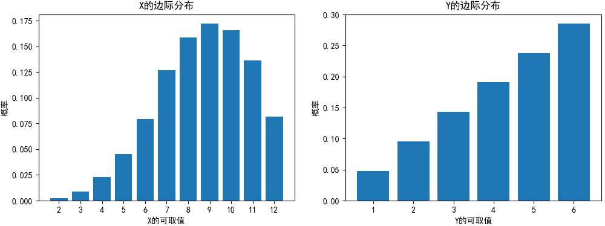

# 二维随机变量

假设有以下表格:
$$
\begin{array}{c|c}
    \hline
    \quad \quad &\quad 身高（\text{cm}）\quad&\quad 体重（\text{kg}）\quad&\quad 性别\quad\\
    \hline
    \\
    儿童1 & 112 & 22 & 女 \\
    儿童2 & 108 & 20 & 男 \\
    儿童3 & 108 & 18 & 男 \\
    儿童4 & 112 & 18 & 女 \\
    儿童5 & 115 & 22 & 女 \\
    儿童6 & 112 & 20 & 女 \\
    \\
    \hline
\end{array}
$$
这张表格中至少可以得到三个随机变量：
$$
X=“身高”,\quad Y=“体重”,\quad Z=“性别”
$$
这三个随机变量出自同一次抽查，相互之间有一定的关联，数学上将它们称为多维随机变量.


## 联合分布
二维随机变量是同时处理两个一维随机变量$(X,Y)$, 而且, 其行为取决于可取值组合的集合及其概率.
也就是说, 将$(X,Y)$的可取值组合的集合设为:
$$
[(x_i,y_i)|i=1,2...;j=1,2,...]
$$
则各个可取值的组合可以定义概率. 随机变量$X$取值为$x_i$, 随机变量$Y$取值为$y_i$的概率为:
$$
P(X=x_i,Y=y_i) = p_{ij} (i=1,2...;j=1,2...)
$$
同时考虑随机变量$(X,Y)$的行为的分布称为联合概率分布(joint probability distribution).

可以把身高X、体重Y这两个随机变量根据刚才的抽查表整理成一张表格：
$$
\begin{array}{c|c}
    \hline
    \quad X\overset{\LARGE\setminus}{\phantom{.}}\overset{\Large Y}{\phantom{l}} \quad &\quad 18\quad&\quad 20\quad&\quad 22\quad\\
    \hline
    \\
    108 & 1/6 & 1/6 & 0 \\
    112 & 1/6 & 1/6 & 1/6 \\
    115 & 0 & 0 & 1/6 \\
    \\
    \hline
\end{array}
$$
表中的值代表的是两个随机变量同时发生的概率：
$$
P(X=108, Y=18)=“儿童身高108\ 且\ 体重18的概率”=\frac{1}{6}
$$
$P(X,Y)$也称为联合概率函数(joint probability function)


另一个一个二维随机变量的一个简单而具体的例子, 我们看一下同时投掷两个重心偏移骰子A,B的情况$(X,Y)$, 骰子A出现的点数是随机变量$X$, 骰子B出现点数是随机变量$Y$. 
但是, 这样一个二维随机分布在本节中是没有意义的, 因为其协方差变成了0. 因此, 本节将骰子A的点数作为$Y$, 骰子A的点数和骰子B的点数之和作为$X$, 来考虑这样的二维随机分布. 此时, $X$和$Y$各自可取值的集合分别为: $Y$为$[1,2,3,4,5,6]$, $X$为$[2,3,4,5,6,7,8,9,10,11,12]$

例如, 试着考虑一下$X=9$且$Y=4$时的概率. 因为骰子A,B的点数之和是9, 骰子A的点数是4, 所以骰子B的点数是5. 知道了骰子A的点数是4的概率, 骰子B的点数是5的概率, 可以计算出$X=9$且$Y=4$时的概率为$4/21 \times 5/21 = 20/441$.
二维随机分布的概率可以看做是以$x$和$y$为参数的函数. 函数$P(X=x,Y=y)=f_{xy}(x,y)$被称为联合概率函数(joint probability function).

上例联合概率函数为:
$$
f_{XY}(x,y) = \begin{cases}
    y(x-y)/441  &y\in(1,2,3,4,5,6), x-y\in(1,2,3,4,5,6) \\
    0  &otherwise
\end{cases}
$$

## 联合概率的性质
二维离散随机变量和一维时一样, 概率必须不小于0, 且概率之后必须为1.
$$
f_{XY}(x_i,y_i) \geq 0 \\
\sum_i\sum_jf_{XY}(x_i,y_i) =1
$$

用python实现以上内容,分别把$X$和$Y$的可取值的集合定义为`x_set`和`y_set`.
```python
import numpy as np
import matplotlib.pyplot as plt
plt.rcParams['font.sans-serif'] = ['SimHei']  # 用来正常显示中文标签
plt.rcParams['axes.unicode_minus'] = False  # 用来正常显示负号
x_set = np.arange(2, 13)
y_set = np.arange(1, 7)
```
然后定义联合概率函数
```python
def f_XY(x, y):
    if 1 <= y <=6 and 1 <= x - y <= 6:
        return y * (x-y) / 441
    else:
        return 0
```
随机变量$(X,Y)$的行为是由`x_set`,`y_set`和`f_XY`确定的, 我们把这些做成列表, 记为`XY`
```python
XY = [x_set, y_set, f_XY]
```
使用热力图展示概率分布
```python
prob = np.array([[f_XY(x_i, y_j) for y_j in y_set]
                 for x_i in x_set])

fig = plt.figure(figsize=(10, 8))
ax = fig.add_subplot(111)

c = ax.pcolor(prob)
ax.set_xticks(np.arange(prob.shape[1]) + 0.5, minor=False)
ax.set_yticks(np.arange(prob.shape[0]) + 0.5, minor=False)
ax.set_xticklabels(np.arange(1, 7), minor=False)
ax.set_yticklabels(np.arange(2, 13), minor=False)
## 将y轴上下颠倒，使下方的数字大
ax.invert_yaxis()
## x轴的刻度显示在图表的上方
ax.xaxis.tick_top()
fig.colorbar(c, ax=ax)
plt.show()
```


```python
np.all(prob >= 0)  # True
np.sum(prob)  # 1.000
```


## 边际概率分布
随机变量$(X,Y)$虽然是由联合概率函数定义的, 但我们也可能只对$X, Y$各自的随机分布该兴趣. 例如我们可能只想知道随机变量X的行为, 即随机变量X的概率函数的情况.
这种情况下, 随机变量X的概率函数$f_x(x)$可以通过将$Y$的所有可取值带入联合概率函数$f_{XY}$并求和来得到, 即:
$$
f_X(x) = \sum_kf_{XY}(x,y_k)
$$
如果从联合概率函数$f_{XY}$中出去随机变量$Y$的影响, 只留下描述随机变量$X$行为的随机变量$X$的概率函数, 这样计算出的$f_X(x)$被称为$X$的边际概率分布(marginal probability distribution).

使用python实现一下, X的编辑分布和Y的编辑分布分别如下:
```python
def f_X(x):
    return np.sum([f_XY(x, y_k) for y_k in y_set])
def f_Y(y):
    return np.sum([f_XY(x_k, y) for x_k in x_set])
X = [x_set, f_X]
Y = [y_set, f_Y]
```
看一下$X$和$Y$各自的概率分布情况, 同时也可以确认`prob_x`和`prob_y`是否满足概率的性质:
```python
prob_x = np.array([f_X(x_k) for x_k in x_set])
prob_y = np.array([f_Y(y_k) for y_k in y_set])

fig = plt.figure(figsize=(12, 4))
ax1 = fig.add_subplot(121)
ax2 = fig.add_subplot(122)

ax1.bar(x_set, prob_x)
ax1.set_title('X的边际分布')
ax1.set_xlabel('X的可取值')
ax1.set_ylabel('概率')
ax1.set_xticks(x_set)

ax2.bar(y_set, prob_y)
ax2.set_title('Y的边际分布')
ax2.set_xlabel('Y的可取值')
ax2.set_ylabel('概率')

plt.show()
```


## 二维离散型随机变量的数值指标

### 期望值
期望值与一维时基本相同, 如果是求$X$的期望值, 则用$x_i$与概率相乘再求和即可.
$$
\mu_x = E(X) =\sum_i\sum_j x_if_{XY}(x_i,y_i)
$$
用python实现如下:
```python
np.sum([x_i * f_XY(x_i, y_j) for x_i in x_set for y_j in y_set])  # 8.667
```
定义$X,Y$的函数$g(X,Y)$的期望值, 如下:
$$
E[g(X,Y)] = \sum_i\sum_j g(x_i,y_i)f_{XY}(x_i,y_i)
$$
使用python实现:
```python
def E(XY, g):
    x_set, y_set, f_XY = XY
    return np.sum([g(x_i, y_j) * f_XY(x_i, y_j)
                   for x_i in x_set for y_j in y_set])
```
X,Y的期望值可以分别求出
```python
mean_X = E(XY, lambda x, y: x)
mean_X  # 8.667
mean_Y = E(XY, lambda x, y: y)
mean_Y  # 4.333
```


#### 期望值的线性性质
$$
E(aX+bY) = aE(X) + bE(Y)
$$
确认一下$a,b$取2,3时线性性质是否成立
```python
a, b = 2, 3
E(XY, lambda x, y: a*x + b*y)  # 30.333
a * mean_X + b * mean_Y  # 30.333
```


### 方差
方差也与一维时基本相同, 如果是求$X$的方差, 可以通过求$X$的偏差的平方的期望值来得到.
$$
\sigma_X^2=V(X)=\sum_i\sum_j(x_i-\mu_X)^2f_{XY}(x_i,y_i)
$$
使用python实现:
```python
np.sum([(x_i-mean_X)**2 * f_XY(x_i, y_j)
       for x_i in x_set for y_j in y_set])
```


而求$X,Y$的函数$g(X,Y)$的方差, 公式如下:
$$
V[g(X,Y)] = \sum_i\sum_j(g(x_i,y_i)-E[g(X,Y)])^2f_{XY}(x_i,y_i)
$$
使用python实现:
```python
def V(XY, g):
    x_set, y_set, f_XY = XY
    mean = E(XY, g)
    return np.sum([(g(x_i, y_j)-mean)**2 * f_XY(x_i, y_j)
                   for x_i in x_set for y_j in y_set])
var_X = V(XY, g=lambda x, y: x)  # X的方差, 4.444
var_Y = V(XY, g=lambda x, y: y)  # Y的方差, 2.222
```

### 协方差
通过使用协方差可以知道两个随机变量$X,Y$之间的关联性.
$$
\sigma_{XY}=Cov(X,Y)=\sum_i\sum_j(X_i-\overline{X})(Y_i-\overline{Y})f_{XY}(x_i,y_i)
$$
使用python实现:
```python
def Cov(XY):
    x_set, y_set, f_XY = XY
    mean_X = E(XY, lambda x, y: x)
    mean_Y = E(XY, lambda x, y: y)
    return np.sum([(x_i-mean_X) * (y_j-mean_Y) * f_XY(x_i, y_j)
                    for x_i in x_set for y_j in y_set])

cov_xy = Cov(XY)  # 2.222
```

方差和协方差的性质:
$$
V(aX+bY)=a^2V(X)+b^2V(Y)+2abXov(X,Y)
$$
使用python验证:
```python
V(XY, lambda x, y: a*x + b*y)  # 64.444
a**2 * var_X + b**2 * var_Y + 2*a*b * cov_xy  # 64.444
```

### 相关系数
随机变量的相关系数和数据的相关系数一样, 可以通过协方差除以各自的标准差来得到, 符号一般使用$p$来表示:
$$
p_{XY} = p(X, Y) = \frac{\sigma_{XY}}{\sigma_X\sigma_Y}
$$
使用python表示:
```python
cov_xy / np.sqrt(var_X * var_Y)
```


参考:
