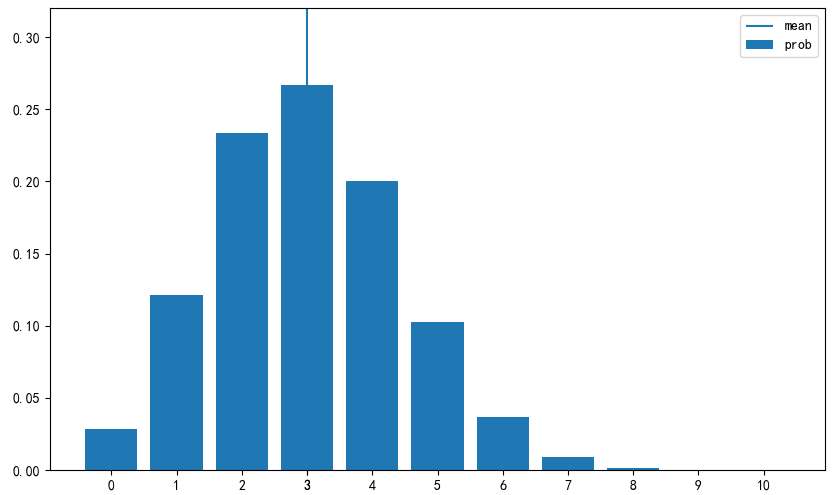

# 二项分布

## 概念
二项分布(binomial distribution)是按照成功概率为p进行了n次伯努利试验时的成功次数的分布. 因为成功的次数可以从0次到n次, 可以取值是$(0,1,2,3,...,n)$.
二项分布参数有成功概率p和试验次数n两个, 记作Bin(n,p). 它的概率函数如下, 其中$C_n^x$称为组合数, 表示从n个不同的事物中选择x个, $C_n^x = \frac{n!}{x!(n-x)!}$:
$$
f(x) = 
\begin{cases}
    C_n^xp^x(1-p)^{n-x} & x \in(0,1,2,3,...,n) \\
    0 & otherwise
\end{cases}
$$
以下是二项分布的具体例子:
1. 扔10次硬币，得到3次正面的概率为多少?
得到其中一种情况的概率为：
$$
p^3(1-p)^7
$$
那么总共有多少种情况呢？枚举肯定不现实，让我们换换一种问法，“从10次结果中，挑出其中6次结果，有多少种挑选方法？”
这其实就是一个组合问题了，总共有 ${10\choose 3}$种选法，所以扔10次硬币，得到3次正面的概率为：
$$
P(X=3)=C_{10}^3(1/2)^3(1-1/2)^{10-3}=15/128
$$
1. 投4次骰子出现6点的次数
可以认为是p=1/6的伯努利试验进行4次时, 成功的次数, 所以按照Bin(4,1/6), 投4次骰子一次6点都没有出现的概率可以由:
$$
P(X=0)=C_4^0(1/6)^0(1-1/6)^{4-0}=625/1296
$$
二项分布的期望和方差如下:
$$
E(X)=np, V(X)=np(1-p)
$$
使用Numpy来实现二项分布的相关计算, 组合$C_n^x$的计算可以使用`scipy.special`中的`comb`函数:
```python
from scipy.special import comb
import numpy as np
import matplotlib.pyplot as plt
from scipy import stats
def E(X, g=lambda x: x):
    x_set, f = X
    return np.sum([g(x_k) * f(x_k) for x_k in x_set])

def V(X, g=lambda x: x):
    x_set, f = X
    mean = E(X, g)
    return np.sum([(g(x_k)-mean)**2 * f(x_k) for x_k in x_set])

def check_prob(X):
    x_set, f = X
    prob = np.array([f(x_k) for x_k in x_set])
    assert np.all(prob >= 0), '有负概率'
    prob_sum = np.round(np.sum(prob), 6)
    assert prob_sum == 1, f'概率之和{prob_sum}等于'
    print(f'期望值为{E(X):.4}')
    print(f'方差为{(V(X)):.4}')

def plot_prob(X):
    x_set, f = X
    prob = np.array([f(x_k) for x_k in x_set])
    
    fig = plt.figure(figsize=(10, 6))
    ax = fig.add_subplot(111)
    ax.bar(x_set, prob, label='prob')
    ax.vlines(E(X), 0, 1, label='mean')
    ax.set_xticks(np.append(x_set, E(X)))
    ax.set_ylim(0, prob.max()*1.2)
    ax.legend()
    
    plt.show()

def Bin(n, p):
    x_set = np.arange(n+1)
    def f(x):
        if x in x_set:
            return comb(n, x) * p**x * (1-p)**(n-x)
        else:
            return 0
    return x_set, f
```
构造一个服从Bin(10,0.3)分布的随机变量X.
```python
n = 10
p = 0.3
X = Bin(n, p)
```
计算期望和方差
```python
check_prob(X)
"""
期望值为3.0
方差为2.1
"""
```
可视化
```python
plot_prob(X)
```



## scipy
scipy.stats中二项分布的随机变量可以由binom函数生成. 将n固定为10, 当p的取值为0.3,0.5,0.7时, 二项分布是:
```python
fig = plt.figure(figsize=(10, 6))
ax = fig.add_subplot(111)

x_set = np.arange(n+1)
for p, ls in zip([0.3, 0.5, 0.7], linestyles):
    rv = stats.binom(n, p)
    ax.plot(x_set, rv.pmf(x_set),
            label=f'p:{p}', ls=ls, color='gray')
ax.set_xticks(x_set)
ax.legend()

plt.show()
```
## 例子
- 10个新生婴儿中，有6个是男孩的概率为多少？
- 100个光临本店的顾客，53个会购买的概率为多少？
- 1000个美国人中，670个眼睛为绿色的概率为多少？
- 加州是十万选民，一半选民投票给特朗普的概率为多少？
### 如何判断是不是二项分布
首先，为啥叫二项，不叫三项，或者二愣子呢？故明思义，二项代表事件有2种可能的结果，把一种称为成功，另外一种称为失败。生活中有很多这样2种结果的二项情况，例如你表白是二项的，一种成功，一种是失败。你向老板提出加薪的要求，结果也有两种。一种是成功，一种是失败.
具体来说, 判断二项分布有四个特点:
1）做某件事的次数（也叫试验次数）是固定的，用n表示。（例如抛硬币3次，投资5支股票）
2）每一次事件都有两个可能的结果（成功，或者失败）（例如每一次抛硬币有2个结果：正面表示成功，反面表示失败。每一次投资美股有2个结果：投资成功，投资失败）
3）每一次成功的概率都是相等的，成功的概率用p表示（例如每一次抛硬币正面朝上的概率都是1/2。你投资了5家公司的股票，假设每一家投资盈利成功的概率都相同）
4）你感兴趣的是成功x次的概率是多少。那么就可以用二项分布的公式快速计算出来了。

你已经知道了我前面讲的5家美股的赚钱概率最大，所以你买了这5家公司的股票，假设投资的这5家公司成功的概率都相同，那么你关心其中只要有3个投资成功，你就可以赚翻了，所以想知道成功3次的概率


## 总结
参数|描述
--|--
参数|n,p
可取值|0,1,2,3,...,n
概率质量函数|$C_n^xp^x(1-p)^{n-x}$
期望值|np
方差|np(1-p)
scipy.stats|binom(n,p)


参考:
https://www.zhihu.com/question/26441147