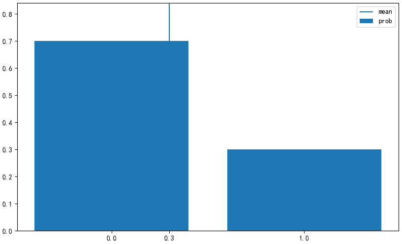

# 伯努利分布

## 伯努利分布
**伯努利分布(Bernoulli distribution)**是最基本的离散型分布, 可以取值只有0和1两个. 根据伯努利分布的随机变量进行的试验称为**伯努利试验**, 1表示试验成功, 0表示试验失败.
在伯努利分布中, 若1出现的概率为p, 则0出现的概率为1-p. 将参数为p的伯努利分布表示为`Bern(p)`:
$$
f(x) = 
\begin{cases}
    p^x(1-p)^{1-x} & x\in (0,1) \\ 
    0 & otherwise
\end{cases}
$$
看起来很复杂, 其实: 将1代入该函数后会返回p, 将0代入后会返回1-p.
可取值只有两个值的事件都以用伯努利分布来考虑:
1. 投一个硬币, 它是否为正面.
投掷一个正面和背面出现概率相等的普通硬币, 出现正面为1, 背面为0的随机变量X服从Bern(1/2), 则抛掷硬币正面朝上的概率为:
$$
P(X=1)(1/2)^1\times(1-1/2)^{1-1}=1/2
$$
2. 投一个骰子, 是否出现6点
投掷一颗所有点数出现概率相等的普通骰子, 出现6点为1, 否则为0的堆积变量X服从Bern(1/6), 则得出没有出现6点的概率为:
$$
P(X=0)=(1/6)^0 \times (1-1/6)^{1-0}=5/6
$$

伯努利的**期望**和**方差**如下.
$$
E(X) = p, V(X) = p(1-p)
$$

下面使用Numpy来实现伯努利分布, 把`x_set`和`f`作为以`p`为参数的函数实现:
```python
import numpy as np
import matplotlib.pyplot as plt
from scipy import stats
def E(X, g=lambda x: x):
    x_set, f = X
    return np.sum([g(x_k) * f(x_k) for x_k in x_set])

def V(X, g=lambda x: x):
    x_set, f = X
    mean = E(X, g)
    return np.sum([(g(x_k)-mean)**2 * f(x_k) for x_k in x_set])

def check_prob(X):
    x_set, f = X
    prob = np.array([f(x_k) for x_k in x_set])
    assert np.all(prob >= 0), '有负概率'
    prob_sum = np.round(np.sum(prob), 6)
    assert prob_sum == 1, f'概率之和{prob_sum}等于'
    print(f'期望值为{E(X):.4}')
    print(f'方差为{(V(X)):.4}')

def plot_prob(X):
    x_set, f = X
    prob = np.array([f(x_k) for x_k in x_set])
    
    fig = plt.figure(figsize=(10, 6))
    ax = fig.add_subplot(111)
    ax.bar(x_set, prob, label='prob')
    ax.vlines(E(X), 0, 1, label='mean')
    ax.set_xticks(np.append(x_set, E(X)))
    ax.set_ylim(0, prob.max()*1.2)
    ax.legend()
    
    plt.show()


def Bern(p):
    x_set = np.array([0, 1])
    def f(x):
        if x in x_set:
            return p ** x * (1-p) ** (1-x)
        else:
            return 0
    return x_set, f
```
构造一个服从Bern(0.3)的随机变量X:
```python
p = 0.3
X = Bern(p)
```
计算伯努利分布的期望值和方差:
```python
check_prob(X)
"""
期望值为0.3
方差为0.21
"""
```
可视化随机变量:
```python
plot_prob(X)
```



`scipy.stats`提供了一个bernoulli函数, 可以根据伯努利分布生成随机变量. 参数为p.
```python
rv = stats.bernoulli(p)
```
代码中的`rv`是random variable(随机变量)的缩写, pmf是概率质量函数, 分别取0或1, 就会得到相应的概率:
```python
rv.pmf(0), rv.pmf(1)  # (0.700, 0.300), 可以传递列表[0,1]
```
`cdf`是概率累积函数, 可以传递列表
```python
rv.cdf([0, 1])  # array([ 0.7,  1. ])
```
计算期望和方差
```python
rv.mean(), rv.var()  # (0.300, 0.210)
```


## 总结
描述|值
--|--
参数|p
可取值|{0,1}
概率质量函数|$p^x(1-p)^{1-x}$
期望值|p
方差|p(1-p)
scipy.stats|bernoulli(p)

## 例子
生活中有很多事情类似于抛硬币，具有`二选一`的随机性，或者称为`是非题`，比如：
- 刚出生的小孩是男孩，还是女孩
- 进来的顾客买还是不买商品
- 人的眼睛是不是绿色
- 选民会不会选这位候选人
上面举的例子虽然都是二选一，但两者的概率并不一定相等。