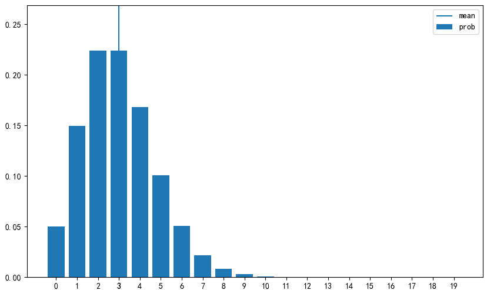
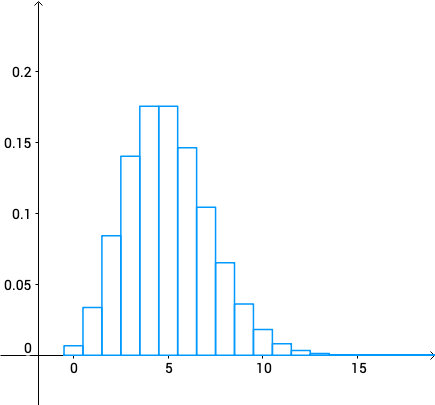
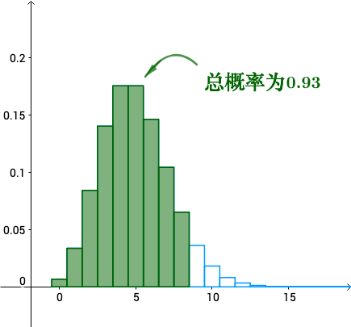

# 泊松分布

## 泊松分布
泊松分布(poisson distribution)是随机事件在单位时间内的发生次数所服从的概率. 因为是发生次数的随机变量, 所以可取值是(0,1,2,...). 泊松分布的参数是$\lambda$, 记为$Poi(\lambda)$:
$$
f(x)=
\begin{cases}
    \frac{\lambda^x}{x!}e^{\lambda} & x \in (1,2,3,...) \\
    0 & otherwise
\end{cases}
$$
$Poi(\lambda)$是随机事件在单位时间内平均发生$\lambda$次所服从的概率分布, 例子如下:
1. 平均每天发生2起交通事故的地区, 每天发生交通事故的数量:
如果将交通事故视为完全随机事件, 那么没单位时间(1天)发生交通事故数量将服从Poi(2).因此这个地区一天都没发生交通事故, 其概率可以由:
$$
P(X=0)=\frac{2^0}{0!}\cdot e^{-2}=0.135
$$
2. 平均每小时被访问10次的网站, 1个小时的访问量
如果将网站的访问次数视为完全随机事件, 则每单位时间(1小时)对网站的访问量将服从Poi(10). 因此如果在这个网站上1小时正好有15次访问, 其概率为:
$$
P(X=15)=\frac{10^{15}}{15!}\cdot e^{-10}=0.035
$$
3. 例如你搞了个促销抽奖活动，只知道1天内中奖的平均个数为5个，你想知道1天内恰巧中奖次数为7的概率是多少？
此时$k=7，\lambda=5$（区间内发生的平均次数），代入公式求出概率为10.44%。


泊松分布的期望和方差都是$\lambda$.
$$
E(X)=\lambda, V(X)=\lambda
$$

使用Numpy来实现泊松分布.使用`scipy.special`的`factorial`函数求阶乘$x!$, 可取值为0以上的全部整数, 为了方便实现, `x_set`设置为0-19的整数.
```python
from scipy.special import factorial
import numpy as np
import matplotlib.pyplot as plt
from scipy import stats
def E(X, g=lambda x: x):
    x_set, f = X
    return np.sum([g(x_k) * f(x_k) for x_k in x_set])

def V(X, g=lambda x: x):
    x_set, f = X
    mean = E(X, g)
    return np.sum([(g(x_k)-mean)**2 * f(x_k) for x_k in x_set])

def check_prob(X):
    x_set, f = X
    prob = np.array([f(x_k) for x_k in x_set])
    assert np.all(prob >= 0), '有负概率'
    prob_sum = np.round(np.sum(prob), 6)
    assert prob_sum == 1, f'概率之和{prob_sum}等于'
    print(f'期望值为{E(X):.4}')
    print(f'方差为{(V(X)):.4}')

def plot_prob(X):
    x_set, f = X
    prob = np.array([f(x_k) for x_k in x_set])
    
    fig = plt.figure(figsize=(10, 6))
    ax = fig.add_subplot(111)
    ax.bar(x_set, prob, label='prob')
    ax.vlines(E(X), 0, 1, label='mean')
    ax.set_xticks(np.append(x_set, E(X)))
    ax.set_ylim(0, prob.max()*1.2)
    ax.legend()
    
    plt.show()
def Poi(lam):
    x_set = np.arange(20)
    def f(x):
        if x in x_set:
            return np.power(lam, x) / factorial(x) * np.exp(-lam)
        else:
            return 0
    return x_set, f
```
随机变量X服从Poi(3)
```python
lam = 3
X = Poi(lam)
```
查看期望值和方差
```python
check_prob(X)
"""
期望值为3.0
方差为3.0
"""
```
进行可视化
```python
plot_prob(X)
```


## scipy
在`scipy.stats`中, 可以用`poisson`函数进行泊松分布的相关计算. 当参数$\lambda$在2,5,8中变化时, 如下:
```python
fig = plt.figure(figsize=(10, 6))
ax = fig.add_subplot(111)

x_set = np.arange(20)
for lam, ls in zip([3, 5, 8], linestyles):
    rv = stats.poisson(lam)
    ax.plot(x_set, rv.pmf(x_set),
            label=f'lam:{lam}', ls=ls, color='gray')
ax.set_xticks(x_set)
ax.legend()

plt.show()
```


## 什么是泊松分布
符合以下3个特点就是泊松分布：
1）事件是独立事件（类似抽奖这样的就是独立事件）
2）在任意相同的时间范围内，事件发的概率相同（例如1天内中奖概率，与第2天内中间概率相同）
3）你想知道某个时间范围内，发生某件事情x次的概率是多大（例如你搞了个促销抽奖活动，想知道一天内10人中奖的概率）

### 泊松分布有啥用
如果你想知道某个时间范围内，发生某件事情x次的概率是多大。这时候就可以用泊松分布轻松搞定。比如一天内中奖的次数，一个月内某机器损坏的次数等。
泊松分布的形状会随着平均值的不同而有所变化，无论是一周内多少人能赢得彩票，还是每分钟有多少人会打电话到呼叫中心，泊松分布都可以告诉我们它们的概率。


## 总结
参数|描述
--|--
参数|$\lambda$
可取值|1,2,3,...,n
概率质量函数|$\frac{\lambda^x}{x!}\cdot e^{-\lambda}$
期望值|$\lambda$
方差|$\lambda$
scipy.stats|$poisson(\lambda)$

## 二项分布与泊松分布的关系
泊松分布可以由二项分布推导得出.
当$p \to 0, n \to \infty$时, 二项分布中的$np=\lambda$, 换言之, 成功概率趋近于0, 试验次数趋向无穷大的二项分布就是泊松分布.
例如, 研究某日遭遇交通事故的人数, 所有走在路上的人都有可能遭遇交通事故, 那么n的值会很大, 但遭遇事故的概率p应该很小. 非常多的对象($n \to \infty$)中发生稀有事件($p \to 0$)的件数就服从泊松分布.

再例如, 湖中有非常多的鱼, 所有的鱼都可能被钓到, 但这个概率很小, 在这种条件下钓到的鱼的条数就服从泊松分布.

注意不是任何离散型数据都可以使用泊松分布, 只有通过上述条件能够得到数据, 才可以应用泊松分布.

### 使用python
```python
## 泊松分布的概率质量函数
sp.stats.poisson.pmf(k = 2, mu = 5)

## 从 λ = 2 的泊松分布中生成随机数
np.random.seed(1)
sp.stats.poisson.rvs(mu = 2, size = 5)

## λ = 2 的泊松分布
poisson = sp.stats.poisson(mu = 2)

## 生成随机数
np.random.seed(1)
rvs_poisson = poisson.rvs(size = 10000)

## 概率质量函数
pmf_poisson = poisson.pmf(k = m)

## 绘制样本直方图与概率质量函数
sns.distplot(rvs_poisson, bins = m, kde = False, 
             norm_hist = True, color = 'gray')
plt.plot(m, pmf_poisson, color = 'black')

```

### 确认泊松分布和二项分布的关系.
对比试验次数为100000000次, 成功概率为0.00000002的二项分布与强度为2的泊松分布的概率质量函数图形, 可见二者基本一致:
```python
## N 非常大但 p 非常小的二项分布
N = 100000000
p = 0.00000002
binomial_2 = sp.stats.binom(n = N, p = p)

## 概率质量函数
pmf_binomial_2 = binomial_2.pmf(k = m)

## 绘制概率质量函数
plt.plot(m, pmf_poisson, color = 'gray')
plt.plot(m, pmf_binomial_2, color = 'black', 
         linestyle = 'dotted')
```


## 理论推导

抽象一点，T时间段内(将T时间分割成n等份)卖出k个馒头的概率为：
$$
\lim_{n\to\infty}\binom{n}{k}p^k(1-p)^{n-k}
$$

在上面的假设下，问题已经被转为了二项分布。二项分布的期望为：
$$
E(X)=np=\mu
$$
所以可以得出：
$$
p=\frac{\mu}{n}
$$
可能有同学会问，期望$\mu$也不知道啊？确实不知道，不过有办法进行“估计”。

假设知道p=0.5，那么抛十次硬币就应该平均可以得到：
$$
10\times 0.5=5次正面
$$
如果不知道p，那么可以多进行几次这个实验（n表示抛硬币次数，$n_H$表示正面出现次数）：
$$
\begin{array}{c|c|c|c}
    \hline
    \quad\quad&\quad n\quad&\quad n_\text{H}\quad\\
    \hline \\
    \quad 第1次 \quad&\quad 10 \quad&\quad 5 \quad\\ 
    \quad 第2次 \quad&\quad 10 \quad&\quad 6 \quad\\ 
    \quad 第3次 \quad&\quad 10 \quad&\quad 7 \quad\\ 
    \quad 第4次 \quad&\quad 10 \quad&\quad 3 \quad\\ 
    \quad 第5次 \quad&\quad 10 \quad&\quad 4 \quad\\ 
    \quad 第6次 \quad&\quad 10 \quad&\quad 4 \quad\\ 
    \\\hline
\end{array}
$$
根据常识，我们有理由相信均值约等于期望\mu：
$$
\mu=np\approx \frac{5+6+7+3+4+4}{6}=4.8\dot{3}
$$
这已经是统计的知识了，后面讲到“估计”的时候会进一步深入。

有了$p=\frac{\mu}{n}$了之后，就有：
$$
\lim_{n\to\infty}\binom{n}{k}p^k(1-p)^{n-k}=\lim_{n\to\infty}{n\choose k}\left(\frac{\mu}{n}\right)^k\left(1-\frac{\mu}{n}\right)^{n-k}
$$
我们来算一下这个极限：
$$
\begin{align}
    \lim_{n\to\infty}{n\choose k}\left(\frac{\mu}{n}\right)^k\left(1-\frac{\mu}{n}\right)^{n-k}
    &=\lim_{n\to\infty}\frac{n(n-1)(n-2)\cdots(n-k+1)}{k!}\frac{\mu^k}{n^k}\left(1-\frac{\mu}{n}\right)^{n-k}\\
    &=\lim_{n\to\infty}\frac{\mu^k}{k!}\frac{n}{n}\cdot\frac{n-1}{n}\cdots\frac{n-k+1}{n}\left(1-\frac{\mu}{n}\right)^{-k}\left(1-\frac{\mu}{n}\right)^n
\end{align}
$$
其中：

$$
\lim_{n\to\infty}\frac{n}{n}\cdot\frac{n-1}{n}\cdots\frac{n-k+1}{n}\left(1-\frac{\mu}{n}\right)^{-k}=1
$$
$$
\lim_{n \to \infty}\left(1-\frac{\mu}{n}\right)^n = e^{-\mu}
$$
所以：
$$
\lim_{n\to\infty}{n\choose k}\left(\frac{\mu}{n}\right)^k\left(1-\frac{\mu}{n}\right)^{n-k}=\frac{\mu^k}{k!}e^{-\mu}
$$
上面就是泊松分布的概率质量函数，也就是说，在T时间内卖出k个馒头的概率为：
$$
P(X=k)=\frac{\mu^k}{k!}e^{-\mu}
$$
数学上习惯于让$\mu=\lambda$，这一替换就得到了：
对于随机变量X的概率质量函数：
$$
P(X=k)=\frac{\lambda^k}{k!}e^{-\lambda},\quad k=0,1,2,\cdots
$$
称为随机变量X的**泊松分布**，也可以记为：
$$
X\sim P(\lambda)
$$
其数学期望和方差为：
$$
E(X)=\lambda,\quad Var(X)=\lambda
$$


之前已经解释过了，可以用样本均值：
$$
\overline{X}=5
$$
来近似$\mu$，或者说$\lambda$：
$$
\overline{X}\approx\mu=\lambda
$$
于是：
$$
P(X=k)=\frac{5^k}{k!}e^{-5}
$$
画出概率质量函数的图像为：

可以看到，如果每天准备8个馒头的话，那么足够卖的概率就是把前8个的概率加起来：

这样93\%的情况够用，偶尔卖缺货也有助于品牌形象。老板算出一脑门的汗，“那就这么定了！”

### 二项分布近似
根据之前的推导，泊松分布是二项分布的极限：
$$
\lim_{n\to\infty}{n\choose k}\left(\frac{\mu}{n}\right)^k\left(1-\frac{\mu}{n}\right)^{n-k}=\frac{\mu^k}{k!}e^{-\mu}
$$
所以在泊松分布的\lambda固定的情况，二项分布的n越大（对应的$p=\frac{\lambda}{n}$越小），此时两者会非常接近：


参考:
https://www.zhihu.com/question/26441147