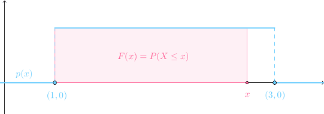

# 累积分布函数

## 连续的累计分布函数
对连续随机变量而言，因为单点的概率始终为0，所以累积分布函数更加常用：
连续随机变量X的概率密度函数为p(x)，则：
$$
F(x)=P(X \le x)=\int_{-\infty}^{x}p(t)\mathrm{d}t
$$
称为X的`累积分布函数`。
F(x)就是p(x)的积分上限函数，对应$(-\infty,x)$之间的曲线下面积：

还有一个重要性质，根据微积分第一基本定理有：
$$
\frac{\mathrm{d}}{\mathrm{d}x}F(x)=p(x)
$$

参考:
马同学