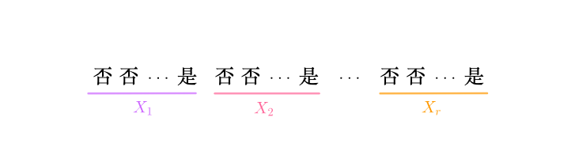

# 负二项分布

## 负二项分布
每次飞行之后，都要对飞机进行检查：
其中一非关键的易损件，每次飞行后都有p的概率损坏。本着节约成本的原则，规定可以修理，但损坏r次后必须报废更换。问，第k次飞行后此零件报废的概率为多少？

假设随机变量为：
$$
X=第k次飞行，零件正好损坏r次
$$
那根据题意就是要求P(X=k)。所求概率可这么分析，之前k-1次飞行后，已经发生了r-1次损坏（所以k必须大于等于r），这里可通过二项分布来计算：
$$
 {k-1\choose r-1}p^{r-1}(1-p)^{k-r},\quad k=r,r+1,\cdots
$$
然后第k次飞行，此零件必须要损坏，所以所求概率为：

$$
\begin{aligned}
    P(X=k)
        &={k-1\choose r-1}p^{r-1}(1-p)^{k-r}p\\
        \\
        &={k-1\choose r-1}p^r(1-p)^{k-r}
\end{aligned}
$$

> 对于n重伯努利实验，如果每次得到“是”的概率为p，设随机变量：
X=第r次“是”发生时的实验次数
则称：
$$
p(k)=P(X=k)={k-1\choose r-1}p^r(1-p)^{k-r},k=r,r+1,\cdots
$$
为随机变量X的`负二项分布`，也称为`帕斯卡分布`，也可以记作：
$$
X\sim Nb(r,p)
$$
其数学期望为：
$$
E(X)=\frac{r}{p},\quad Var(X)=\frac{r(1-p)}{p^2}
$$

### 负二项分布与几何分布

#### 几何是负二项的特例
负二项分布是这样的：
$$
p(k)=P(X=k)={k-1\choose r-1}p^r(1-p)^{k-r},k=r,r+1,\cdots
$$
r=1的时候，就得到了几何分布：
$$
p(k)=P(X=k)=(1-p)^{k-1}p,\quad k=1,2,\cdots
$$

#### 负二项是几何的和
参数为r、p的负二项分布可以表示为如下事件序列：

图中所示的每一段X_1、X_2、\cdots、X_r都是几何分布，所以有（关于这点后面的课程会证明）：
$$
X=X_1+X_2+\cdots+X_r\sim Nb(r,p)
$$
所以负二项分布的期望为：
$$
E(X)=E(X_1)+E(X_2)+\cdots+E(X_r)=\frac{r}{p}
$$
