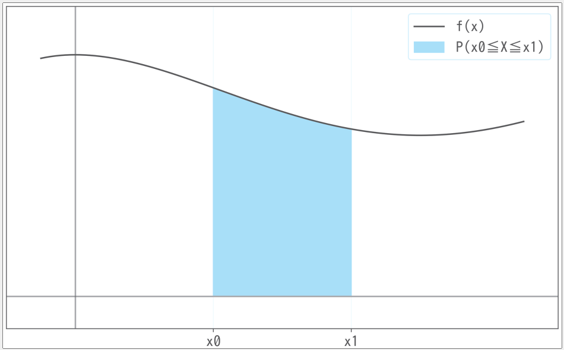
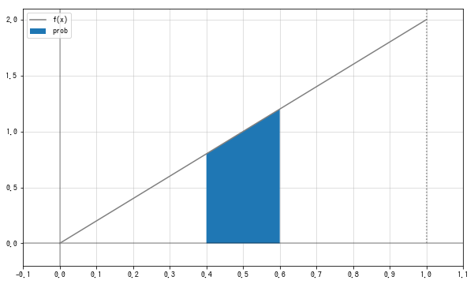
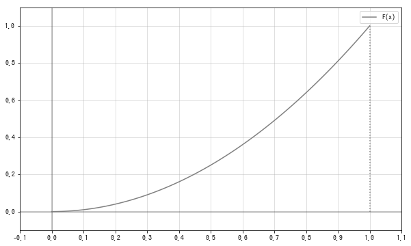
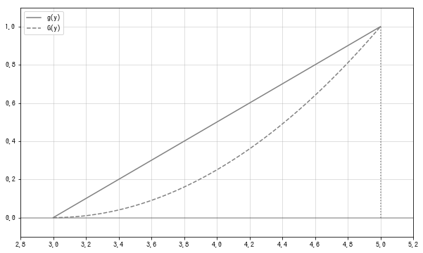

# 一维随机变量

连续型随机变量是指取值连续的随机变量.
比如, 轮盘赌博. 设轮盘的周长是1, 从起点到轮盘赌停止的位置的弧长作为实现值. 也就是说, 这个轮盘赌的可取值是0-1的实数.


## 概率密度函数
离散型随机变量可以由可取值(离散的)的集合和概率函数来定义, 连续型随机变量本质上也是一样, 但是公式的表述有些不同, 其可取值区间由[a,b]定义, <font style="background: yellow">注意离散取值是一个值, 连续是一个区间</font>, 概率由概率密度函数(probability density function, pdf).
概率密度函数类似于概率质量函数, 但不能为:
$$
f(x) = P(X=x)
$$
因为, 连续型随机变量定义取某个值的概率是不可行的.
概率密度函数的概率由随机变量$X$在$x_0 \leq X \leq x_1$区间的概率$P(x_0 \leq X \leq x_1)$定义, 按如下的积分计算:
$$
P(x_0 \leq X \leq x_1) = \int_{x_0}^{x_1}f(x)dx
$$
这个积分可以解释为密度函数f(x)和x轴, 两条直线$x=x_0,x=x_1$所包围的区域的面积, 因此下图的蓝色区域的面积为概率$P(x_0 \leq X \leq x_1)$.



<font style="background: lightgreen">注意和离散中的概率质量函数(PMF)来区分, 在概率质量函数中对应的值就是概率本身, 而概率密度函数是**质量/长度**是概率的密度, 需要乘以随机变量$X$才能表示概率, 参考[概率质量函数](/probability_离散_概率质量函数/)</font>


以轮盘赌为例, 用python来实现. 首先, 将可取值区间的下限和上限定义为`x_range`.
```python
x_range = np.array([0, 1])
```
接下来实现以`x_range`为定义域的密度函数. 由于重心偏移轮盘赌被设计为值越大越容易出现, 所以使用以下密度函数. 其中, 乘以2是为了满足概率的性质, 随后会进行确认:
$$
f(x)=
\begin{cases}
    2x & 0 \leq x \leq 1 \\ 
    0 & otherwise
\end{cases}
$$
```python
import numpy as np
import matplotlib.pyplot as plt
from scipy import integrate

def f(x):
    if x_range[0] <= x <= x_range[1]:
        return 2 * x
    else:
        return 0
```
这个`x_range`和`f`的组合是概率分布, 由此可以确定随机变量$X$的行为. 因此$X$是通过将`x_range`和`f`作为要素的列来实现的.
```python
X = [x_range, f]
```
我们将$f(x)$和x轴以及两条直线x=0.4,x=0.6包围的区域填充了颜色, 这个区域的面积就是轮盘赌在$0.4 \sim 0.6$区间的取值概率:
```python
xs = np.linspace(x_range[0], x_range[1], 100)

fig = plt.figure(figsize=(10, 6))
ax = fig.add_subplot(111)

ax.plot(xs, [f(x) for x in xs], label='f(x)', color='gray')
ax.hlines(0, -0.2, 1.2, alpha=0.3)
ax.vlines(0, -0.2, 2.2, alpha=0.3)
ax.vlines(xs.max(), 0, 2.2, linestyles=':', color='gray')

## 准备0.4到0.6之间的x坐标
xs = np.linspace(0.4, 0.6, 100)
## 在xs的范围内填充被f(x)和x轴包围的区域
ax.fill_between(xs, [f(x) for x in xs], label='prob')

ax.set_xticks(np.arange(-0.2, 1.3, 0.1))
ax.set_xlim(-0.1, 1.1)
ax.set_ylim(-0.2, 2.1)
ax.legend()

plt.show()
```


被包围的区域的面积, 也可以用梯形的面积公式来计算, 但这里使用积分来计算. 将数值分别带入概率定义公式如下:
$$
P(0.4 \leq X \leq 0.6) = \int_{0.4}^{0.6}2xdx
$$
这个积分可以通过integrate的quad函数得到, 该函数的返回值包括积分值和计算误差.
```python
## 第一个参数是被积分函数，第二个参数和第三个参数是积分区间
integrate.quad(f, 0.4, 0.6)  # (0.200, 0.000), 第一个返回的是积分值, 概率为0.2
```

## 概率密度函数的性质
$$
f(x) \geq 0 \\ 
\int_{-\infty}^{\infty}f(x)dx = 1
$$
使用python来确定一下这两个性质.`scipy.optimize`的`minimize_scalar`函数用于求一个函数的最小值.
```python
from scipy.optimize import minimize_scalar

res = minimize_scalar(f)
## 函数的最小值是fun这个实例变量
res.fun  # 0, 说明第一个性质非负成立
```
在$-\infty \sim \infty$积分, 结果为1, 证明第二个性质成立.
```python
integrate.quad(f, -np.inf, np.inf)[0]  # 1
```


## 累积分布函数
将随机变量$X$小于等于$x$时的概率表示为函数$F(x)$, 与离散型概率分布一样称为累积分布函数(cumulative distribution function, CDF).
$$
F(x) = P(X \leq x) = \int_{-\infty}^{\infty}f(x)dx
$$
使用python实现
```python
def F(x):
    return integrate.quad(f, -np.inf, x)[0]
```
利用累积分布函数, 计算$0.4 \sim 0.6$的区间的概率:
$$
P(0.4 \leq X \leq 0.6) = F(0.6) - F(0.4)
$$
作图:
```python
xs = np.linspace(x_range[0], x_range[1], 100)

fig = plt.figure(figsize=(10, 6))
ax = fig.add_subplot(111)

ax.plot(xs, [F(x) for x in xs], label='F(x)', color='gray')
ax.hlines(0, -0.1, 1.1, alpha=0.3)
ax.vlines(0, -0.1, 1.1, alpha=0.3)
ax.vlines(xs.max(), 0, 1, linestyles=':', color='gray')

ax.set_xticks(np.arange(-0.1, 1.2, 0.1))
ax.set_xlim(-0.1, 1.1)
ax.set_ylim(-0.1, 1.1)
ax.legend()

plt.show()
```


## 随机变量的变换
将赌盘上的值乘以2加上3得到$2X+3$, 记为Y, Y也变成了连续型的随机变量. 记Y的密度函数为g(y), 则有:
$$
g(y)=
\begin{cases}
    (y-3)/2 & 3\leq x \leq 5 \\
    0 & otherwise
\end{cases}
$$
假设$Y$的分布函数为$G(y)$, 则有:
$$
G(y) = P(Y \leq y) = \int_{-\infty}^yg(y)dy
$$
python实现:
```python
y_range = [3, 5]

def g(y):
    if y_range[0] <= y <= y_range[1]:
        return (y - 3) / 2
    else:
        return 0
    
def G(y):
    return integrate.quad(g, -np.inf, y)[0]
```
同时做出函数g(y)和分布函数G(y)的图像:
```python
ys = np.linspace(y_range[0], y_range[1], 100)

fig = plt.figure(figsize=(10, 6))
ax = fig.add_subplot(111)

ax.plot(ys, [g(y) for y in ys],
        label='g(y)', color='gray')
ax.plot(ys, [G(y) for y in ys],
        label='G(y)', ls='--', color='gray')
ax.hlines(0, 2.8, 5.2, alpha=0.3)
ax.vlines(ys.max(), 0, 1, linestyles=':', color='gray')

ax.set_xticks(np.arange(2.8, 5.2, 0.2))
ax.set_xlim(2.8, 5.2)
ax.set_ylim(-0.1, 1.1)
ax.legend()

plt.show()
```


## 一维连续型随机变量的数值指标
和离散的比较一下就明白了, 基本上只是把$\sum$换成了$\int$

### 期望值
$$
\mu = E(X) = \int_{-\infty}^{\infty}xf(x)dx
$$
python实现
```python
def integrand(x):
    return x * f(x)

integrate.quad(integrand, -np.inf, np.inf)[0]  # 0.667
```

也可以考虑变换后的随机变量的期望值, 例如随机变量$X$变换成$2X+3$后的随机变量$Y$的期望值由以下公式定义:
$$
E(Y)=E(2X+3)=\int_{-\infty}^{\infty}(2x+3)f(x)dx
$$
进一步定义随机变量$X$变换成$G(X)$的期望值:
$$
E[g(X)] = \int_{-\infty}^{\infty}g(x)f(x)dx
$$
python实现:
```python
def E(X, g=lambda x: x):
    x_range, f = X
    def integrand(x):
        return g(x) * f(x)
    return integrate.quad(integrand, -np.inf, np.inf)[0]


```
验证期望的性质:
```python
E(X)  # 0.667
E(X, g=lambda x: 2*x+3)  # 4.333
2 * E(X) + 3  # 4.333

```


### 方差
连续型随机变量方差定义为:
$$
\sigma^2 = V(X) = \int_{-\infty}^{\infty}(x-\mu)^2f(x)dx
$$
计算轮盘赌方差:
```python
mean = E(X)
def integrand(x):
    return (x - mean) ** 2 * f(x)

integrate.quad(integrand, -np.inf, np.inf)[0]  # 0.056
```
计算变换后的随机变量的方差. 将随机变量X变换为$2X+3$得到的随机变量$Y$, 其方差由以下公式定义, 此时$\mu = E(2X+3)$:
$$
V(Y)=V(2X+3)=\int_{-\infty}^{\infty}[(2x+3)-\mu]^2f(x)dx
$$
进一步定义随机变量X变换为$g(X)$的方差
$$
V[g(X)]=\int_{-\infty}^{\infty}(g(x)-E[g(X)])^2f(x)g(x)
$$
使用python实现:
```python
def V(X, g=lambda x: x):
    x_range, f = X
    mean = E(X, g)
    def integrand(x):
        return (g(x) - mean) ** 2 * f(x)
    return integrate.quad(integrand, -np.inf, np.inf)[0]
```

验证方差公式:
```python
V(X)  # 0.056
V(X, lambda x: 2*x + 3)  # 0.222
2**2 * V(X)  # 0.222
```


