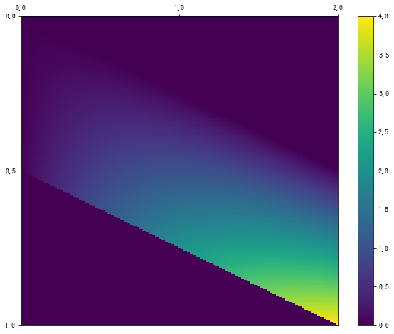

# 二维随机变量

## 联合概率密度函数
以二维连续型随机变量$X,Y$的联合取值:
$$
[(x,y)|a\leq x \leq b;c \leq y \leq d]
$$
为定义域定义函数:
$$
f(x,y)
$$
该函数f(x,y)被称为联合概率密度函数, $x_0 \leq X \leq x_1$且$y_0 \leq Y \leq y_1$的概率可以按下式计算:
$$
P(x_0 \leq X \leq x_1,y_0 \leq Y \leq y_1) = \int_{x_0}^{x_1}\int_{y_0}^{y_1}f(x,y)dxdy
$$
在离散变量中,使用两个骰子作为二维随机变量的具体例子, 这里, 使用两个**重心偏移**轮盘赌A,B代替骰子, 将A的值记作随机变量Y, A的值与B的值之和作为随机变量X, 将围绕二维随机变量(X,Y)进行讨论.
这个随机变量(X,Y)的可取值是:
$$
[0\leq X \leq 2,0\leq Y \leq 1]
$$
联合概率密度函数是:
$$
f(x,y)=
\begin{cases}
    4y(x-y) & 0\leq y \leq 10, x-y \leq 1 \\ 
    0 & otherwise
\end{cases}
$$

## 联合概率密度函数的性质
$$
f(x,y) \geq 0 \\
\int_{-\infty}^{\infty}\int_{-\infty}^{\infty}f(x,y)=1
$$
使用python验证这些性质, 把X和Y的可取值分别定义为`x_range`和`y_range`.
```python
x_range = [0, 2]
y_range = [0, 1]
```
定义联合概率密度函数
```python
def f_xy(x, y):
    if 0 <= y <= 1 and 0 <= x - y <= 1:
        return 4 * y * (x - y)
    else:
        return 0
```
随机变量(X,Y)的行为由`x_range`和`y_range`以及`f_xy`定义, 所以把这些作为列表记为:
```python
XY = [x_range, y_range, f_xy]
```
使用热图表示:
```python
xs = np.linspace(x_range[0], x_range[1], 200)
ys = np.linspace(y_range[0], y_range[1], 200)
pd = np.array([[f_xy(x, y) for y in ys] for x in xs])

fig = plt.figure(figsize=(10, 8))
ax = fig.add_subplot(111)

c = ax.pcolor(pd)
ax.set_xticks(np.linspace(0, 200, 3), minor=False)
ax.set_yticks(np.linspace(0, 200, 3), minor=False)
ax.set_xticklabels(np.linspace(0, 2, 3))
ax.set_yticklabels(np.linspace(0, 1, 3))
ax.invert_yaxis()
ax.xaxis.tick_top()
fig.colorbar(c, ax=ax)
plt.show()
```


可以从函数的定义或热图来确认是否满足$f_{xy} \geq 0$, 因为python确认有些麻烦所以省略了.
确认积分结果为1, 与之前使用`integrate.quad`不同, 而是使用`integrate.nquad`对x和y两个变量同时积分.
```python
## 第一个参数是被积分函数，第二个参数是x的积分区间和y的积分区间
integrate.nquad(f_xy,
                [[-np.inf, np.inf],
                 [-np.inf, np.inf]])[0]  # 1.000
```


## 边际概率密度函数
将随机变量X的密度函数设为$f_X(x)$则有:
$$
f_X(x)=\int_{-\infty}^{\infty}f(x,y)dy
$$
这样计算出的$f_X(x)$被称为X的编辑概率密度函数.

使用python来实现. X的边际概率密度函数是在联合概率密度函数中只对y积分得到的, 但是因为`integrate`没有实现仅对二元函数中的一个变量进行积分的函数, 所以我们使用`functools`中的`partial`函数.
`partial(f_xy,x)`, 随函数`f_xy`的参数x,y中的x进行固定, 从而返回一个只有参数y的新函数. 得到的是可以通过`integrate.quad`进行积分的一元函数, 然后对y积分就可以得到X的编辑密度函数. Y的边际密度函数通过`partial(f_xy,y=y)`对y进行固定, 然后对x积分得到.
```python
from functools import partial

def f_X(x):
    return integrate.quad(partial(f_xy, x), -np.inf, np.inf)[0]
def f_Y(y):
    return integrate.quad(partial(f_xy, y=y), -np.inf, np.inf)[0]
```
获得边际密度函数, 可以单独考虑X和Y:
```python
X = [x_range, f_X]
Y = [y_range, f_Y]
```
画出各个概率密度函数
```python
xs = np.linspace(*x_range, 100)
ys = np.linspace(*y_range, 100)

fig = plt.figure(figsize=(12, 4))
ax1 = fig.add_subplot(121)
ax2 = fig.add_subplot(122)
ax1.plot(xs, [f_X(x) for x in xs], color='gray')
ax2.plot(ys, [f_Y(y) for y in ys], color='gray')
ax1.set_title('X的边际密度函数')
ax2.set_title('Y的边际密度函数')

plt.show()
```


## 二维连续型随机变量的数值指标

### 期望值
期望值与一维连续型随机变量几乎相同. 如果都是求X的期望值, 可以通过x和密度函数的乘积对x和y进行积分得出:
$$
\mu_X=E(X)=\int_{-\infty}^{\infty}\int_{-\infty}^{\infty}xf(x,y)dxdy
$$
python实现:
```python
def integrand(x, y):
    return x * f_xy(x, y)

integrate.nquad(integrand,
                [[-np.inf, np.inf],
                 [-np.inf, np.inf]])[0]  # 1.333
```
一般来说, 可以定义X,Y的函数g(X,Y)的期望值:
$$
E(g(X,Y))=\int_{-\infty}^{\infty}\int_{-\infty}^{\infty}g(x,y)f(x,y)dxdy
$$
python实现:
```python
def E(XY, g):
    x_range, y_range, f_xy = XY
    def integrand(x, y):
        return g(x, y) * f_xy(x, y)
    
    return integrate.nquad(integrand,
                           [[-np.inf, np.inf],
                            [-np.inf, np.inf]])[0]
```

验证期望的线性性质:
```python
mean_X = E(XY, lambda x, y: x)  # 1.333
mean_Y = E(XY, lambda x, y: y)  # 0.667
a, b = 2, 3
E(XY, lambda x, y: a*x + b*y)  # 4.667
a * mean_X + b * mean_Y  # 4.667
```

### 方差
方差也和一维时几乎相同, X的方差可以用以下公式求出:
$$
\sigma_X^2 = V(X)=\int_{-\infty}^{\infty}\int_{-\infty}^{\infty}(x-\mu_X)^2f(x,y)dxdy
$$
python实现:
```python
def integrand(x, y):
    return (x - mean_X)**2 * f_xy(x, y)

integrate.nquad(integrand,
                [[-np.inf, np.inf],
                 [-np.inf, np.inf]])[0]  # 0.111
```


#### 线性变换
可以定义X,Y的函数g(X,Y)的方差:
$$
V(g(X,Y))=\int_{-\infty}^{\infty}\int_{-\infty}^{\infty}(g(x,y)-E[g(X,Y)])^2f(x,y)dxdy
$$
python实现:
```python
def V(XY, g):
    x_range, y_range, f_xy = XY
    mean = E(XY, g)
    def integrand(x, y):
        return (g(x, y) - mean)**2 * f_xy(x, y)

    return integrate.nquad(integrand,
                           [[-np.inf, np.inf],
                            [-np.inf, np.inf]])[0]
```

验证方差性质:
```python
var_X = V(XY, lambda x, y: x)  # 0.111
var_Y = V(XY, lambda x, y: y)  # 0.056
```

### 协方差
通过协方差可以知道两个随机变量X,Y之间的相关程度:
$$
\sigma_{XY}=Cov(X,Y)=\int_{-\infty}^{\infty}\int_{-\infty}^{\infty}(x-\mu_X)(y-\mu_Y)f(x,y)dxdy
$$

python实现:
```python
def Cov(XY):
    x_range, y_range, f_xy = XY
    mean_X = E(XY, lambda x, y: x)
    mean_Y = E(XY, lambda x, y: y)
    def integrand(x, y):
        return (x-mean_X) * (y-mean_Y) * f_xy(x, y)

    return integrate.nquad(integrand,
                           [[-np.inf, np.inf],
                            [-np.inf, np.inf]])[0]

cov_xy = Cov(XY)
cov_xy  # 0.056
```
方差和协方差的关系和离散一致, 确认下$V(2X+3Y)=4V(X)+9V(Y)+12Cov(X,Y)$
```python
V(XY, lambda x, y: a*x + b*y)  # 1.611
a**2 * var_X + b**2 * var_Y + 2*a*b * cov_xy  # 1.611
```

### 相关系数
和离散随机变量一样
$$
P_{XY} = \frac{\sigma_{XY}}{\sigma_X\sigma_Y}
$$

```python
cov_xy / np.sqrt(var_X * var_Y)  # 0.707
```


参考:
