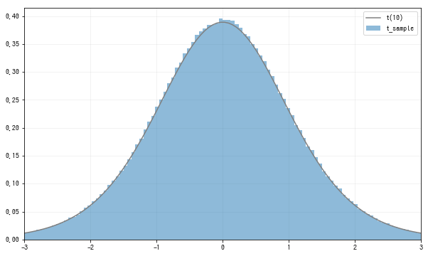
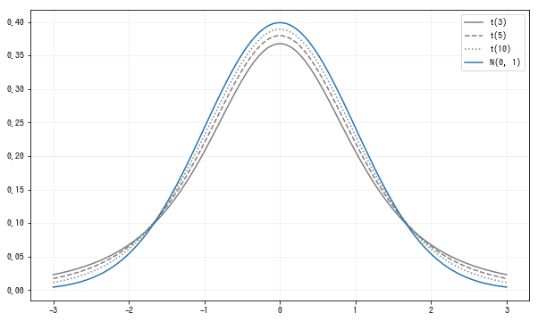

# t分布

t分布(t distribution)是对正态分布的总体平均值进行区间估计时使用的概率分布. t分布由相互独立的标准正态分布和卡方分布定义:
$$
Z为标准正态分布N(0,1), Y为自由度为n的卡方分布\chi^2(n), 则 \\
\frac{Z}{\sqrt{Y/n}}  \\
的概率分布被称为自由度为n的t分布
$$
将自由度为n的t分布记为t(n), t分布的可取值是全体实数.

下面试着使用标准正态分布和卡方分布构造t分布, 这里取, $Z\sim N(0,1)$, $Y \sim \chi^2(10)$, 从$\frac{Z}{\sqrt{Y/10}}$中随机抽取样本:
```python
n = 10
rv1 = stats.norm()
rv2 = stats.chi2(n)

sample_size = int(1e6)
Z_sample = rv1.rvs(sample_size)
chi2_sample = rv2.rvs(sample_size)

t_sample = Z_sample / np.sqrt(chi2_sample/n)
```
因为使用了自由度为10的卡方分布, 可以得到自由度为10的t分布. 在`scipy.stats`中, 可以用t函数构造服从t分布的随机变量, 在第1个参数指定自由度. 利用这个函数, 将从$\frac{Z}{\sqrt{Y/10}}$中随机抽取的样本数据的直方图和t(10)的密度函数在一张图中显示出来:
```python
fig = plt.figure(figsize=(10, 6))
ax = fig.add_subplot(111)

rv = stats.t(n)
xs = np.linspace(-3, 3, 100)
ax.hist(t_sample, bins=100, range=(-3, 3),
        density=True, alpha=0.5, label='t_sample')
ax.plot(xs, rv.pdf(xs), label=f't({n})', color='gray')

ax.legend()
ax.set_xlim(-3, 3)
plt.show()
```

可以确认$\frac{Z}{\sqrt{Y/10}}$是t(10)分布.

接下来看一下t分布随自由度n是怎样变化的. 让自由度n在3,5,10中进行变化, 其分布图像如下:
```python
fig = plt.figure(figsize=(10, 6))
ax = fig.add_subplot(111)

xs = np.linspace(-3, 3, 100)
for n, ls in zip([3, 5, 10], linestyles):
    rv = stats.t(n)
    ax.plot(xs, rv.pdf(xs),
            label=f't({n})', ls=ls, color='gray')
rv = stats.norm()
ax.plot(xs, rv.pdf(xs), label='N(0, 1)')
    
ax.legend()
plt.show()
```



t分布的特征有以下3个:
1. 左右对称分布
2. 尾部比正态分布厚
3. 随着自由度增加, 越来越接近正态分布

因为会经常使用自由度为n的t分布的上侧100$\alpha$%分位点, 所以本书中记为$t_\alpha(n)$.$t_\alpha(n)$的计算可以使用`isf`函数, 比如计算$t_{0.05}(5)$:
```python
rv = stats.t(5)
rv.isf(0.05)  # 2.0150483726691575
```

## 总结
标签|描述
--|--
参数|n
可取值|全体实数
scipy.stats|t(n)


