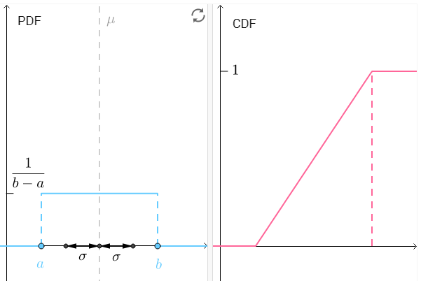

# 几何分布

## 均匀分布
> 如果连续随机变量X的概率密度函数为：
$$
p(x)=
\begin{cases}
    \frac{1}{b-a}, &a \le x \le b\\
    0, & 其它
\end{cases}
$$
则称X服从区间(a,b)上的均匀分布，记作X\sim U(a,b)，其累积分布函数为：
$$
F(x)=\begin{cases}
    0,&x < a\\
    \frac{x-a}{b-a},&a\le x < b\\
    1,&x \ge b
\end{cases}
$$
期望和方差分别为：
$$
E(X)=\frac{a+b}{2},\quad Var(X)=\frac{(b-a)^2}{12}
$$
通过调整a，b两个点，大家来感受下PDF和CDF：
