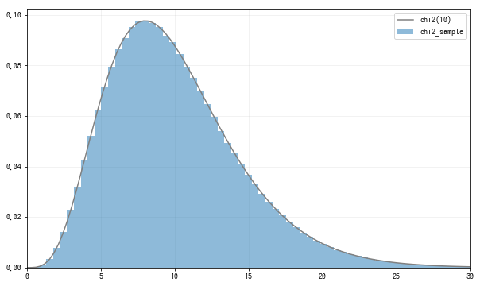

# 卡方分布

卡方分布(chi-square distribution): $Z_1,...,Z_n$服从N(0,1), 则Y=\sum_{i=1}^nZ_i^2$服从自由度为n的卡方分布,记为$\chi^2(n)$

使用python构造一个服从标准正态分布的卡方分布. 这里, 我们从标准正态分布中随机抽取容量为10的样本, 然后取其平方和, 这样的过程重复100万次. 这样的话, 就相当于从$\sum_{i=1}^{10}Z_i^2$中随机抽取样本量为100万的样本数据.
```python
n = 10
rv = stats.norm()
sample_size = int(1e6)
## 从标准正态分布中随机抽取10×100万的容量
Zs_sample = rv.rvs((n, sample_size))
## 在axis=0的方向上求和，得到标准正态分布的平方和的标本数据
chi2_sample = np.sum(Zs_sample**2, axis=0)
```
因为是10个标准正态分布的平方和, 所以应该是自由度为10的卡方分布.在`scipy.stats`中, 可以用`chi2`函数构造服从卡方分布的随机变量, 在第1个参数指定自由度. 将从$\sum_{i=1}^{10}Z_i^2$中随机抽取的样本数据的直方图和$\chi^2(10)$的密度函数可视化, 如图:
```python
fig = plt.figure(figsize=(10, 6))
ax = fig.add_subplot(111)

rv_true = stats.chi2(n)
xs = np.linspace(0, 30, 100)
ax.hist(chi2_sample, bins=100, density=True,
        alpha=0.5, label='chi2_sample')
ax.plot(xs, rv_true.pdf(xs), label=f'chi2({n})', color='gray')

ax.legend()
ax.set_xlim(0, 30)
plt.show()
```

直方图和密度函数非常吻合, 则$\sum_{i=1}^{10}Z_i^2$可以确认是$\chi^2(10)$分布.
接下来看卡方分布随自由度n是怎样变化的. 这里让自由度n在3,5,10中进行变化, 做出图像:
```python
fig = plt.figure(figsize=(10, 6))
ax = fig.add_subplot(111)

xs = np.linspace(0, 20, 500)
for n, ls in zip([3, 5, 10], linestyles):
    rv = stats.chi2(n)
    ax.plot(xs, rv.pdf(xs),
            label=f'chi2({n})', ls=ls, color='gray')
    
ax.legend()
plt.show()
```


卡方分布特征有3个:
1. 左右不对称, 向右偏斜
2. 自由度越大, 就越接近左右对称
3. 分布峰值在自由度附近

与标准正态分布一样, 经常会使用卡方分布的上次100$\alpha$%分为点, 因此, 将自由度为n的卡方分布的上侧100$\alpha$%分位点记为$\chi^2_\alpha(n)$, 可以使用`isf`函数计算$\chi^2_\alpha(n)$, 比如计算$\chi^2_\alpha(5)$, 可以执行以下操作:
```python
rv = stats.chi2(5)
rv.isf(0.05)  # 11.070497693516355
```

## 总结
标签|描述
--|--
参数|n
可取值|非负实数
scipy.stats|chi2(n)