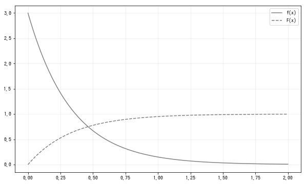

# 指数分布

指数分布(exponential distribution)是指某个事件发生的间隔所服从的分布. 因为是按照时间间隔分布的, 所以指数分布参数$\lambda$必须是正实数. 本书中参数为$\lambda$的指数分布记为Ex($\lambda$):
$$
f(x)=
\begin{cases}
    \lambda e^{-\lambda x} & x \ge 0 \\
    0 & otherwise
\end{cases}
$$
$Ex(\lambda)$是描述没单位时间平均有$\lambda$次事件发生的间隔所服从的概率分布, 具体例子如下:
1. 平均每天发生2起交通事故的地区, 1天发生交通事故的间隔.
如果将交通事故视为完全随机现象, 那么交通事故的发生间隔, 即从1次交通事故发生到下1次交通事故发生的时间间隔可以视为服从$Ex(2)$的指数分布. 因此, 在该地区发生交通事故后3天内又发生交通事故的概率可以求:
$$
P(X \leq 3) = \int_0^3 2e^{-2x}dx = 0.998
$$

2. 每小时平均访问10次的网站的访问时间间隔
如果将网站访问视为完全随机事件, 则访问时间间隔应服从$Ex(10)$的指数分布. 因此, 该网站在被访问后1分钟内, 再次被访问的概率, 可以求:
$$
P(X \le 1/60) = \int_0^{1/60}10e^{-10x}dx=0.154
$$
通过上述例子可以发现, 指数分布和泊松分布密切相关, 这时因为如果单位时间平均发生$\lambda$次事件, 则单位时间发生事件的次数服从$Poi(\lambda)$分布, 而事件发生的时间间隔就成了$Ex(\lambda)$.

指数分布的期望和方差:
$$
E(X)= \frac{1}{\lambda}, V(X)=\frac{1}{\lambda^2}
$$
使用Numpy来实现:
```python
def Ex(lam):
    x_range = [0, np.inf]
    def f(x):
        if x >= 0:
            return lam * np.exp(-lam * x)
        else:
            return 0
    return x_range, f
```
构造服从$Ex(3)$的随机变量X:
```python
lam = 3
X = Ex(lam)
check_prob(X)
"""
期望值为0.333
方差为0.111
"""
```
在0-2区间内做出密度函数和分布函数的图像, 可以看出指数分布的密度函数随着x的增加呈指数递减:
```python
plot_prob(X, 0, 2)
```

## scipy
在`scipy.stats`模块中, 可以用expon函数构造服从指数分布的随机变量, 但是分布参数$\lambda$由函数参数scale指定为$1/\lambda$. 参数$\lambda$在1,2,3中进行变化, 其指数分布的形状变化如图:
```python
fig = plt.figure(figsize=(10, 6))
ax = fig.add_subplot(111)

xs = np.linspace(0, 3, 100)
for lam, ls in zip([1, 2, 3], linestyles):
    rv = stats.expon(scale=1/lam)
    ax.plot(xs, rv.pdf(xs),
            label=f'lambda:{lam}', ls=ls, color='gray')
ax.legend()

plt.show()
```

## 总结
标签|描述
--|--
参数|$\lambda$
可取值|正实数
密度函数|$\lambda e^{-\lambda x}$
期望值|$\frac{1}{\lambda}$
方差|$\frac{1}{\lambda^2}$
`scipy.stats`|$expon(scale=1/\lambda)$