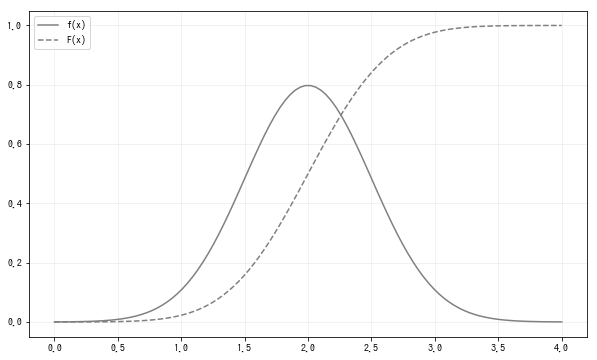
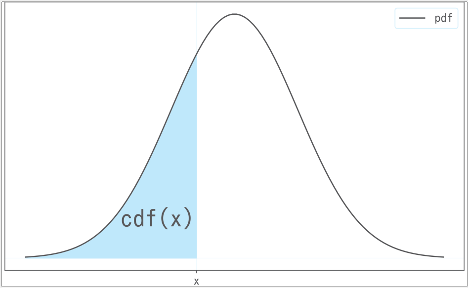
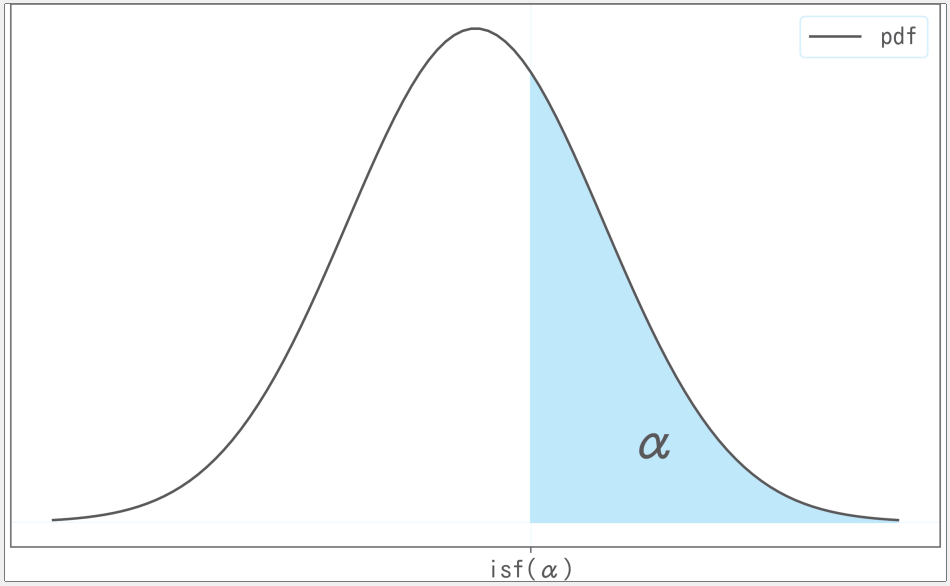
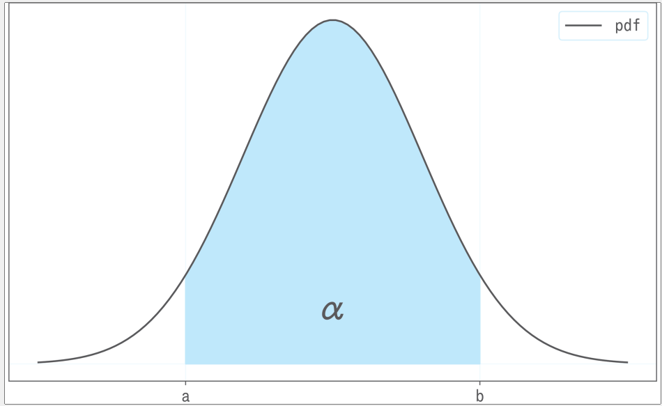
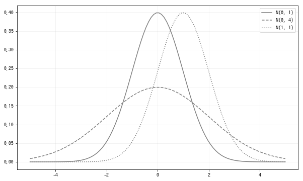
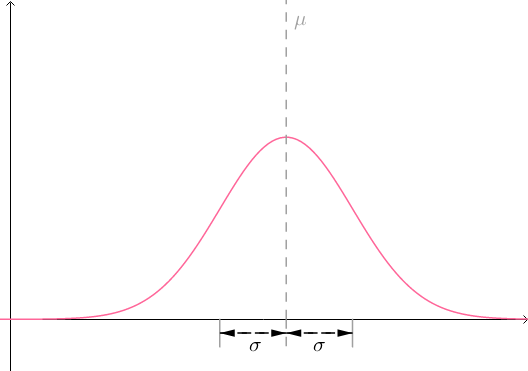
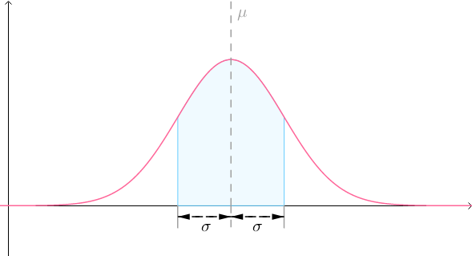
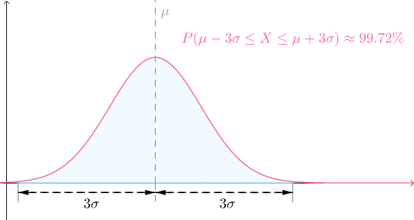
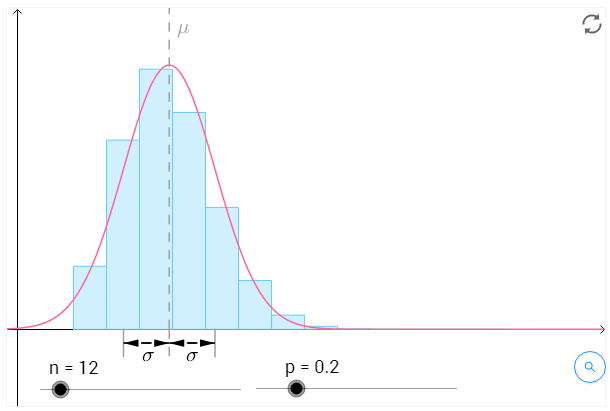

# 正态分布

## 定义
正态分布(normal distribution)也被称为高斯分布(gaussian distribution). 正态分布的可能值是全体实数, 参数有$\mu,\sigma^2$两个, 表示均值和方差, 表示为$N(\mu,\sigma^2)$:
$$
f(x)=\frac{1}{\sqrt{2\pi}\sigma }exp(-\frac{(x-\mu)^2}{2\sigma^2}),(-\infty < x < \infty)
$$
正态分布可以描述很多现象:
1. 男高中生的身高
比如男高中生的平均身高是170cm, 标准差是5cm, 可以认为偶然看到的高中生的身高会服从$N(170,5^2)$的正态分布. 因此偶然看到的男高中生身高在165cm以上175cm以下的概率可以由:
$$
P(165 \leq X \leq 175)=\int_{165}^{175}\frac{1}{\sqrt{2\pi}\times 5}exp(\frac{(x-170)^2}{2\times 5^2})dx=0.683
$$

2. 模拟考试的分数
模拟考试的平均分是70分, 标准差是8分, 可以认为偶然看到的学生的分数服从$N(70,8^2)$的正态分布. 因此, 偶然看到的学生的分数在54分以上, 86分以下的概率:
$$
P(54 \leq X \leq 86)=\int_{86}^{54}\frac{1}{\sqrt{2\pi}\times 8}exp(\frac{(x-70)^2}{2\times 8^2})dx=0.954
$$

<font style="background: yellow">注意以上概率值(概率质量)都是通过积分求得的</font>


正态分布的期望和方差为:
$$
E(X)=\mu,V(X)=\sigma^2
$$

正态分布具有其他大多数概率分布所不具备的非常重要的性质, 那就是将服从正态分布的随机变量X变换成aX+b, 其概率也会服从概率分布, 变换后的期望值和方差也可以简单进行计算:
$$
aX+b \sim N(a\mu +b,a^2\sigma^2)
$$
利用这个性质, $X\sim N(\mu,\sigma^2)$的标准化后的随机变量$Z=(X-\mu)/\sigma$服从$N(0,1)$分布, 被称为**标准正态分布(standard normal distribution)**.
<font style="background: yellow">不管处理什么参数的正态分布, 只要将其标准化就可以轻松解决.</font>


使用Numpy来实现:
```python
def N(mu, sigma):
    x_range = [- np.inf, np.inf]
    def f(x):
        return 1 / np.sqrt(2 * np.pi * sigma**2) *\
                    np.exp(-(x-mu)**2 / (2 * sigma**2))
    return x_range, f 
```
构造一个服从$N(2,0.5^2)$的随机变量X.
```python
mu, sigma = 2, 0.5
X = N(mu, sigma)
check_prob(X)
"""
期望值为2.000
方差为0.250
"""
```
把密度函数和分布函数在0-4的区间内可视化, 发现正态分布的密度函数图像的特征是左右对称的吊钟型.
```python
plot_prob(X, 0, 4)
```



## 标准正态分布
我们称$\mu=0、\sigma=1$时的正态分布$N(0,1)$为`标准正态分布`。
通常记标准正态变量为Z（Z Score），记标准正态分布的概率密度函数为$\phi(x)$，累积分布函数为$\Phi(x)$，即：
$$
\phi(x)=\frac{1}{\sqrt{2\pi}}e^{-\frac{x^2}{2}},\quad -\infty < x < +\infty
$$
$$
\Phi(x)=\frac{1}{\sqrt{2\pi}}\int_{-\infty}^{x}e^{-\frac{t^2}{2}}\mathrm{d}t
$$
标准正态分布代数形式很清爽，是最简单的正态分布，图像上是关于纵轴对称的偶函数.

### 转化为标准正态分布

正态分布有一个重要结论：
>如果$X\sim N(\mu, \sigma^2)$，那么有：
$$
aX+b\sim N(a\mu+b, a^2\sigma^2)
$$

更改a、b参数，可以看到不论怎么调整，概率密度函数仍然是正态分布：
只需要设置合适a、b就可以让X转为标准正态分布，具体而言就是令（在概率与统计中，Z基本上就是标准正态分布随机变量的专用符号）：
$$
Z=\frac{X-\mu}{\sigma}
$$
则有：
$$
Z\sim N(0,1)
$$
## scipy
使用`scipy.stats`来实现. 服从正态分布的随机变量可以由`norm`函数生成, 分别对第1个参数指定期望值$\mu$, 对第二个参数指定标准差$\sigma$.
因为函数对这两个参数分别默认为0和1, 所以**未指定任何值**会生成标准正态分布的随机变量.
构造期望值为2, 标准差为0.5的正态分布随机变量.
```python
rv = stats.norm(2, 0.5)
rv.mean(), rv.var()  # (2.0, 0.25)
```
### pdf

概率密度函数可以用`pdf`函数计算, 在这里计算`rv.pdf(2)`, 
<font style="background: hotpink">注意这并不是求$P(X=2)$的概率, 而是概率的密度.</font>

```python
rv.pdf(2)  # 0.7978845608028654
```

### cdf
<font style="background: yellow">使用cdf函数计算概率$P(X \leq x)$</font>, `cdf(x)`相当于计算下面的填充面积:

使用cdf函数, 计算X取小于1.7的值的概率($P(x \leq 1.7)$):
```python
rv.cdf(1.7)  # 0.27425311775007355
```

<font style="background: yellow">cdf和pdf都是通过随机变量X求P</font>


### isf

使用`isf`函数可以求出上侧100$\alpha$%分位点(upper 100$\alpha$% point). 上侧100 $\alpha$%分为点是满足$P(X \geq x)=\alpha$所对应的x的值, 也就是说, 下图的填充区域的面积为$\alpha$时, 对应的左端的x的坐标.
特别是在标准正态分布中, 上侧100 $\alpha$%分位点会经常使用, 所以记为$Z_\alpha$.也就是说, 假设$Z \sim N(0,1)$分布, 则$Z_\alpha$满足$P(Z \geq z_\alpha)=\alpha$. 另外, 标准正态分布呈以x=0为中心对称形状, 因此$z_{1-\alpha}=-z_\alpha$成立

使用`isf`函数求上侧30%分为点:
```python
rv.isf(0.3)  # 2.2622002563540207
```

### interval


使用`interval`函数可以求出一个概率为$\alpha$的中心区间, 如下图填充区域的面积为$\alpha$, 需要求a,b. 这时, 右边和左边空白的区域是相等的, 即a和b需要满足
1. $P(a \leq X \leq b)=\alpha$
或
2. $P(X \leq a)=P(X \geq b)=(1-\alpha)/2$

这样的区间[a,b]记为 100$\alpha$%区间.

下面使用`interval`函数计算90%的区间:
```python
rv.interval(0.9)  # (1.1775731865242636, 2.822426813475736)
rv.isf(0.95), rv.isf(0.05)  # (1.1775731865242638, 2.8224268134757367)
```
在标准正态分布的情况下, $100(1-\alpha)$%区间是$[z_{1-\alpha/2},z_{\alpha/2}]$. 例如, 标准正态分布的95%区间对应于$\alpha=0.05$,对应区间是$[z_{0.975},z_{0.025}]$.

<font style="background: yellow">isf和interval是通过P来求随机变量X</font>

## 不同参数的正态分布

使用python观察$N(0,1),N(0,4),N(1,1)$图形是如何变化的:
```python
fig = plt.figure(figsize=(10, 6))
ax = fig.add_subplot(111)

xs = np.linspace(-5, 5, 100)
params = [(0, 1), (0, 2), (1, 1)]
for param, ls in zip(params, linestyles):
    mu, sigma = param
    rv = stats.norm(mu, sigma)
    ax.plot(xs, rv.pdf(xs),
            label=f'N({mu}, {sigma**2})', ls=ls, color='gray')
ax.legend()

plt.show()
```

可见$\sigma^2$越大分布越广, $\mu$使得整个分布平行移动.

## 期望与方差
> 正态分布$X\sim N(\mu,\sigma^2)$的期望和方差为：
$$
E(X)=\mu,\quad Var(X)=\sigma^2
$$

从图像上可以看出，正态分布是关于均值$\mu$对称：



## 六个西格玛
对于随机变量：
$$
X\sim N(\mu,\sigma^2)
$$
不论$\mu、\sigma$是多少，如图所示的曲线下面积是固定的：

这个值为：
$$
P(\mu-\sigma\le X\le \mu+\sigma)\approx 68.26\%
$$

同样的道理，如下范围对应的概率（曲线下面积）为：

也就是说，对于正态分布而言，99.72%的概率都在均值附近、六个标准差的范围内。


## 总结
标签|描述
--|--
参数|$\mu,\sigma$
可取值|全体实数
密度函数|$$
期望值|$\mu$
方差|$\sigma^2$
`scipy.stats`|norm($\mu,\sigma$)


## 例子

对于二项分布而言，如果n太大，比如n=5000的时候：
$$
X\sim b(5000,0.001)
$$
要计算这个分布是很麻烦的：
$$
P(X= k)={5000\choose k}0.001^k0.999^{5000-k}
$$
这是因为系数 $5000\choose k$ 中有阶乘，计算量太大，尤其在中世纪没有计算机的时候（之前介绍过用泊松分布，这里介绍另外一种逼近办法）。

法国数学家亚伯拉罕·棣莫弗（1667－1754）：他当时在名为“屠夫咖啡馆”的赌坊工作，计算赔率的时候发现，比如对于二项分布：
$$
X\sim b(n,p)
$$
只需要求出它的期望和方差：
$$
\mu=np,\quad \sigma^2=np(1-p)
$$
然后用下面这个函数：
$$
p(x)=\frac{1}{\sigma\sqrt{2\pi}}e^{-\frac{(x-\mu)^2}{2\sigma^2}},\quad -\infty < x < +\infty
$$
就可以逼近二项分布（蓝色方块为二项分布，红色曲线为函数p(x)，n越大逼近效果越好）：



## 其他参考

正态分布的概率密度函数:
$$
N(x|\mu,\sigma^2) = \frac{1}{\sqrt{2\pi\sigma^2}}e^{(-\frac{(x-\mu)^2}{2\sigma^2})}
$$
公式中包含了圆周率$\pi$和自然对数的底$e$.
```python
## 圆周率
sp.pi
## 指数函数
sp.exp(1)
```
有了这两个常数, 我们就能计算概率密度了. 计算均值为4, 方差为0.64(标准差为0.8)的正态分布在随机变量为3时的概率密度,既$N(3|4,0.8^2)$的值:
```python
## 均值为 4 标准差为 0.8 的正态分布在随机变量为 3 时的概率密度
x = 3
mu = 4
sigma = 0.8

1 / (sp.sqrt(2 * sp.pi * sigma**2)) * \
    sp.exp(- ((x - mu)**2) / (2 * sigma**2))  # 0.228

## 使用scipy的函数

stats.norm.pdf(loc = 4, scale = 0.8, x = 3)  # 0.228
### 或者先生成正态分布
norm_dist = stats.norm(loc = 4, scale = 0.8)
norm_dist.pdf(x = 3)  # # 0.228


```
绘制概率密度的图形

```python
## 用于数值计算的库
import numpy as np
import pandas as pd
import scipy as sp
from scipy import stats

## 用于绘图的库
from matplotlib import pyplot as plt

x_plot = np.arange(start = 1, stop = 7.1, step = 0.1)
plt.plot(
    x_plot, 
    stats.norm.pdf(x = x_plot, loc = 4, scale = 0.8),
    color = 'black'
)
plt.show()
```


## 样本小于等于某值的比率
求样本小于等于某个值的比例, 就是小于等于这个值的数据个数和样本容量的比值.

```python
np.random.seed(1)
simulated_sample = stats.norm.rvs(
    loc = 4, scale = 0.8, size = 100000)
sp.sum(simulated_sample <= 3)
sp.sum(simulated_sample <= 3) / len(simulated_sample)  # 0.104
```

### 累计分布函数
对于随机变量$X$, 当$x$为实数时, $F(X)$叫做累计分布函数:
$$
F(X) = P(X \leq x)
$$
累积分布函数可以计算随机变量小于等于某个值的概率. 使用该式子, 就不必像上述方法计算个数了. 例如, 在正态分布中随机变量小于等于3的概率可通过下面的积分求得:
$$
P(X \leq 3) = \int_{-\infty}^3 \frac{1}{\sqrt{2\pi\sigma^2}}e^{(-\frac{(x-\mu)^2}{2\sigma^2})}dx
$$
积分相当于加法的角度来考虑, 上述式子可以理解为$\infty \sim 3$上所有概率的密度的和.


### 累积分布函数
$N(x|4,0.8^2)$的随机变量小于等于3的概率
```python
stats.norm.cdf(loc = 4, scale = 0.8, x = 3)  # 0.106
```

### 左侧概率与百分位数
数据小于等于某个值的概率叫做左侧概率. 借助累积分布函数可以求得左侧概率.
能得到某个概率的那个值叫做百分位数, 也叫左侧百分位数.
比如前面提到的"随机变量小于等于x的概率为p%", 可以理解为:
1. 给定变量值x, 求概率值p, 则p为左侧概率
2. 给定概率值p, 求变量值x, 则x为百分位数

使用`stats.norm.ppf`可以求百分位数. ppf的全称是:percent point function.
```python
stats.norm.ppf(loc = 4, scale = 0.8, q = 0.025)  # 2.432 求百分位数

left = stats.norm.cdf(loc = 4, scale = 0.8, x = 3)
stats.norm.ppf(loc = 4, scale = 0.8, q = left)  # 3.000
stats.norm.ppf(loc = 4, scale = 0.8, q = 0.5)  # 4.000
```

## t值
统计量$t$值的计算方法如下:
$$
t=\frac{\hat{\mu}-\mu}{\hat{\sigma}/\sqrt{N}}
$$
其中, $\hat{\mu}$为样本均值, $\mu$为总体均值, $\hat{\sigma}$为实际样本的无偏标准差(无偏方差的平方根), $N$为样本容量, 上式可以描述为:
$$
t值=\frac{样本均值-总体均值}{标准误差}
$$
含义是对样本均值进行标准化. 然而这个计算的除数不是标准误差的理论值, 它来自实际样本, 不能把方差转换为1.

### t值的样本分布
用程序模拟t值的样本分布:
1. 从$N(x|4,0.8^2)$中抽样, 样本容量为10
2. 求所得样本的样本均值
3. 求上述样本对应的标准误差(样本均值的标准差)
4. 计算"(样本均值-总体均值)/标准误差", 得到t值
5. 将上述操作重复执行1万次

模拟结果放在`t_value_array`变量中, 最终会得到1万次试验所得到的t值.


```python
## 随机数种子
np.random.seed(1)
## 存放 t 值的空间
t_value_array = np.zeros(10000)
## 实例化一个正态分布
norm_dist = stats.norm(loc = 4, scale = 0.8)
## 开始实验
for i in range(0, 10000):
    sample = norm_dist.rvs(size = 10)
    sample_mean = sp.mean(sample)
    sample_std = sp.std(sample, ddof = 1)
    sample_se = sample_std / sp.sqrt(len(sample))
    t_value_array[i] = (sample_mean - 4) / sample_se

## t 值的直方图
sns.distplot(t_value_array, color = 'black')

## 标准正态分布的概率祺
x = np.arange(start = -8, stop = 8.1, step = 0.1)
plt.plot(x, stats.norm.pdf(x = x), 
         color = 'black', linestyle = 'dotted')
```
样本均值的均值满足无偏性, 可以看做总体的均值, 所以"(样本均值-总体均值)/标准误差"的分布的中央是0.
t值的分布以标准误差为除数, 这个标准误差来自实际样本, 所以分布的宽度大于标准正态分布, 即它的方差大于1.


### t分布
当总体样本服从正态分布时, t值的样本分布就是t分布.
设样本容量为$N$, $N-1$就叫做自由度.例如样本容量为10, 则自由度为9.t分布的图形与自由度相关.如果自由度为n, 则t分布表示为$t(n)$.
t分布的均值为0.
t分布的方差稍微大于1.设自由度为n(n>2), 则t分布的方差如下:
$$
t(n)的方差=\frac{n}{n-2}
$$
自由度(或样本容量)越大, 方差越接近1, t分布越接近标准正态分布; 样本容量越小, t分布越远离标准正态分布.

```python
plt.plot(x, stats.norm.pdf(x = x), 
         color = 'black', linestyle = 'dotted')
plt.plot(x, stats.t.pdf(x = x, df = 9), 
         color = 'black')
```

t分布的意义就是在总体方差未知时也可以研究样本均值的分布.
在推导t分布时, 使用了与实际样本对应的标准误差作为除数, 对样本均值进行了"标准化". 然而此时总体方差未知, 这样的标准化是一个很冒险的举措. 显然, 这样的计算不能让方差转化为1, 所以它不是严格意义上的标准化, t分布的方差永远不是1.

参考:


参考:
马同学