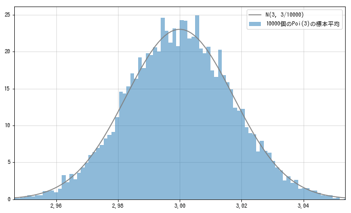

# 中心极限定理

## 中心极限定理
我们了解了$\sum_{i=1}^nX_i$和样本平均值$\overline{X}$的分布.和的分布和样本平均值的分布是通过对期望值和方差的简单计算得到的, 所以只要知道分布的形状就能确定概率分布. 但是除了泊松分布和正态分布等部分具有再生性的概率分布之外, 和的分布形状一般是不知道的. 而且即使是具有再生性的泊松分布, 其样本平均值的分布也不能保持泊松分布的形状.

为了得到样本平均值的分布, 有一个非常强大而美丽的定理, 就是中心极限定理(central limit theorem):任何一个群体的样本的平均值都会围绕在该群体的整体平均值周围，并且呈正态分布。
$$
当随机变量X_1,...,X_n相互独立地分布于期望值为\mu且方差为\sigma^2的概率分布F时, \\
随着n的增加, 样本平均值\overline{X}的分布将接近于正态分布N(\mu,\sigma^2/n)
$$
不管原始分布如何, 样本平均值的分布都接近正态分布. 下面试着用泊松分布的样本平均值来确认一下. 这里, 取n=1000, 求得$X_1,X_2,...,X_{10000}\sim^{iid}Poi(3)$时的样本平均值的分布.

首先对样本平均值进行10000次计算(从泊松分布随机抽取 10000 x 10000次)
```python
l = 3
rv = stats.poisson(l)

n = 10000
sample_size = 10000
Xs_sample = rv.rvs((n, sample_size))
sample_mean = np.mean(Xs_sample, axis=0)

rv_true = stats.norm(l, np.sqrt(l/n))
xs = np.linspace(rv_true.isf(0.999), rv_true.isf(0.001), 100)
```
根据中心极限定理, $\overline{X}$应该服从N(3,3/10000)分布. $\overline{X}$的样本数据的直方图和N(3,3/10000)的密度函数图像如下:
```python
fig = plt.figure(figsize=(10, 6))
ax = fig.add_subplot(111)

ax.hist(sample_mean, bins=100, density=True,
        alpha=0.5, label='10000个Poi(3)的样本平均值')
ax.plot(xs, rv_true.pdf(xs), label='N(3, 3/10000)', color='gray')

ax.legend()
ax.set_xlim(rv_true.isf(0.999), rv_true.isf(0.001))
plt.show()
```


虽然有些偏差, 但是可以看出是接近正态分布的形状. 至此, 通过泊松分布证明了中心极限定理是成立的.