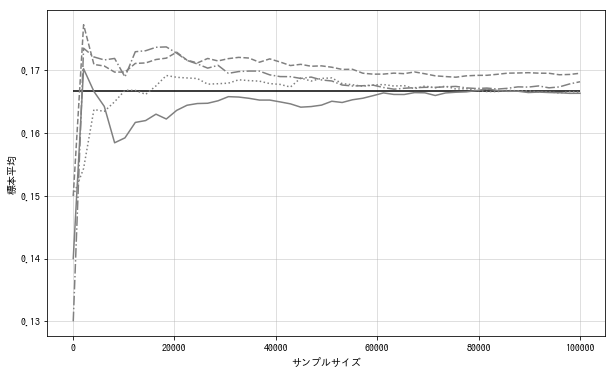

# 大数定律

## 大数定律
与样本平均值相关的定理中, 与中心极限定理同样重要的还有大数定律(law of large numbers).大数定律主张样本容量越大, 样本平均值越趋向于收敛到总体平均值. 例如, 多次掷骰子, 出现6点的概率接近1/6.
$$
随机变量X_1,...,X_n相互独立地分布于平均值为\mu,且方差为\sigma^2的概率分布时, 随着n的增加, 样本平均值将收敛到\mu
$$

下面试着确认一下掷骰子出现6点的概率是否满足大数定律. 因为每次的试验都服从Bern(1/6), 随着样本容量的变大, 样本平均值应该能收敛到1/6.
在此先做4次样本容量为10万的随机抽样.
```python
p = 1/6
rv = stats.bernoulli(p)

n = int(1e5)
sample = rv.rvs((n, 4))
space = np.linspace(100, n, 50).astype(int)
plot_list = np.array([np.mean(sample[:sp], axis=0)
                      for sp in space]).T
```
通过4次随机抽样, 逐渐增加计算样本平均值时使用的样本容量, 样本平均值发生变化的图像如下:
```python
fig = plt.figure(figsize=(10, 6))
ax = fig.add_subplot(111)

for pl, ls in zip(plot_list, linestyles):
    ax.plot(space, pl, ls=ls, color='gray')
ax.hlines(p, -1, n, 'k')
ax.set_xlabel('样本容量')
ax.set_ylabel('样本平均值')

plt.show()
```


样本容量小时可能有偏差, 但是随着样本容量变大, 无论哪次随机抽样, 其结果都接近1/6.
