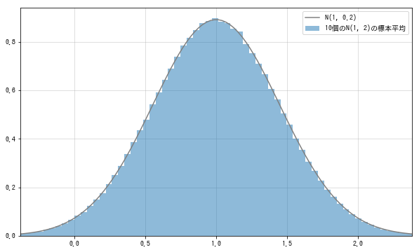

# 平均值的分布

样本均值的分布, 是指相互独立的, 服从相同概率分布的随机变量$X_1,...,X_n$的平均值$\overline{X}=\frac{X_1+,...,+X_n}{n}$的分布.
与讨论和的分布一样, 先了解一下期望值和方差的情况如何. 可以使用期望值的线性性质来计算样本平均值的期望值:
$$
\begin{align*}
    E(\overline{X}) &=E(\frac{X_1+...+X_n}{n})  \\
    &=\frac{E(X_1)+...+E(X_n)}{n}  \\
    &=\frac{n\mu}{n}  \\
    &=\mu
\end{align*}
$$
可以按下面的方法计算样本平均值的方差. 要注意$V(aX)=a^2V(X)$, 这与期望值不同:
$$
\begin{align*}
    V(\overline{X}) &=V(\frac{X_1+...+X_n}{n})  \\
    &=\frac{V(X_1)+...+V(X_n)}{n^2}  \\
    &=\frac{n\sigma^2}{n^2}  \\
    &=\frac{\sigma^2}{n}
\end{align*}
$$
总结如下:
$$
随机变量X_1,...,X_n独立同分布于期望值为\mu,方差为\sigma^2的概率分布F,则 \\
E(\overline{X})=\mu  \\
V(\overline{X})=\frac{\sigma^2}{n}  \\
成立
$$

### 正态分布的样本平均值的分布
在这里取n=10, 考察$X_1,...,X_n \sim^{iid} N(1,2)$的样本平均值$\overline{X}$.此时$\overline{X}$的期望值应该是1, 方差应该是2/10. 使用python来确认:
```python
mean = 1
var = 2
rv = stats.norm(mean, np.sqrt(var))

n = 10
sample_size = int(1e6)
Xs_sample = rv.rvs((n, sample_size))
sample_mean = np.mean(Xs_sample, axis=0)

np.mean(sample_mean), np.var(sample_mean)  # (1.000, 0.199)
```
正态分布的情况下, 样本平均值$\overline{X}$也是正态分布. 即$\overline{X} \sim N(1,2/10)$. 将从$\overline{X}$随机抽取的样本数据的直方图和N(1,2/10)的密度函数可视化:
```python
fig = plt.figure(figsize=(10, 6))
ax = fig.add_subplot(111)

rv_true = stats.norm(mean, np.sqrt(var/n))
xs = np.linspace(rv_true.isf(0.999), rv_true.isf(0.001), 100)
ax.hist(sample_mean, bins=100, density=True,
        alpha=0.5, label='10个N(1, 2)的样本平均值')
ax.plot(xs, rv_true.pdf(xs), label='N(1, 0.2)', color='gray')

ax.legend()
ax.set_xlim(rv_true.isf(0.999), rv_true.isf(0.001))
plt.show()
```


将正态分布的样本平均值的分布总结如下:
$$
对于X_1,...,X_n \sim N(\mu,\sigma^2), \\
\overline{X} \sim N(\mu,\frac{\sigma^2}{n})  \\
成立
$$


### 泊松分布的样本平均值的分布

考虑泊松分布的样本平均值. 在这里, 取n=10, 考察$X_1,X_2,...,X_{10} \sim^{iid} Poi(3)$的样本平均值$\overline{X}$, 此时的$\overline{X}$的期望值应该是3, 方差应该是3/10.
```python
l = 3
rv = stats.poisson(l)

n = 10
sample_size = int(1e6)
Xs_sample = rv.rvs((n, sample_size))
sample_mean = np.mean(Xs_sample, axis=0)

np.mean(sample_mean), np.var(sample_mean)  # (2.999, 0.300)
```
从期望值和方差不同这一点可以看出, $\overline{X}$不再服从泊松分布. 即使泊松分布具有再生性, 样本平均值也不能保持泊松分布. 而是服从正态分布:
```python
fig = plt.figure(figsize=(10, 6))
ax = fig.add_subplot(111)

ax.hist(sample_mean, bins=100, density=True,
        alpha=0.5, label='10个Poi(3)的样本平均值')

ax.legend()
ax.set_xlim(0, 6)
plt.show()
```
