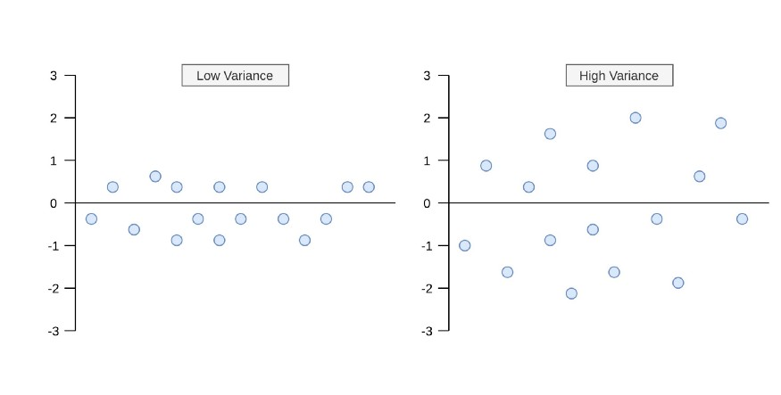
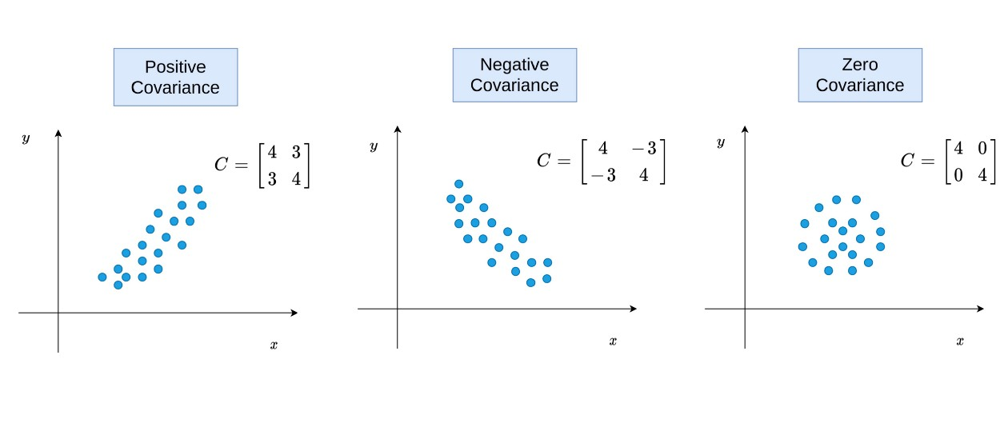
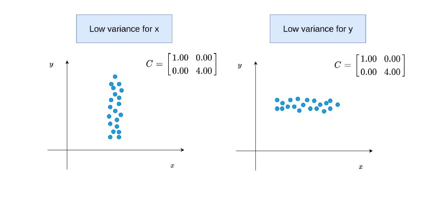
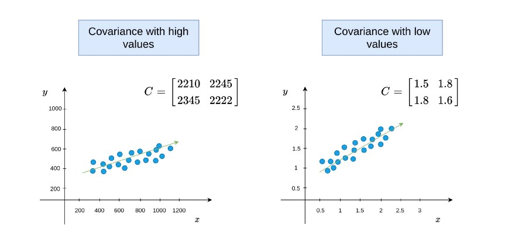
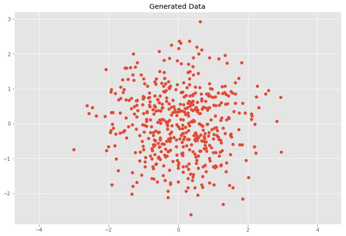

# zindex

## Variance和CoVariance

### Variance
Variance measures the variation of a single random variable(单个随机变量的离散程度)
variance的formula:
1. 仅使用sample data, 只能获得sample mean, 使用n-1做为分子
$$\sigma^2_x = \frac{1}{n-1} \sum^{n}_{i=1}(x_i - \bar{x})^2 $$
2. 使用population data, 知道population mean, 使用n作为分子
$$\sigma^2_x = \frac{1}{n} \sum^{n}_{i=1}(x_i - \bar{x})^2 $$

如下图展示了Low Variance和High Variance的区别:



### CoVariance
covariance is a measure of how much two random variables vary together(两个随机变量的相似程度)
covariance的formula:
$$\sigma(x, y) = \frac{1}{n-1} \sum^{n}_{i=1}{(x_i-\bar{x})(y_i-\bar{y})}$$
$$\sigma(x, y) = \frac{1}{n} \sum^{n}_{i=1}{(x_i-\bar{x})(y_i-\bar{y})}$$

Variance和CoVariance的区别就是: CoVariance使用了两个变量的的mean.
variance $\sigma_x^2$可以写成它自己的协方差$\sigma(x, x)$


## Positive, Negative, and Zero States of The Covariance
当$x_i-\bar{x}$和$y_i-\bar{y}$同时为negative或positive时, 他们的乘积就是正向的, 如果最后加和为positive, 表明$X$和$Y$方向相同. 同理可知为negative的情况.
而当Covariance为0, 说明两个随机变量并没有相关关系.如下图:


另外一个场景是, covariance为0, 而每个随机变量的variance不同.



因为covariance没有归一化到`[-1,1]`中, 因此不能说从covariance越大两者的关系就越强



## Eigenvalues and Eigenvectors of Covariance Matrix
eigenvalues表示了$X$和$Y$的magnitude of the spread
eigenvectors表示了$X$和$Y$的方向


下图的第一行两个图: 当covariance是0时, eigenvalues和两个变量的variance是相同的
下图的第二行两个图: 当covariance不是0时, eigenvalues 和 eigenvectors 将从两个随机变量一起计算

[5.jpeg](5.jpeg)

使用`numpy.cov()`求covariance, 使用`numpy.linalg.eig(M)`求特征值和特征向量.


## CoVariance Matrix

$C_{i,j} = \sigma(x_i, x_j)$ where $C \in \mathbb{R}^{d \times d}$ $d$代表了维度或者说随机变量的数量(比如身高,体重,年龄等).
covariance matrix是symmetric, $\sigma(x_i, x_j) = \sigma(x_j, x_i)$.
对角线(diagonal)上的元素是variances, 对角线之外的元素是covariances.
CoVariance Matrix的formula是:
$C = \frac{1}{n-1} \sum^{n}_{i=1}{(X_i-\bar{X})(X_i-\bar{X})^T}$

定义一个二维的CoVariance Matrix
$$C = \left( \begin{array}{ccc}
\sigma(x, x) & \sigma(x, y) \\
\sigma(y, x) & \sigma(y, y) \end{array} \right)$$

我们来生成$\bar{x}$=$\bar{y}$=0, $\sigma^2_x = \sigma^2_y = 1$

```python
import numpy as np
import matplotlib.pyplot as plt
%matplotlib inline

plt.style.use('ggplot')
plt.rcParams['figure.figsize'] = (12, 8)


## Normal distributed x and y vector with mean 0 and standard deviation 1
x = np.random.normal(0, 1, 500)
y = np.random.normal(0, 1, 500)
X = np.vstack((x, y)).T

plt.scatter(X[:, 0], X[:, 1])
plt.title('Generated Data')
plt.axis('equal')
```

这种情况意味着$x$和$y$是独立的, covariance matrix $C$是
$$C = \left( \begin{array}{ccc}
\sigma_x^2 & 0 \\
0 & \sigma_y^2 \end{array} \right)$$
我们来计算验证一下:
```python
## Covariance
def cov(x, y):
    xbar, ybar = x.mean(), y.mean()
    return np.sum((x - xbar)*(y - ybar))/(len(x) - 1)

## Covariance matrix
def cov_mat(X):
    return np.array([[cov(X[0], X[0]), cov(X[0], X[1])], \
                     [cov(X[1], X[0]), cov(X[1], X[1])]])

## Calculate covariance matrix 
cov_mat(X.T) # (or with np.cov(X.T))

## array([[ 1.008072  , -0.01495206],
##        [-0.01495206,  0.92558318]])
```

## Linear Transformations

### scaling
使用下面的scaling matrix对$C$进行转换(矩阵乘积):
$$S = \left( \begin{array}{ccc}
s_x & 0 \\
0 & s_y \end{array} \right)$$
既$Y=SX$


矩阵相乘后我们期望得到以下的结果,既:
$$C = \left( \begin{array}{ccc}
(s_x\sigma_x)^2 & 0 \\
0 & (s_y\sigma_y)^2 \end{array} \right)$$


```python
## Center the matrix at the origin
X = X - np.mean(X, 0)

## Scaling matrix
sx, sy = 0.7, 3.4
Scale = np.array([[sx, 0], [0, sy]])

## Apply scaling matrix to X
Y = X.dot(Scale)

plt.scatter(Y[:, 0], Y[:, 1])
plt.title('Transformed Data')
plt.axis('equal')

## Calculate covariance matrix
cov_mat(Y.T)
```
结果正式我们所期望的$(s_x\sigma_x)^2=(0.7*1)^2=0.49,(s_y\sigma_y)^2=(3.4*1)^2=11.56$
[2.png](2.png)

### linear transformation
使用rotation matrix $R$和scaling matrix $S$进行转换:
$T=RS$
其中$R$matrix为:
$$R = \left( \begin{array}{ccc}
cos(\theta) & -sin(\theta) \\
sin(\theta) & cos(\theta) \end{array} \right)$$
其中$\theta$是旋转的角度, 使用如下公式进行旋转:
$Y=TX\ or\ Y=RSX$

```python
## Scaling matrix
sx, sy = 0.7, 3.4
Scale = np.array([[sx, 0], [0, sy]])

## Rotation matrix
theta = 0.77*np.pi
c, s = np.cos(theta), np.sin(theta)
Rot = np.array([[c, -s], [s, c]])

## Transformation matrix
T = Scale.dot(Rot)

## Apply transformation matrix to X
Y = X.dot(T)

plt.scatter(Y[:, 0], Y[:, 1])
plt.title('Transformed Data')
plt.axis('equal')

## Calculate covariance matrix
cov_mat(Y.T)

## array([[ 4.94072998, -4.93536067],
##        [-4.93536067,  5.99552455]])
```
[3.png](3.png)

This leads to the question how to decompose the covariance matrix $C$ into a rotation matrix $R$ and a scaling matrix $S$.


## Eigen Decomposition
Eigen Decomposition是linear transformation和covariance matrix之间的关联.
An eigenvector is a vector whose direction remains unchanged when a linear transformation is applied to it.
$Av=\lambda v$
$v$是 eigenvector, $\lambda$是eigenvalue

如果我们将eigenvectors,按列放入Matrix $V$,所有的eigenvalues作为matrix $L$的diagonal元素, 则covariance matrix $C$可以写成:
$$CV = VL$$
变换后可得:
$$C = VLV^{-1}$$


```python
C = cov_mat(Y.T)
eVe, eVa = np.linalg.eig(C)

plt.scatter(Y[:, 0], Y[:, 1])
for e, v in zip(eVe, eVa.T):
    plt.plot([0, 3*np.sqrt(e)*v[0]], [0, 3*np.sqrt(e)*v[1]], 'k-', lw=2)
plt.title('Transformed Data')
plt.axis('equal')
```


参考:
https://blog.csdn.net/pipisorry/article/details/48788671
https://zhuanlan.zhihu.com/p/37609917
https://towardsdatascience.com/5-things-you-should-know-about-covariance-26b12a0516f1
