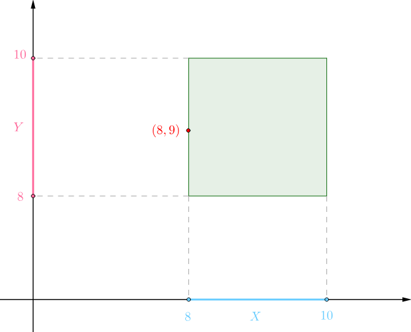
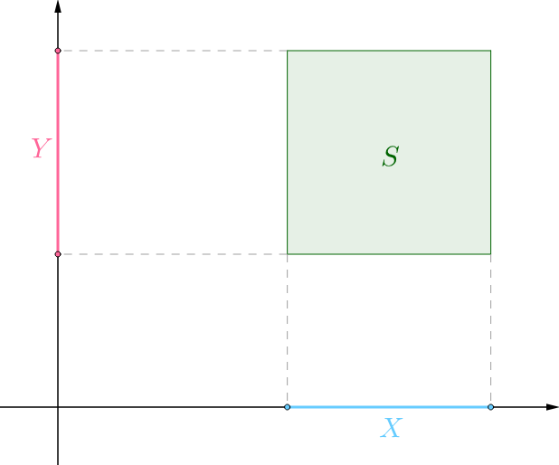
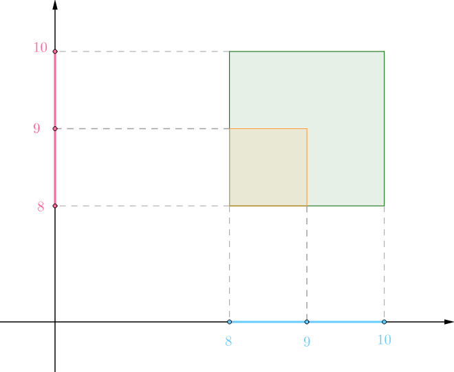
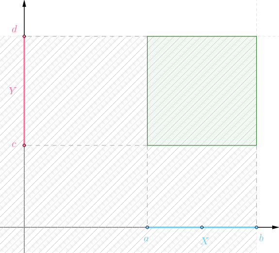
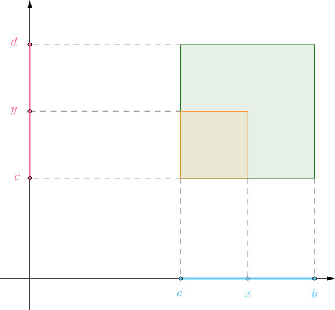

# 多维随机变量

## 多维随机变量的联合概率密度函数
有两个同事早上到达公司的时间分别是随机变量X、Y，都服从均匀分布：
$$
X\sim U(8,10),\quad Y\sim U(8,10)
$$
其中$U(8,10)$表示到达公司的时间为8点到10点之间。如果把这两个随机变量联合起来看就可以知道两个人上班时间的情况，下图中的(8,9)这个点表示的就是一个人在8点钟到且另外一个人在9点到：

两个人上班时间的所有可能性就在上面这个矩形中随机，很显然每个点的概率都是一样的，所以这也是一种均匀分布.
正如单随机变量的均匀分布一样，这里用“概率1”（代表所有的可能性）除以面积就可以得到这两个随机变量联合起来的概率密度，简称联合概率密度：

具体到这个问题而言可以得到如下的联合概率密度函数，这个函数也可以称为`二维均匀分布`：

p(x,y)=
\begin{cases}
    \frac{1}{(10-8)(10-8)}=\frac{1}{4},&x,y\in[8,10]\\
    0,&其它
\end{cases}

### 概率的求解
有了这个联合概率密度函数就方便求：

- 两个人都没有迟到的概率
- 两个人到达公司时间间隔相差不到10分钟
- 其中某人早于另外一个同事到公司的概率

下面来求下两个人都没有迟到的概率吧。假设公司规定9点之前不算迟到的话，那么橙色矩形内的点就表示两人都没有迟到：

这个橙色矩形代表的概率可以通过联合概率密度函数求出：
$$
\begin{aligned}
    P(X\le 9, Y\le 9)
        &=P(X\le 9\ \color{red}{且}\ Y\le 9)\\
        &=\int_{8}^{9}\int_{8}^{9}p(x,y)\mathrm{d}x\mathrm{d}y=\frac{1}{4}
\end{aligned}
$$

### 单点的概率
同样的道理，单点的概率依然为0，比如之前说过的(8,9)点的概率：
$$
P(X=8, Y=9)=\int_{9}^{9}\int_{8}^{8}p(x,y)\mathrm{d}x\mathrm{d}y=0
$$
在这里0依然表示“几乎不可能事件”，而并非“不可能事件”。
### 联合概率密度函数
> 对于某二维随机变量(X,Y)存在二元函数p(x,y)满足：
非负性：
$$
p(x,y)\ge 0
$$
规范性和可加性（连续的都通过积分来相加）：
$$
\int_{-\infty}^{+\infty}\int_{-\infty}^{+\infty}p(x,y)\mathrm{d}x\mathrm{d}y=1
$$
则称此函数为(X,Y)的`联合概率密度函数`（Joint Probability Density Function），此定义可以推广到多维连续随机变量上去。

## 联合累积分布函数
离散随机变量有概率质量函数，连续随机变量有概率密度函数，但它们的累积分布函数定义是相同的：

> 设(X,Y)是二维随机变量，对于任意实数x、y，可以定义一个二元函数来表示两个事件同时发生的概率：
$$
F(x,y)=P\Big(\{X\le x\}\ \color{red}{且}\ \{Y\le y\}\Big)=P(X\le x, Y\le y)
$$
称为二维随机变量(X,Y)的`联合累积分布函数`（Joint Cumulative Distribution Function），如果混合偏导存在的话，那么：
$$
\frac{\partial F(x,y)}{\partial x \partial y}=p(x,y)
$$
得到p(x,y)就是此分布的概率密度函数。此定义和性质可以推广到多维随机变量。

在刚才的二维均匀分布中，F(x,y)的几何意义下面阴影对应的概率：

但因为矩形外概率为0，所以F(x,y)相当于橙色矩形对应的概率：

参考:
马同学
