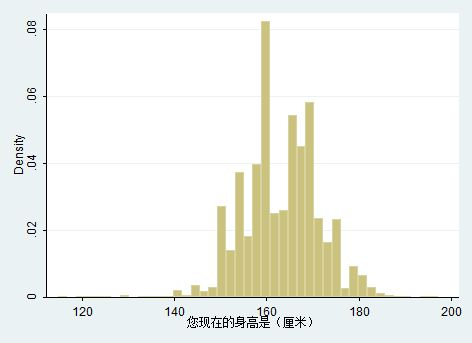
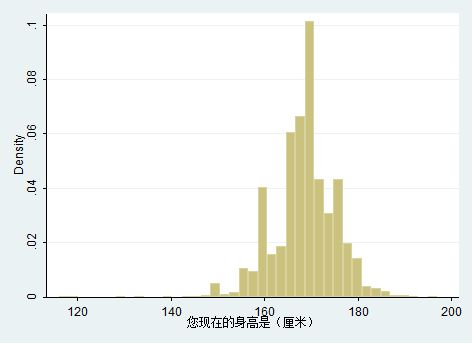
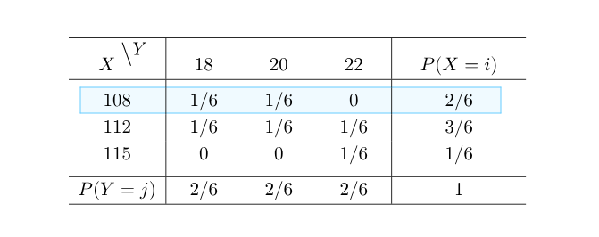

# 条件分布

选择什么交通工具迟到的概率是不一样的, 这称为条件概率。同样的，通过抽查可以得到中国人口的身高分布：

但如果给出不同的条件，比如男性或者女性，会得到不同的分布：

这就称为`条件分布`。

## 离散的条件分布
身高X和体重Y的联合分布为：
$$
\begin{array}{c|c}
    \hline
    \quad X\overset{\LARGE\setminus}{\phantom{.}}\overset{\Large Y}{\phantom{l}} \quad &\quad 18\quad&\quad 20\quad&\quad 22\quad\\
    \hline
    \\
    108 & 1/6 & 1/6 & 0 \\
    112 & 1/6 & 1/6 & 1/6 \\
    115 & 0 & 0 & 1/6 \\
    \\
    \hline
\end{array}
$$
从中可以得到边缘分布$P(X=108)=\frac{2}{6}$：

在身高为X=108的条件下，可以得到条件概率：
$$
P\left(Y=18 | X=108\right)=\frac{P\left(X=108,Y=18\right)}{P\left(X=108\right)}=\frac{1}{2} \\
P\left(Y=20 | X=108\right)=\frac{P\left(X=108,Y=20\right)}{P\left(X=108\right)}=\frac{1}{2} \\
P\left(Y=22 | X=108\right)=\frac{P\left(X=108,Y=22\right)}{P\left(X=108\right)}=0
$$
这些条件概率共同组成了一个条件分布：
$$
\begin{array}{c|c}
    \hline
    \quad k\quad &\quad 18\quad&\quad 20\quad&\quad 22\quad\\
    \hline
    \\
    \quad P(Y=k|X=108)\quad & 1/2 & 1/2 & 0 \\
    \\
    \hline
\end{array}
$$
通过这个分布可以看出，在X=108这个条件下对应的体重是比较轻的。而在X=112条件下，体重分布是比较均匀的：
$$
\begin{array}{c|c}
    \hline
    \quad k\quad &\quad 18\quad&\quad 20\quad&\quad 22\quad\\
    \hline
    \\
    \quad P(Y=k|X=112)\quad & 1/3 & 1/3 & 1/3 \\
    \\
    \hline
\end{array}
$$
这就是条件概率质量函数：

设(X,Y)是二维离散型随机变量，对于固定的j，若$P(Y=y_j)\ge 0$，则称：
$$
P\left(X=x_{i} | Y=y_{j}\right)=\frac{P\left(X=x_{i}, Y=y_{j}\right)}{P\left(Y=y_{j}\right)}, i=1,2, \cdots
$$
为$Y=y_j$条件下的随机变量X的`条件概率质量函数。同样的对于固定的i，若$P(X=x_i)\ge 0$，则称:

$$
P\left(Y=y_{j} | X=x_{i}\right)=\frac{P\left(X=x_{i}, Y=y_{j}\right)}{P\left(X=x_{i}\right)}, j=1,2, \cdots
$$
为$X=x_i$条件下的随机变量Y的`条件概率质量函数`。

## 连续的条件分布
设二维连续型随机变量(X,Y)的概率密度函数为p(x,y)，若对于固定的y有边缘概率密度函数$p_Y(y) > 0$，则：
$$
p_{X|Y}(x\ |\ y)=\frac{p(x,y)}{p_Y(y)}
$$
为Y=y条件下的随机变量X的`条件概率密度函数`。对应的`条件累积分布函数`为：
$$
F_{X|Y}(x\ |\ y)=\int_{-\infty}^{x}\frac{p(u,y)}{p_Y(y)}\mathrm{d}u
$$
同样的道理，以X=x为条件有：
$$
p_{Y|X}(y\ |\ x)=\frac{p(x,y)}{p_X(x)}
$$
$$
F_{Y|X}(y\ |\ x)=\int_{-\infty}^{y}\frac{p(x,u)}{p_X(x)}\mathrm{d}u
$$
