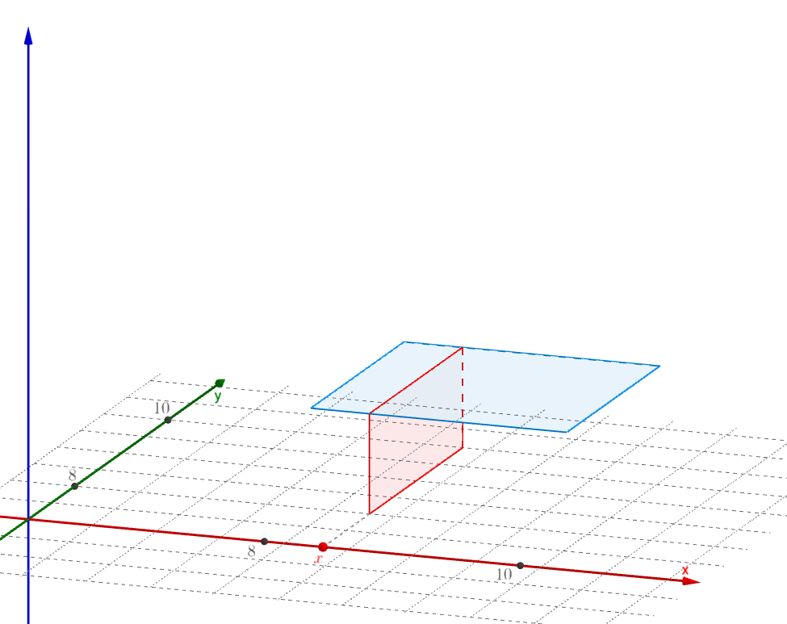

# 边缘分布

## 边缘概率质量函数
有身高X和体重Y的联合分布列：
$$
\begin{array}{c|c}
    \hline
    \quad X\overset{\LARGE\setminus}{\phantom{.}}\overset{\Large Y}{\phantom{l}} \quad &\quad 18\quad&\quad 20\quad&\quad 22\quad\\
    \hline
    \\
    108 & 1/6 & 1/6 & 0 \\
    112 & 1/6 & 1/6 & 1/6 \\
    115 & 0 & 0 & 1/6 \\
    \\
    \hline
\end{array}
$$
该分布列包含了所有的原始信息，只需要对每一行求和就可以还原出X的分布，对每一列求和就可以还原出Y的分布（下图中蓝色的一行相加就得到了P(X=112)，绿色的一列相加就得到了P(Y=20)）：

并且可以验证下所有体重的概率之和为1，满足概率的三大公理，这说明得到的确实为X的概率分布（Y也同理可以验证）：
$$
P(X=108)+P(X=112)+P(X=115)=1
$$

### 全概率
为什么把蓝色的一行相加就可以得到P(X=112)呢？首先，(X,Y)是二维随机变量，意味着这两个随机变量都来自同一个样本空间$\Omega$；其次，事件：
$$
Y=18,\quad Y=20,\quad Y=22
$$

可以看作$\Omega$一个分割，把样本空间$\Omega$割成三块的同时，也把$\Omega$中的事件X=112割成了三块：

那么根据全概率公式可得：
$$
\begin{aligned}
    P(X=112)
        &=P\Big((X=112)\cap(Y=18)\Big)\\
        &\quad +P\Big((X=112)\cap(Y=20)\Big)+P\Big((X=112)\cap(Y=22)\Big)\\
        &=P(X=112, Y=18)+P(X=112, Y=20)+P(X=112, Y=22)
\end{aligned}
$$

### 边缘概率质量函数
> 如果二维离散随机变量(X,Y)的联合概率质量函数为：
$$
P(X=x_i,Y=y_j),i,j=1,2,\cdots
$$
对j求和所得的函数：
$$
\sum_{j=1}^{\infty}P(X=x_i,Y=y_j)=P(X=x_i)
$$
称为X的`边缘概率质量函数`（Marginal Probability Mass Function），或者称为`边缘分布列`。类似的对i求和所得的函数：
$$
\sum_{i=1}^{\infty}P(X=x_i,Y=y_j)=P(Y=y_j)
$$
称为Y的边缘概率质量函数。

## 边缘概率密度函数
之前介绍过两个服从均匀分布的随机变量：
$$
X\sim U(8,10),\quad Y\sim U(8,10)
$$
可以构成二维均匀分布：

它的联合概率密度函数为：
$$
p(x,y)=
\begin{cases}
    \frac{1}{(10-8)(10-8)}=\frac{1}{4},&8\le x,y\le 10\\
    \\
    0,&其它
\end{cases}
$$

这个联合概率密度函数也保留了所有的信息；类似于全概率公式，如果把所有的y加起来（这里y是连续的，所以对y进行积分）：
$$
p(x)=\int_{-\infty}^{+\infty}p(x,y)\mathrm{d}y=
\begin{cases}
    \int_{8}^{10}\frac{1}{4}\mathrm{d}y=\frac{1}{2},&8\le x\le 10\\
    \\
    0,&其它
\end{cases}
$$
那么就还原出了X的分布，也就是X\sim U(8,10)：

更一般的定义:
>如果二维连续随机变量(X,Y)的联合概率密度函数为p(x,y)，则：
$$
p_X(x)=\int_{-\infty}^{+\infty}p(x,y)\mathrm{d}y
$$
称为X的边缘概率密度函数（Marginal Probability Density Function）。类似的：
$$
p_Y(y)=\int_{-\infty}^{+\infty}p(x,y)\mathrm{d}x
$$
称为Y的边缘概率密度函数。

## 积分的几何意义
如下两个随机变量：
$$
X\sim U(8,10),\quad Y\sim U(8,10)
$$
之前用下图表示它们构成的二维均匀分布：

### 概率密度函数
刚才介绍的二维均匀分布的概率密度函数是：
$$
p(x,y)=
\begin{cases}
   \frac{1}{4},&8\le x,y\le 10\\
    \\
    0,&其它
\end{cases}
$$
这是一个二元函数，图像是空间中的一个矩形：

对x、y积分就是该矩形下的立方体的体积：

这个立方体底面积为$2\times 2=4$，高为$\frac{1}{4}$，所以体积为：
$$
\begin{aligned}
    \int_{-\infty}^{+\infty}\int_{-\infty}^{+\infty}p(x,y)\mathrm{d}x\mathrm{d}y
        &=\int_{8}^{10}\int_{8}^{10}\frac{1}{4}\mathrm{d}x\mathrm{d}y\\
        &=4\times\frac{1}{4}=1
\end{aligned}
$$

### 边缘概率密度函数
边缘概率密度就是对其中某一个自变量求积分，比如说对y求积分吧，那么可以把x看作固定的，沿着y进行积分，得到的就是如下切面的面积：

这个切面边长为2，高为$\frac{1}{4}$，所以面积为：
$$
\begin{aligned}
    \int_{-\infty}^{+\infty}p(x,y)\mathrm{d}y
        &=\int_{8}^{10}\frac{1}{4}\mathrm{d}y\\
        &=2\times\frac{1}{4}=\frac{1}{2}
\end{aligned}
$$

## 边缘累积分布函数
>如果二维连续随机变量(X,Y)的联合累积分布函数为F(x,y)，如下可以得到X的累积分布函数：
$$
F_X(x)=\lim_{y\to+\infty}F(x,y)=P(X\le x,Y < +\infty)=P(X\le x)
$$
称为X的`边缘累积分布函数`（Marginal Cumulative Distribution Function）。可记作：
$$
F_X(x)=F(x,+\infty)
$$
同理可以得到Y的边缘累积分布函数：
$$
F_Y(y)=F(+\infty, y)
$$

## 随机变量的独立性

参考:
马同学