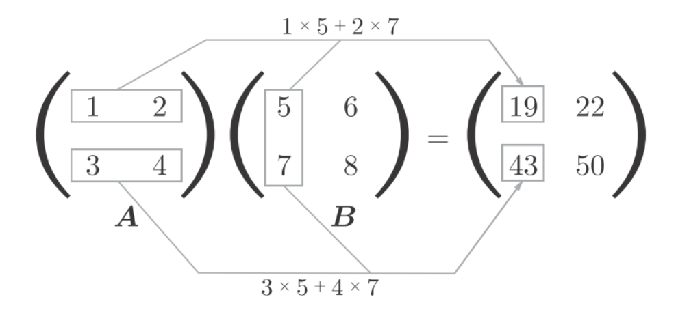
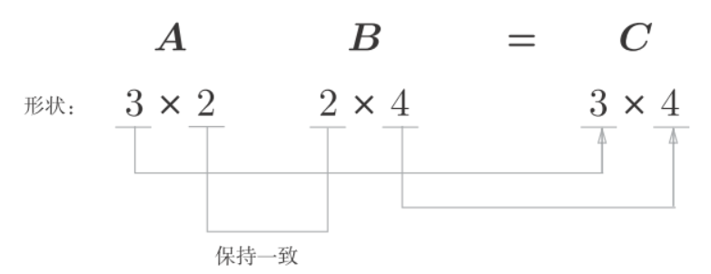

# dot


## 矩阵乘法

矩阵的乘积是通过左边矩阵的行（横向）和右边矩阵的列（纵向）以**对应元素**的方式相**乘**后再求**和**而得到的。
结果中, $A$决定了行, $B$决定了列。


python实现
```python
A = np.array([[1,2], [3,4]])
A.shape
B = np.array([[5,6], [7,8]])
B.shape
np.dot(A, B)

## array([[19, 22],
##        [43, 50]])
```


注意$A$的列数要与$B$的行数保持一致


python实现
```python
A = np.array([[1,2], [3,4], [5,6]])
B = np.array([[1,2], [3,4], [5,6],[7,8]])
np.dot(A, B)
```


## 直觉理解(intuition)
$A$ 行数可以看成有多少条数据, 每一行可以看成一条数据. 列数可以看成每条数据有多少个特征.
$B$ 行数可以看成特征对应的权重个数, 列数可以看成有多少组权重, 每一列可以看成一组权重