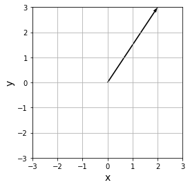
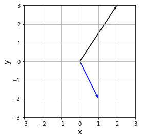
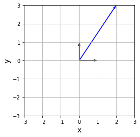

# linear


## 标量,向量,矩阵和张量
### 标量
标量(scalar)就是像1,3,-4等正常的数字, 一般用小写字母和希腊字母表示. $a,b,\alpha,\beta$
向量(vector)是将标量排列在直线上的产物.
$$
\vec{a}=\begin{pmatrix}
    1 \\ 2 \\3
\end{pmatrix}
\\
\vec{b} = (1,2,3)
$$
向量包含垂直排列数值的垂直向量, 如$\vec{a}$. 和水平排列数值的水平向量, 如$\vec{b}$.

```python
import numpy as np
a = np.array([1, 2, 3])  # 用一维数组表示向量
print(a)
```

### 矩阵
行数为从顶部开始的第一行, 第二行, ... . 列数为从左数第一列, 第二列, ... .m行n列矩阵表示为$m \times n$矩阵. 垂直向量可以被认为是列数为1的矩阵, 水平向量可以认为是行数为1的矩阵. 矩阵表示方法如下, A是$3 \times 2$ 矩阵:
$$
A = \begin{pmatrix}
    0 & 1 & 2 \\
    3 & 4 & 5
\end{pmatrix}
$$

```python
import numpy as np

a = np.array([[1, 2, 3],
              [4, 5, 6]])  # 2×3矩阵
print(a)
```

### 张量
张量是在多个维度中排列的标量, 其中包含标量,向量和矩阵. 每个元素的的下标的数量被称为张量的阶数. 标量没有下标 ,因此它是0阶张量, 向量有1个下标, 因此为1阶张量, 矩阵有2个下标, 因此为2阶张量.

```python
## 三阶张量
import numpy as np

a = np.array([[[0, 1, 2, 3],
                      [2, 3, 4, 5],
                      [4, 5, 6, 7]],
              
                     [[1, 2, 3, 4],
                      [3, 4, 5, 6],
                      [5, 6, 7, 8]]])  # (2,3,4)的3阶张量
print(a)
```


## 向量的点积和范数
### 点积
点积是向量之间乘积的一种, 如:
$$
\vec{a} = (a_1,a_2,...,a_n) \\
\vec{b} = (b_1,b_2,...,b_n)
$$
则$\vec{a} \cdot \vec{b}$表示为:
$$
\begin{align*}
    \vec{a} \cdot \vec{b} =& (a_1,...,a_n) \cdot (b_1,...,b_n)  \\
    =& (a_1b_1+...+a_nb_n)  \\
    =& \sum_{k=1}^na_kb_k
\end{align*}
$$

```python
import numpy as np

a = np.array([1, 2, 3])
b = np.array([3, 2, 1])

print("--- dot()函数 ---")
print(np.dot(a, b))  # dot()所计算出的点积
print("--- 积的总和 ---")
print(np.sum(a * b))  # 用积的总和计算出点积
```

### 范数
范数是表示向量大小的量. 机器学习中常用的范数有$L_1$和$L_2$范数.
1. $L_1$范数
$$
||\vec{x}||_1=|x_1|+|x_2|+...+|x_n|=\sum_{k=1}^n|x_k|
$$
2. $L_2$范数
$$
||\vec{x}||_2=\sqrt{x_1^2+...+x_n^2}=\sqrt{\sum_{k=1}^nx_k^2}
$$
3. $L_n$范数
$$
||\vec{x}||_n=\sqrt[n]{|x_1|^n+...+|x_n|^n}=\sqrt[n]{\sum_{k=1}^n|x_k|^n}
$$

```python
import numpy as np

a = np.array([1, 1, -1, -1])

print("--- L2范数---")
print(np.linalg.norm(a))  # L2范数（默认）
print("--- L1范数 ---")
print(np.linalg.norm(a, 1))  # L1范数
```

## 矩阵的积
计算矩阵乘积时, 将前一矩阵中行的各个元素和后一矩阵中列的各个元素相乘, 求和并作为新矩阵的元素.
$A$是$2 \times 3$的矩阵, $B$是$3 \times 2$的矩阵.则:
$$
\begin{align*}
    AB=&\begin{pmatrix}
        a_{11},a_{12},a_{13} \\
        a_{21},a_{22},a_{23}
    \end{pmatrix}
    \begin{pmatrix}
        b_{11},b_{12} \\
        b_{21},b_{22} \\
        b_{31},b_{32} 
    \end{pmatrix} \\
    =&\begin{pmatrix}
        a_{11}b_{11}+a_{12}b_{21}+a_{13}b_{31}, a_{11}b_{12}+a_{12}b_{22}+a_{13}b_{32} \\
        a_{21}b_{11}+a_{22}b_{21}+a_{23}b_{31}, a_{21}b_{12}+a_{22}b_{22}+a_{23}b_{32}
    \end{pmatrix} \\
    =&\begin{pmatrix}
        \sum_{k=1}^3a_{1k}b_{k1}, \sum_{k=1}^3a_{1k}b_{k2} \\
        \sum_{k=1}^3a_{2k}b_{k1}, \sum_{k=1}^3a_{2k}b_{k2}
    \end{pmatrix}
\end{align*}
$$

```python
import numpy as np

a = np.array([[0, 1, 2],
              [1, 2, 3]]) 

b = np.array([[2, 1],
              [2, 1],
              [2, 1]]) 

print(np.dot(a, b))
```

### 各元素的积(哈达玛积)
矩阵中每个元素的乘积也被称为哈达玛积.
```python
import numpy as np

a = np.array([[0, 1, 2],
              [3, 4, 5],
              [6, 7, 8]]) 

b = np.array([[0, 1, 2],
              [2, 0, 1],
              [1, 2, 0]]) 

print(a*b)
```

### 转置
交换矩阵的行和列.
$$
A=
\begin{pmatrix}
    1 & 2 & 3 \\
    4 & 5 & 6
\end{pmatrix} \\
A^T=
\begin{pmatrix}
    1 & 4 \\
    2 & 5 \\
    3 & 6 \\
\end{pmatrix}
$$

```python
import numpy as np

a = np.array([[1, 2, 3],
              [4, 5, 6]])  # 矩阵

print(a.T)  # 转置
```

转置后进行矩阵乘积计算
```python
import numpy as np

a = np.array([[0, 1, 2],
             [1, 2, 3]])  # 2×3矩阵
b = np.array([[0, 1, 2],
             [1, 2, 3]])  #2×3矩阵,这种形态下无法计算矩阵乘积

## print(np.dot(a, b))  # 不转置而求矩阵乘积时会报错
print(np.dot(a, b.T))  # 转置后可以计算矩阵乘积
```

## 行列式与逆矩阵
使用行列式计算出矩阵的逆. 使用矩阵的逆, 对矩阵的方程式进行求解.

### 单位矩阵
行数和列数相等, 从左上角到右下角的元素为1, 其余元素为0.
单位矩阵的特征是, 使用矩阵乘积在矩阵的前后进行相乘, 不会使该矩阵发生变化. 如下, $E$表示一个$2 \times 2$ 的单位矩阵, $A$是$2 \times 2$的矩阵, 他们相乘, 矩阵$A$不会改变:
$$
E = \begin{pmatrix}
    1 & 0 \\
    0 & 1
\end{pmatrix} \\
A = \begin{pmatrix}
    a & b \\
    c & d
\end{pmatrix} \\
A \cdot E = E \cdot A = \begin{pmatrix}
    a & b \\
    c & d
\end{pmatrix}
$$
代码实现单位矩阵:
```python
import numpy as np

print(np.eye(2))  # 2×2的单位矩阵
print()
print(np.eye(3))  # 3×3的单位矩阵
print()
print(np.eye(4))  # 4×4的单位矩阵
```

### 逆矩阵
一个数值乘以其倒数将得到1:
$$
3 \times \frac{1}{3} = 1 \\
21 \times \frac{1}{21} =1
$$
与标量相同, 矩阵中同样存在可以令某个矩阵相乘后得到单位矩阵的概念. 这样的矩阵被称为逆矩阵.
如果将$A$的逆矩阵表示为$A^{-1}$, 那么$A$和$A^{-1}$的关系如下:
$$
A^{-1} \cdot A = A \cdot A^{-1} = E
$$
如:
$$
C=\begin{pmatrix}
    1 & 1 \\
    1 & 2
\end{pmatrix}
D=\begin{pmatrix}
    2 & -1 \\
    -1 & 1
\end{pmatrix} \\
CD = DC = \begin{pmatrix}
    1 & 0 \\
    0 & 1
\end{pmatrix}
$$

### 行列式
行列式可以用来确定某个矩阵是否存在逆矩阵.
观察下面的矩阵$A$:
$$
A=\begin{pmatrix}
    a & b \\
    c & d
\end{pmatrix}
$$
用$|A|$或者 $det A$代表行列式, 它的公式如下:
$$
|A|=det A = ad-bc
$$
如果行列式为0, 则该矩阵不存在逆矩阵.如果不为零, 则它的逆矩阵为:
$$
A^{-1}=\frac{1}{ad-bc}\begin{pmatrix}
    d & -b \\
    -c & a
\end{pmatrix}
$$
python计算行列式:
```python
import numpy as np

a = np.array([[1, 2],
              [3, 4]])
print(np.linalg.det(a))  # 行列式不为0的情况

b = np.array([[1, 2],
              [0, 0]])
print(np.linalg.det(b))  # 行列式为0的情况
```
python求逆矩阵
```python
import numpy as np

a = np.array([[1, 2],
              [3, 4]])
print(np.linalg.inv(a))  # 逆矩阵

b = np.array([[1, 2],
              [0, 0]])
## print(np.linalg.inv(b))  #  由于不存在逆矩阵，因此会出现错误
```

## 线性变换
使用线性变换来转换向量, 线性变换通常用于神经网络的传播信息.

### 绘制矢量
用箭头绘制下面的垂直向量:
$$
\vec{a} = \begin{pmatrix}
    2 \\
    3
\end{pmatrix}
$$
要绘制箭头, 可以使用`matplotlib.pyplot`中的`quiver()`函数.
```python
import numpy as np
import matplotlib.pyplot as plt

## 绘制箭头的函数
def arrow(start, size, color):
    plt.quiver(start[0], start[1], size[0], size[1], angles="xy", scale_units="xy", scale=1, color=color)

## 箭头的起点
s = np.array([0, 0])  # 原点

## 向量
a = np.array([2, 3])  # 显示垂直向量

arrow(s, a, color="black")

## 用图表进行显示
plt.xlim([-3,3])  # x的显示范围
plt.ylim([-3,3])  # y的显示范围
plt.xlabel("x", size=14)
plt.ylabel("y", size=14)
plt.grid()
plt.axes().set_aspect("equal")  # 令纵横比一致
plt.show()
```



### 线性变换
观察下面的矩阵$A$.
$$
A=\begin{pmatrix}
    2 & -1 \\
    2 & -2
\end{pmatrix}
$$
可以通过矩阵A与垂直向量$\vec{a}$相乘来转换向量:
$$
\vec{b} = A\vec{a} =\begin{pmatrix}
    2 & -1 \\
    2 & -2
\end{pmatrix}
\begin{pmatrix}
    2 \\
    3
\end{pmatrix} = 
\begin{pmatrix}
    1 \\
    2
\end{pmatrix}
$$
利用矩阵$A$将向量$\vec{a}$转换成了$\vec{b}$.这种向量到向量的转换被称为线性变换.

下图, 用箭头绘制出变换前的$\vec{a}$, 和变换后的$\vec{b}$的图像.
```python
import numpy as np
import matplotlib.pyplot as plt

a = np.array([2, 3])  # 变换前的向量

A = np.array([[2, -1],
                     [2, -2]])

b = np.dot(A, a)  # 线性变换

print("变换前的向量（a）:", a)
print("变换后的向量（b）:", b)
      
def arrow(start, size, color):
    plt.quiver(start[0], start[1], size[0], size[1], angles="xy", scale_units="xy", scale=1, color=color)

s = np.array([0, 0])  # 原点

arrow(s, a, color="black")
arrow(s, b, color="blue")

#显示图表
plt.xlim([-3,3])  # x的显示范围
plt.ylim([-3,3])  # y的显示范围
plt.xlabel("x", size=14)
plt.ylabel("y", size=14)
plt.grid()
plt.axes().set_aspect("equal")  # 令纵横比一致
plt.show()
```

利用矩阵$A$, 把黑色箭头表示的$\vec{a}$, 变换成了用蓝色箭头表示的$\vec{b}$.

### 标准基底
下面的$\vec{e}_x,\vec{e}_y$被称为标准基底:
$$
\vec{e}_x = \begin{pmatrix}
    1 \\
    0
\end{pmatrix} \\
\vec{e}_y = \begin{pmatrix}
    0 \\
    1
\end{pmatrix}
$$
此时, $\vec{a}$可以表示如下:
$$
\vec{a}=\begin{pmatrix}
    2 \\
    3
\end{pmatrix} =2 \begin{pmatrix}
    1 \\
    0
\end{pmatrix} + 3\begin{pmatrix}
    0 \\
    1
\end{pmatrix} = 2\vec{e}_x + 3\vec{e}_y
$$
绘制向量与标准基底的图像:
```python
import numpy as np
import matplotlib.pyplot as plt

a = np.array([2, 3])
e_x = np.array([1, 0])  # 标准基底
e_y = np.array([0, 1])  # 标准基底

print("a:", a)
print("e_x:", e_x)
print("e_y:", e_y)
      
def arrow(start, size, color):
    plt.quiver(start[0], start[1], size[0], size[1], angles="xy", scale_units="xy", scale=1, color=color)

s = np.array([0, 0])  # 原点

arrow(s, a, color="blue")
arrow(s, e_x, color="black")
arrow(s, e_y, color="black")

## 显示图表
plt.xlim([-3,3])  # x的显示范围
plt.ylim([-3,3])  # y的显示范围
plt.xlabel("x", size=14)
plt.ylabel("y", size=14)
plt.grid()
plt.axes().set_aspect("equal")  # 令纵横比一致
plt.show()
```

蓝色箭头的向量, 是通过将黑色向量的标准基底与常量相乘并将积求和后表示得出来的.


## 特征值和特征向量
在机器学习中, 特征值和特征向量被用于汇总数据的主成分分析方法中.


### 特征值和特征向量
矩阵$A$中, 满足以下关系的变量$\lambda$被称为矩阵$A$的特征值, $\vec{x}$则被称为矩阵$A$的特征向量:
$$
A\vec{x} = \lambda\vec{x}
$$
从公式可以看出, 特征向量是通过线性变换将每个元素与特征值相乘得到的向量.
接下来, 观察单位矩阵:
$$
E = \begin{pmatrix}
    1 & 0 \\
    0 & 1
\end{pmatrix}
$$
由于向量与单位矩阵相乘之后并不会发生变化, 因此可以得:
$$
A\vec{x} = \lambda E \vec{x}
$$
继续可得:
$$
(A-\lambda E)\vec{x} = \vec{0}
$$
假设$(A-\lambda E)$有逆矩阵, 两边均乘以$(A-\lambda E)^-1$可得:
$$
\vec{x} = (A-\lambda E)^{-1}\vec{0}=\vec{0}
$$
如果$(A-\lambda E)$没有逆矩阵, 此时满足:
$$
det(A-\lambda E)=0
$$
这个方程称为$A$的特征方程.

### 求特征值和特征向量
下面计算矩阵$A$的特征值:
$$
A=\begin{pmatrix}
    3 & 1 \\
    2 & 4
\end{pmatrix}
$$
可以使用特征方程求得$A$的特征值:
$$
det (A-\lambda E) =0
$$
解得$\lambda=2$或$\lambda =5$.
在$\lambda=2$的情况下, 假设$\vec{x}$:
$$
\vec{x} = \begin{pmatrix}
    p \\
    q
\end{pmatrix}
$$
由$(A-\lambda E)\vec{x} = \vec{0}$可以计算出特征向量:
$$
\vec{x} = \begin{pmatrix}
    t \\
    -t
\end{pmatrix}
$$
其中$t$是任意实数. 同理可以计算出$\lambda =5$时的特征向量:
$$
\vec{x} = \begin{pmatrix}
    t \\
    2t
\end{pmatrix}
$$
使用python计算特征值和特征向量:
```python
import numpy as np

a = np.array([[3, 1],
              [2, 4]])

ev = np.linalg.eig(a)  # 同时计算特征值和特征向量

print(ev[0])  # 最初的元素为特征值

print()

print(ev[1])  # 接下来的元素为特征向量
```


## 余弦相似度
余弦相似度用来表示向量方向的接近程度.
观察下面两个元素为2的向量:
$$
\vec{a} = (a_1,a_2) \\
\vec{b} = (b_1,b_2)
$$
则点积公式为:
$$
\vec{a}\cdot\vec{b} = a_1b_1 + a_2b_2
$$
另外点积还可以表示成三角函数和$L_2$范数:
$$
\vec{a}\cdot\vec{b} = \sqrt{a_1^2+a_2^2}\sqrt{b_1^2+b_2^2} cos\theta
$$
则有:
$$
cos\theta = \frac{a_1b_1+a_2b_2}{\sqrt{a_1^2+a_2^2}+\sqrt{b_1^2+b_2^2}}
$$
当向量之间的角度为0时, $cos\theta$的值为最大值, 当角度$\theta$变大时, $cos\theta$的值变小. 因此$cos\theta$表示的是两个向量方向的对齐程度.
在机器学习中, 经常用向量来表示单词, 余弦相似度用于表示这些单词之间的关系.
```python
import numpy as np

def cos_sim(vec_1, vec_2):
    return np.dot(vec_1, vec_2) / (np.linalg.norm(vec_1) * np.linalg.norm(vec_2))  

a = np.array([2, 2, 2, 2])
b = np.array([1, 1, 1, 1])  # 与a方向相同
c = np.array([-1, -1, -1, -1])  # 与a方向相反

print("--- a与b的余弦相似度 ----")
print(cos_sim(a, b))

print("---  a与c的余弦相似度 ----")
print(cos_sim(a, c))
```


