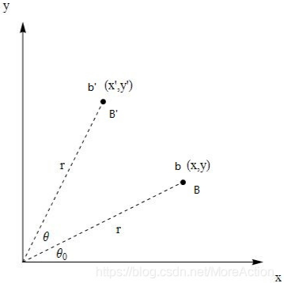

# 变换

“变换”本质上就是函数，不过我们狭义认为的函数接收和输出都是一个数，这个数位于实数空间中，$x \in R$. 如果输入和输出不止是一个数，往往是多元的，这些数组织起来我们称为向量，从一个向量作用到另一个向量的这个过程，我们就称为“变换”，它接收的是一个向量，而向量位于高维空间中，$x \in R^n$.

对于函数，我们有一个具体的函数体$f(x)$。对于变换，是通过矩阵来实现类似函数的功能。要对一个输入向量$x$, $x \in R^n$, 那么就对其左乘一个矩阵$A$, 于是变换就定义为$y=Ax$.

左乘一个矩阵就代表对右边的向量做一次变换，向量代表的是一条有方向的直线，变换的结果其实就是对这条直线进行各种运动，包括：平移、旋转、伸缩、投影（高维到低维）、映射等，其中，映射是对一个向量作升维或降维（也可以在同一空间中）的操作 $R^n$→$R^m$，所以广义上，映射的意思等同于变换.

`线性变换`保证了输入的直线(向量)在变换过程中不会产生弯曲，即输入是直线，输出也是直线。因为 矩阵变换都是线性变换，所以我们这里说的`变换`其实就是`线性变换`。

举例: 将直线OB $\begin{bmatrix} x \\ y \end{bmatrix}$, 逆时针旋转$\theta$,  变换到直线OB' $\begin{bmatrix} x' \\ y' \end{bmatrix}$, 如何求变换矩阵$A$? 也即$\begin{bmatrix} x' \\ y' \end{bmatrix}=A\begin{bmatrix} x \\ y \end{bmatrix}$.

根据几何知识可知:

$$
\frac{x'}{r} = cos(\theta_0 + \theta) = cos\theta_0cos\theta -sin\theta_0sin\theta = \frac{x}{r}cos\theta - \frac{y}{r}sin\theta \\
\frac{y'}{r} = sin(\theta_0 + \theta) = sin\theta_0cos\theta + cos\theta_0sin\theta = \frac{y}{r}cos\theta + \frac{x}{r}sin\theta

$$

整理得到:

$$
x' = xcos\theta - ysin\theta \\
y' = xsin\theta - ycos\theta
$$

把该式改成矩阵的形式:

$$
\begin{bmatrix} x' \\ y' \end{bmatrix} = \begin{bmatrix} cos\theta & -sin\theta \\ sin\theta & cos\theta \end{bmatrix} \begin{bmatrix} x \\ y \end{bmatrix} 
$$

所以变换矩阵$A$就是
$$
A = \begin{bmatrix} cos\theta & -sin\theta \\ sin\theta & cos\theta \end{bmatrix}
$$

如果二维空间中有许多点同时进行变化, 只需要将他们一次并列起来:

$$
\begin{bmatrix} x'_1 & x'_2 & ...\\ y'_1 & y'_2 & ... \end{bmatrix} = \begin{bmatrix} cos\theta & -sin\theta \\ sin\theta & cos\theta \end{bmatrix} \begin{bmatrix} x_1 & x_2 & ...\\ y_1 & y_2 & ... \end{bmatrix} 
$$

## 参考
- [通俗易懂的理解正交变换和正交矩阵](https://blog.csdn.net/MoreAction_/article/details/105442932)
- [Linear_Transformations](https://math.libretexts.org/Bookshelves/Linear_Algebra/A_First_Course_in_Linear_Algebra_(Kuttler)/05%3A_Linear_Transformations/5.01%3A_Linear_Transformations)