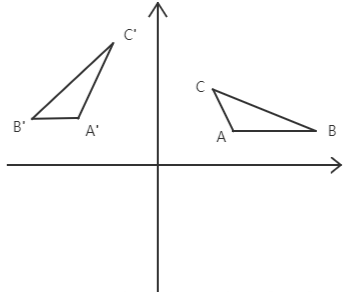

在各种变换中，有一种变换拥有良好的特性——它能使变换后的向量长度，向量之间的内积、距离、夹角等很多性质都不变，这种变换，我们称为正交变换，用于实施这种变换的矩阵，我们称为正交矩阵，这种变换的特性，我们称为正交变换的不变性。

假如有m个向量，我们把向量都看作点，那么这m点就会构成一个具有一定几何结构的空间（图形），我们对这m个点进行正交变换，其结果直观来说就是，正交变换不会对图形进行拉伸、压缩，它能够使变换后的图形保持原来图形的几何形状，如下图所示，ABC构成的空间正交变换到A'B'C'，其大小和形状都不会改变

## 正交矩阵

正交变换拥有良好的性质——能够保持空间的不变性，保证不会对原空间产生压缩拉伸，往深了说，就是这种变换不会损失信息，因为它保持了原空间的内部结构，这在工程上是很有用的。

如果矩阵$A$满足：$AA^T = A^TA=E$则$A$为正交矩阵.

由上述定义，我们可以很容易得到正交矩阵的如下性质：

- $A^T = A^{-1}$
- 等式两边取行列式, 可以得到$|A| = \pm 1$
- 列（行）两两相乘相同为1，不同为0（与自身转置乘的意义），可以得到$A$的各列（行）都是单位向量且两两正交

证明正交变换的不变性:
- 向量内积不变, 正交变换$Ax$和$Ay$的内积，有：$(Ax)^TAy = x^TA^TAy=x^Ty$
- 向量长度不变, 对于正交变换$y=Ax$ 的长度：$|y|=\sqrt{y^Ty}=\sqrt{(Ax)^TAx}=\sqrt{x^TA^TAx}=\sqrt{x^Tx}=|x|$
- 同理，对于向量间的夹角，由于长度和内积不变，所以夹角不变
- 同理，还可证得向量间的距离不变

## 参考
- [通俗易懂的理解正交变换和正交矩阵](https://blog.csdn.net/MoreAction_/article/details/105442932)