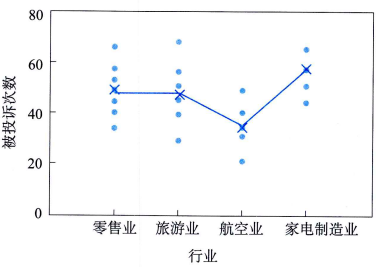
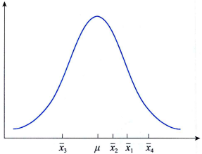
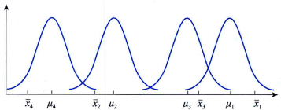

# 方差分析(analysis of variance, ANOVA)引论

设4个总体的均值分别为$\mu_1, \mu_2, \mu_3, \mu_4$，如果用一般假设检验方法，如$t$检验，一次只能研究两个样本，要检验4个总体的均值是否相等，需要作6次检验$C_4^2$。

如果$\alpha = 0.05$，即每次检验犯第I类错误的概率都是0.05，连续作6次检验犯第I类错误的概率为$1一(1一\alpha)5=0.265$,而置信水平则会降低到0.735(即0.95)。

方差分析方法则是同时考虑所有的样本，因此排除了错误累积的概率，从而避免拒绝一个真实的原假设。

表面上看，方差分析是检验多个总体均值是否相等的统计方法，但本质上它所研究的是分类型自变量对数值型因变量的影响，如，变量之间有没有关系，关系的强度如何等。方差分析(analysis of variance,ANOVA)就是通过检验各总体的均值是否相等来判断分类型自变量对数值型因变量是否有显著影响。

## 基本概念
案例:

消费者协会在零售业抽取7家，旅游业抽取6家，航空业抽取5家，家电制造业抽取5家。假定它们在服务对象、服务内容、企业规模等方面基本上是相同的。然后统计出最近一年中消费者对这23家企业投诉的次数，结果如表所示: 

零售业|旅游业|航空业|加点制造业
--|--|--|--
57|68|31|44
66|39|49|51
49|29|21|65
40|45|34|77
34|56|40|58
53|51
44

消货者协会想知道这几个行业之间的服务质量是否有显著差异。

要分析四个行业之间的服务质量是否有显著差异，实际上也就是要判断行业对被投诉次数是否有显著影响，作出这种判断最终被归结为检验这四个行业被投诉次数的均值是否相等。

- 如果它们的均值相等，就意味着行业对被授诉次数是没有影响的，也就是它们之间的服务质量没有显著差异；
- 如果均值不全相等，则意味着行业对被投诉次数是有影响的，它们之间的服务质量有显著差异。

在方差分析中，所要检验的对象称为`因素或因子(factor)`。`因素的不同表现称为水平或处理(treatment)`。在每个因子水平下得到的样本数据称为`观测值`。如，在案例中，要分析行业对被投诉次数是否有显著影响。

- 这里的`行业`是要检验的对象，称为`因素或因子`；
- `零售业、旅游业、航空业、家电制造业`是行业这一因素的具体表现，称为`水平`或处理；
- 在每个行业下得到的样本数据（`被投诉次数`）称为`观测值`。

由于这里只涉及行业一个因素，因此称为`单因素4水平`的试验。因素的每一个水平可以看作一个`总体`，如零售业、旅游业、航空业、家电制造业可以看作4个总体，上面的数据可以看作从这4个总体中抽取的样本数据。

在只有一个因素的方差分析（称为单因素方差分析）中，涉及两个变量：一个是分类型自变量，一个是数值型因变量。如，在上面的例子中，要研究行业对被投诉次数是否有影响，

- 这里的`行业就是自变量`，它是一个`分类型变量`，零售业、旅游业、航空业、家电制造业就是行业这个自变量的具体取值
- `被投诉次数是因变量`，它是一个`数值型变量`，不同的被投诉次数就是因变量的取值。
  
方差分析要研究的就是行业对被投诉次数是否有显著影响。

## 方差分析原理

从散点图可以看出，不同行业被投诉的次数有明显差异，而且，即使是在同一个行业，不同企业被投诉的次数也明显不同。从图中可以看出，家电制造业被投诉的次数较多，而航空公司被投诉的次数较少。这表明行业与被投诉次数之间有一定的关系。

### SSE, SSA, SST

- 首先，注意到在同一行业（同一个总体）中，样本的各观测值是不同的。如，在零售业中，所抽取的7家企业之间被投诉次数是不同的。由于企业是随机抽取的，因此它们之间的差异可以看成是随机因素的影响造成的，或者说是由`抽样的随机性造成的随机误差(random error)`。这种来自水平内部的数据误差也称为`组内误差`。如，零售业中所抽取的7家企业被投诉次数之间的误差就是组内误差，它反映了一个样本内部数据的离散程度。显然，组内误差只含有随机误差。

    误差平方和或残差平方和, SSE(Sum of squares for error): 反映组内误差大小的平方和称为组内平方和. 如，每个样本内部的数据平方和加在一起就是组内平方和，它反映了每个样本内各观测值的离散状况。SSE = randomError
    

- 其次，不同行业（不同总体）的观测值也是不同的。不同水平之间的数据误差称为组间误差。这种差异可能是由抽样本身形成的随机误差，也可能是由行业本身的系统性因素造成的系统误差。因此，`组间误差是随机误差和系统误差(system error)的总和`。如，4个行业被投诉次数之间的误差就是组间误差，它反映了不同样本之间数据的离散程度。

    组间平方和，也称因素平方和，SSA(Sum of squares for factor A): 反映组间误差大小的平方和. 如，4个行业被投诉次数之间的误差平方和就是组间平方和，它反映了样本均值之间的差异程度。SSA = randomError + systemError

- 总平方和, SST(Sum of Squares for total): 反映全部数据误差大小的平方和称为。如，所抽取的全部23家企业被投诉次数之间的误差平方和就是总平方和，它反映了全部观测值的离散状况。

### 方差分析原理
如果不同行业对被投诉次数没有影响，那么在组间误差中只包含随机误差，而没有系统误差。而组内误差只包含随机误差, 所以这时，组间误差与组内误差经过平均后的数值（称为均方或方差）就应该很接近，它们的比值就会接近1。

反之，如果不同行业对被投诉次数有影响，则组间误差中除了包含随机误差，还会包含系统误差，这时组间误差平均后的数值就会大于组内误差平均后的数值，它们之间的比值就会大于1。当这个比值大到某种程度时，就认为因素的不同水平之间存在显著差异，也就是自变量对因变量有显著影响。

因此，判断行业对被投诉次数是否有显著影响这一问题，实际上也就是检验被投诉次数的差异主要是由什么原因引起的。如果这种差异主要是系统误差，就认为不同行业对被投诉次数有显著影响。在方差分析的假定前提下（见下面的介绍），要检验行业（分类型自变量）对被投诉次数（数值型因变量）是否有显著影响，在形式上也就转化为检验4个行业被投诉次数的均值是否相等。

## 方差分析的基本假定

方差分析中有三个基本假定：
- 每个总体都应服从正态分布。也就是说，对于因素的每一个水平，其观测值是来自正态分布总体的简单随机样本。如，要求每个行业被投诉次数必须服从正态分布。
- 各个总体的方差$\sigma^2$必须相同。也就是说，各组观察数据是从具有相同方差的正态总体中抽取的。如，要求每个行业被投诉次数的方差都相同。
- 观测值是独立的。如，要求每个被抽中的企业被投诉次数都与其他企业被投诉次数相互独立。

在上述假定成立的前提下，要分析自变量对因变量是否有影响，在形式上也就转化为检验自变量的各个水平（总体）的均值是否相等。如，判断行业对被投诉次数是否有显著影响，实际上也就是检验具有相同方差的4个正态总体的均值（被投诉次数的均值）是否相等。

尽管不知道4个总体的均值，但可以使用样本数据来检验它们是否相等。如果4个总体的均值相等，可以期望4个样本的均值也会很接近。事实上，4个样本的均值越接近，推断4个总体均值相等的证据也就越充分；反之，样本均值越不同，推断总体均值不同的证据就越充分。换句话说，样本均值变动越小，越支持$H_0$；样本均值变动越大，越支持$H1$。如果原假设$H_0: \mu_1=\mu_2=\mu_3=\mu_4$（4个行业被投诉次数的均值相同）为真，则意味着每个样本都来自均值为以、方差为$\sigma^2$的同一个正态总体。由样本均值的抽样分布可知，来自正态总体的一个简单随机样本的样本均值$\overline{x}$服从均值为$\mu$、方差为$\sigma^2/n$的正态分布，如下图所示:

如果$\mu_1, \mu_2, \mu_3, \mu_4$完全不同，则意味着4个样本分别来自均值不同的4个正态总体，因此有4个不同的抽样分布，如下图所示。在这种情况下，各样本均值就不像$H_0$为真时那样接近了。

## 假设检验提法
设因素有k个水平，每个水平的均值分别用$\mu_1, \mu_2, \mu_3, \mu_4$表示，要检验k个水平（总体）的均值是否相等，需要提出如下假设：
$$
H_0: \mu_1=\mu_2=...=\mu_k 自变量对因变量没有显著影响 \\
H_1: \mu_1, \mu_2, ..., \mu_k 自变量对因变量有显著影响
$$

设零售业被投诉次数的均值为$\mu_1$，旅游业被投诉次数的均值为$\mu_2$，航空业被投诉次数的均值为$\mu_3$，家电制造业被投诉次数的均值为$\mu_4$。为检验行业对被投诉次数是否有影响，需要提出如下假设：
$$
H_0: \mu_1=\mu_2=\mu_3=\mu_4 行业对投诉次数没有显著影响 \\
H_1: \mu_1, \mu_2, \mu_3, \mu_4 行业对投诉次数有显著影响
$$

## 参考
- 统计学第8版184页

