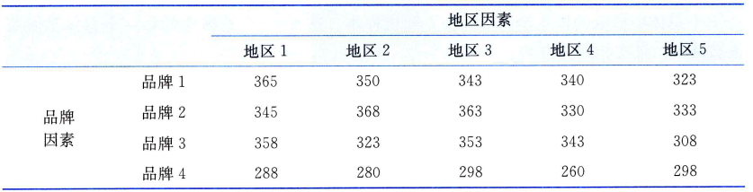
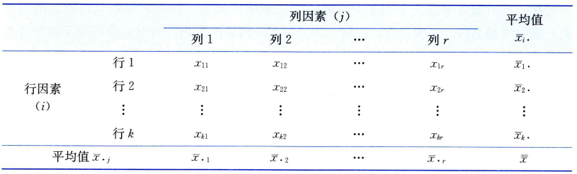

# 双因素方差分析
当方差分析涉及两个分类型自变量时，称为双因素方差分析(two-way analysis of variance)。


有4个品牌的彩电在5个地区销售，为分析彩电的品牌（品牌因素）和销售地区（地区因素）对销售量的影响，取得以下每个品牌在各地区的销售量数据(单位：台)，如表10-7所示。试分析品牌和地区对彩电的销售量是否有显著影响($\alpha=0.05$)。



在上面的例子中，品牌和地区是两个分类型自变量，销售量是一个数值型因变量。同时分析品牌和地区对销售量的影响，分析究竟是一个因素在起作用，还是两个因素都起作用，抑或是两个因素都不起作用，这就是一个双因素方差分析问题。

在双因素方差分析中，由于有两个影响因素，例如，彩电的品牌因素和地区因素，如果品牌和地区对销售量的影响是相互独立的，分别判断品牌和地区对销售量的影响，这时的双因素方差分析称为无交互作用(non-interaction)的双因素方差分析，或无重复双因素(two-factor without replication)分析；如果除了品牌和地区对销售量的单独影响，两个因素的搭配还会对销售量产生一种新的影响，例如，某个地区对某种品牌的彩电有特殊偏好，这就是两个因素结合后产生的新效应，这时的双因素方差分析称为有交互作用的双因素方差分析，或可重复双因素(two-factor with replication)分析。


## 无交互作用的双因素方差分析

### 数据结构

在无交互作用的双因素方差分析中，由于有两个因素，在获取数据时，需要将一个因素安排在“行”(row)的位置，称为行因素；另一个因素安排在“列”(column)的位置，称为列因素。设行因素有k个水平，行1，行2，...，行$k$;列因素有$r$个水平，列1,列2，...，列$r$。行因素和列因素的每一个水平都可以搭配成一组，观察它们对试验数据的影响。共抽取kr个观察数据，其数据结构如下表所示。



表中，行因素共有$k$个水平，列因素共有$r$个水平。每一个观测值$x_{ij}(i=1,2,...,k;=1,2,...,r)$看作从由行因素的$k$个水平和列因素的$r$个水平所组合成的$k*r$个总体中抽取的样本量为$1$的独立随机样本。这$k*r$个总体中的每一个总体都服从正态分布，且有相同的方差。

表中: $\overline{x}_{i\cdot}$是行因素的第$i$个水平下各观测值的平均值，其计算公式为：
$$
\overline{x}_{i\cdot} = \frac{\sum_{j=1}^r x_{ij}}{r}, i=1,2,...,k
$$

$\overline{x}_{\cdot j}$是行因素的第$j$个水平下各观测值的平均值，其计算公式为：
$$
\overline{x}_{\cdot j} = \frac{\sum_{i=1}^k x_{ij}}{r}, j=1,2,...,r
$$

$\overline{x}$是全部$kr$个样本的总平均值, 公式为:
$$
\overline{x} = \frac{\sum_{i=1}^k \sum_{j=1}^r x_{ij}}{kr}
$$

### 分析步骤


1. 提出假设。
为了检验两个因素的影响，需要对两个因素分别提出如下假设。

对行因素提出的假设为：
$$
H_0:\mu_1=\mu_2=...=\mu_i=...=\mu_k \ 行因素（自变量）对因变量没有显著影响\\
H_1:\mu_i(i=1,2,...,k)不全相等 \ 行因素（自变量）对因变量有显著影响
$$

式中，$\mu_i$为行因素的第$i$个水平的均值。

对列因素提出的假设为：
$$
H_0:\mu_1=\mu_2=...=\mu_j=...=\mu_r \ 列因素（自变量）对因变量没有显著影响\\
H_1:\mu_j(j=1,2,...,r)不全相等 \ 列因素（自变量）对因变量有显著影响
$$

式中, $\mu_j$为行因素的第$j$个水平的均值。


2. 构造检验统计量。
为检验$H_0$是否成立，需要分别确定检验行因素和列因素的统计量。与单因素方差分析构造统计量的方法一样，这里也需要从总平方和的分解人手。总平方和是全部样本观测值$x_{ij}(i=1,2,...,k;j=1,2,...,r)$与总的样本均值$\overline{x}$的误差平方和，记为SST,即


下面是一个用于比较多个组的均值差异的示例代码。


```python
from scipy.stats import f_oneway

# 示例数据
group1 = [5.1, 5.2, 5.3, 5.0, 5.4]
group2 = [6.2, 6.3, 6.1, 6.4, 6.0]
group3 = [4.5, 4.4, 4.6, 4.5, 4.7]

# 单因素方差分析
f_stat, p_value = f_oneway(group1, group2, group3)

print("F-statistic:", f_stat)
print("p-value:", p_value)

if p_value < 0.05:
    print("拒绝原假设，至少两组均值显著不同")
else:
    print("不能拒绝原假设，各组均值没有显著差异")
```


## 参考

- 统计学第8版199页

