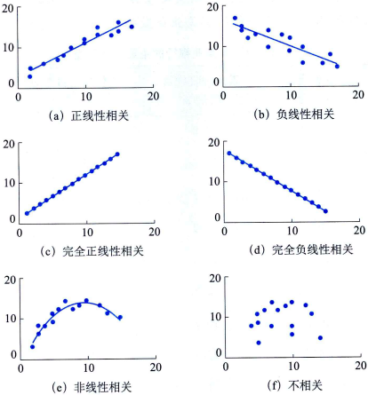

# 变量间关系的度量

设有两个变量$x$和$y$,变量$y$随变量$x$一起变化，并完全依赖于$x$,当变量$x$取某个数值时，$y$依据确定的关系取相应的值，则称$y$是$x$的函数，记为$y=f(x)$,其中$x$称为自变量，$y$称为因变量。

居民储蓄并不完全由居民家庭收人确定，因为家庭收入尽管与家庭储蓄有密切的关系，但它并不是影响储蓄的唯一因素，还有银行利率、消费水平等其他影响因素。正是由于影响一个变量的因素非常多，才造成了变量之间关系的不确定性。变量之间存在的不确定的数量关系称为相关关系(correlation)。

## 相关关系的描述与测度

### 散点图

对于两个变量$x$和$y$,通过观察或试验可以得到若干组数据，记为$(x_i,y_i)(i=1,2,...,n)$。用坐标的横轴代表变量$x$,纵轴代表变量$y$,每组数据$(x_i,y_i)$在坐标系中用一个点表示，$n$组数据在坐标系中形成的$n$个点称为散点，由坐标及散点形成的二维数据图称为散点图(scatter diagram)。

### 相关系数

相关系数(correlation coefficient)是度量两个变量之间线性关系强度的统计量。若相关系数是根据总体全部数据计算的，称为总体相关系数，记为$p$；若是根据样本数据计算的，则称为样本相关系数，记为$r$。样本相关系数的计算公式为：
$$
r = \frac{x\sum xy - \sum x \sum y}{\sqrt{n \sum x^2 - (\sum x )^2} * \sqrt{n \sum y^2 - (\sum y)^2}}
$$

按上述公式计算的相关系数也称为`线性`相关系数(linear correlation coefficient),或称为Pearson相关系数(Pearson's correlation coefficient)。

- $r$的取值范围是$[-1,1]$。
    - 若$0<r≤1$，表明$x$与$y$之间存在正线性相关关系；
    - 若$一1≤r<0$,表明$x$与$y$之间存在负线性相关关系；
    - 若$r=1$,表明$x$与$y$之间为完全正线性相关关系；
    - 若$r=-1$，表明$x$与$y$之间为完全负线性相关关系。可见当$|r|=1$时，$y$的取值完全依赖于$x$,二者之间为函数关系；
    - 当$r=0$时，$y$的取值与$x$无关，二者之间不存在线性相关关系。
- $r$具有对称性。$x$与$y$之间的相关系数$r_{xy}$，和$y$与$x$之间的相关系数$r_{yx}$相等，即$r_{xy}=r_{yx}$.
- $r$的数值大小与$x$和$y$的原点及尺度无关。
- $r$仅仅是$x$与$y$之间线性关系的一个度量，它`不能用于描述非线性关系`。这意味着，$r=0$只表示两个变量之间不存在线性相关关系，并不说明变量之间没有任何关系，它们之间可能存在非线性相关关系。变量之间的非线性相关程度较大时，可能会导致$r=0$.因此，当$r=0$或，很小时，不能轻易得出两个变量之间不存在相关关系的结论，而应结合散点图作出合理的解释。
- $r$虽然是两个变量之间线性关系的一个度量，却不意味着$x$与$y$一定有`因果关系`。

了解相关系数的性质有助于对其实际意义作出解释。但根据实际数据计算出的$r$的取值一般在$-1~1$之间，$|r|→1$说明两个变量之间的线性关系强；$|r|→0$说明两个变量之间的线性关系弱。对于一个具体的$r$的取值，根据经验可将相关程度分为以下几种情况：
- 当$r≥0.8$时，可视为高度相关；
- $0.5≤|r|<0.8$时，可视为中度相关；
- $0.3≤|r|<0.5$时，可视为低度相关；
- 当$|r|<0.3$时，说明两个变量之间的相关程度极弱，可视为不相关。

> 但这种解释必须建立在对相关系数的显著性进行检验的基础之上。

### 相关关系的显著性检验

总体相关系数$ρ$是未知的，通常将样本相关系数$r$作为$ρ$的近似估计值。需要考察样本相关系数的可靠性，也就是进行显著性检验。

1. $r$的抽样分布

为了对总体相关系数$ρ$的显著性进行检验，需要考察$r$的抽样分布。$r$的抽样分布随总体相关系数$ρ$和样本量$n$的大小而变化。当样本数据来自正态总体时，随着$n$的增大，$r$的抽样分布趋于正态分布，尤其是在总体相关系数$ρ$很小或接近$0$时，趋于正态分布的趋势非常明显。而当$ρ$远离$0$时，除非$n$非常大，否则$r$的抽样分布呈现一定的偏态。
- 因为$r$是在$p$的周围分布的，当$p$的数值接近1或-1时，比如$p=0.96$,$r$的值可能以0.96为中心朝两个方向变化，又由于$r$的取值范围在-1~1之间，所以一方的变化以1为限，全距是0.04，而另一方的变化以-1为限，全距是1.96，两个方向变化的全距不等，因此$r$的抽样分布也不可能对称。
- 但当$ρ$等于0或接近0时，两个方向变化的全距接近相等，所以$r$的抽样分布也就接近对称。

总之，
- 当$ρ$为较大的正值时，$r$呈现左偏分布；
- 当$ρ$为较大的负值时$r$呈现右偏分布。
- 只有当$ρ$接近0，而样本量$n$很大时，才能认为$r$是接近正态分布的随机变量

然而，以样本$r$来估计总体$p$时，总是假设r为正态分布，但这一假设常常会带来一些严重后果。

2. $r$的显著性检验

如果对，服从正态分布的假设成立，则可以应用正态分布来检验。但从上面对$r$抽样分布的讨论可知，对$r$的正态性假设具有很大的风险，因此通常情况下不采用正态检验，而采用费希尔提出的$t$检验，该检验可以用于小样本，也可以用于大样本。检验的具体步骤如下。

第一步: 提出假设
$$
H_0: p=0; H_1: p \neq 0
$$

第二步: 计算检验统计量
$$
t=|r|\sqrt{\frac{n-2}{1-r^2}} \sim t(n-2)
$$

第三步: 进行决策

根据给定的显著性水平$\alpha$和自由度$df=n一2$查$t$分布表，得出$t_{\alpha/2}(n一2)$的临界值。若$|t|>t_{\alpha/2}$,则拒绝原假设，表明总体的两个变量之间存在显著的线性关系。

## 参考

- 统计学第8版213页

