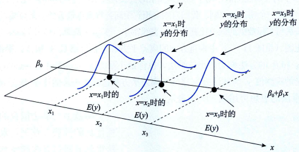
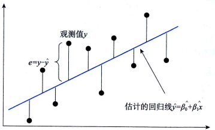

# 一元线性回归

## 回归模型

被预测或被解释的变量称为因变量(dependent variable),用$y$表示。用来预测或解释因变量的一个或多个变量称为自变量(independent variable),用$x$表示。如，在分析贷款余额对不良贷款的影响时，目的是要预测一定的贷款余额条件下不良贷款是多少，因此，不良贷款是被预测的变量，称为因变量，而用来预测不良贷款的贷款余额就是自变量。

对于具有线性关系的两个变量，可以用一个线性方程来表示它们之间的关系。描述因变量$y$如何依赖于自变量$x$和误差项$\epsilon$的方程称为回归模型(regression model)。只涉及一个自变量的一元线性回归模型可表示为：

$$
y = \beta_0+\beta_1 x + \epsilon
$$

式中的$\beta_0$和$\beta_1$称为模型的参数。在一元线性回归模型中，$y$是$x$的线性函数$\beta_0+\beta_1 x$加上误差项$\epsilon$。

- $\beta_0+\beta_1 x$反映了由于$x$的变化而引起的$y$的线性变化；
- $\epsilon$是被称为误差项的随机变量，反映了除$x$和$y$之间的线性关系之外的随机因素对$y$的影响，是不能由$x$和$y$之间的线性关系所解释的变异性。

对这一模型，有以下几个主要假定：
- 因变量$y$与自变量$x$之间具有线性关系。
- 在重复抽样中，自变量$x$的取值是固定的，即假定$x$是非随机的。

    在上述两个假定下，对于任何一个给定的$x$值，$y$的取值都对应着一个分布，因此，$E(y)=\beta_0十\beta_1 x$代表一条直线。但由于单个数据点是从$y$的分布中抽出来的，可能不在这条直线上，因此，必须包含一个误差项$\epsilon$来描述模型的数据点。

- 误差项$\epsilon$是一个期望值为0的随机变量，即$E(\epsilon)=0$。这意味着，由于$\beta_0$和$\beta_1$都是常数，有$E(\beta_0)=\beta_0,E(beta_1)=beta_1$。因此对于一个给定的$x$值，$y$的期望值为$E(y)=\beta_0十\beta_1 x$。这实际上等于假定模型的图示为一条直线。

- 对于所有的$x$值，$\epsilon$的方差$\sigma^2$都相同。这意味着对于一个特定的$x$值，$y$的方差都等于$\sigma^2$.
- 误差项$\epsilon$是一个服从正态分布的随机变量且独立，即$\epsilon \sim N(0,\sigma^2)$。独立性意味着一个特定的$x$值所对应的$\epsilon$与其他$x$值所对应的$\epsilon$不相关。因此，一个特定的$x$值所对应的$y$值与其他$x$值所对应的$y$值也不相关。这表明，在$x$取某个确定值的情况下，$y$的变化由误差项$\epsilon$的方差$\sigma^2$来决定。当$\sigma^2$较小时，$y$的观测值将非常靠近直线；当$\sigma^2$较大时，y的观测值将偏离直线。由于$\sigma^2$是常数，所以$y$的取值不受$x$取值的影响。由于自变量$x$在数据收集前假设是固定的，因此，对于任何一个给定的$x$值，$y$都服从期望值为$E(y)=\beta_0十\beta_1 x$方差为$\sigma^2$的正态分布，且对于不同的$x$具有相同的方差。

## 回归方程

根据回归模型中的假定，$\epsilon$的期望值等于0，因此$y$的期望值$E(y)=\beta_0十\beta_1 x$,也就是说，$y$的期望值是$x$的线性函数。描述因变量$y$的期望值如何依赖于自变量$x$的方程称为回归方程(regression equation)。一元线性回归方程的形式为：
$$
E(y)=\beta_0十\beta_1 x
$$

一元线性回归方程的图示是一条直线，因此也称为直线回归方程。其中$\beta_0$是回归直线在$y$轴上的截距，是当$x=0$时$y$的期望值；$\beta_1$是直线的斜率，它表示$x$每变动一个单位，$y$的平均变动值。

## 估计回归方程
如果回归方程中的参数$\beta_0$和$\beta_1$已知，对于一个给定的$x$值，就能计算出$y$的期望值。但总体回归参数$\beta_0$和$\beta_1$是未知的，必须利用样本数据去估计它们。用样本统计量$\hat{\beta_0}$和$\hat{\beta_1}$代替回归方程中的未知参数$\beta_0$和$\beta_1$,这时就得到了估计的回归方程(estimated regression equation)。它是根据样本数据求出的回归方程的估计。对于一元线性回归，估计的回归方程形式为：
$$
\hat{y} = \hat{\beta_0} + \hat{\beta_1} x
$$

## 参数的最小二乘估计

对于第$i$个$x$值，估计的回归方程可表示为：
$$
\hat{y}_i = \hat{\beta_0} + \hat{\beta_1} x_i
$$

卡尔·高斯(Carl Gauss,1777一1855)提出用最小化图中垂直方向的离差平方和来估计参数$\beta_0$和$\beta_1$，根据这一方法确定模型参数$\beta_0$和$\beta_1$的方法称为`最小二乘法`，也称`最小平方法`(method of least squares),它是通过使因变量的观测值$y_i$与估计值$\hat{y}_i$之间的离差平方和达到最小来估计$\beta_0$和$\beta_1$的方法。

根据最小二乘法使:

$$
\sum(y_i - \hat{y}_i)^2 = \sum(y_i-\hat{\beta}_0-\hat{\beta}_1x_i)^2
$$

最小. 令$Q=\sum(y_i-\hat{y}_i)^2$, 在给定样本数据后, $Q$是$\hat{\beta}_0$和$\hat{\beta}_1$的函数, 且最小值总是存在. 根据微积分的极值定理, 对$Q$求相应的$\hat{\beta}_0$和$\hat{\beta}_1$的偏导数, 令其等于0, 便可求出$\hat{\beta}_0$和$\hat{\beta}_1$:
$$
\frac{\partial Q}{\partial \beta_0} \bigg|_{\beta_0=\beta_0}= -2 \sum_{i=1}^n (y_i - \hat{\beta}_0)-\hat{\beta}_1x_i)=0 \\
\frac{\partial Q}{\partial \beta_1} \bigg|_{\beta_1=\beta_1}= -2 \sum_{i=1}^n (y_i - \hat{\beta}_0)-\hat{\beta}_1x_i)=0
$$

解上述方程组可得:

$$
\hat{\beta}_1 = \frac{n\sum_{i=1}^n x_i y_i - \sum_{i=1}^n x_i \sum_{i=1}^n y_i}{n\sum_{i=1}^n x_i^2 - (\sum_{i=1}^n x_i)^2}  \\
\hat{\beta}_0 = \overline{y} - \hat{\beta}_1 \overline{x}
$$

当$x=\overline{x}$时，$\hat{y}=\overline{y}$，即回归直线$\hat{y}_i = \hat{\beta_0} + \hat{\beta_1} x_i$, 通过点$(\overline{x},\overline{y})$,这是回归直线的重要特征之一。

## 参考
- 统计学第8版221页