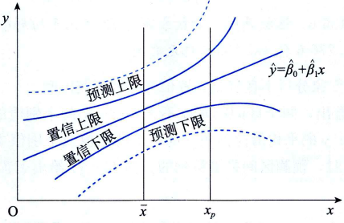

# 利用回归方程进行预测

## 点估计

利用估计的回归方程，对于$x$的一个特定值$x_0$,求出$y$的一个估计值就是点估计。点估计可分为两种：一是平均值的点估计；二是个别值的点估计。

- 平均值的点估计是利用估计的回归方程，对于$x$的一个特定值$x_0$,求出$y$的平均值的一个估计值$E(y_0)$。

    如，得到的估计的回归方程为$\hat{y}=一0.8295十0.037895x$, 如果估计贷款余额为100亿元，`所有分行`不良贷款的平均值就是平均值的点估计。根据估计的回归方程，得
    $$
    E(y_0)=-0.8295+0.037895×100=2.96
    $$

- 个别值的点估计是利用估计的回归方程，对于$x$的一个特定值$x_0$,求出$y$的一个个别值的估计值$\hat{y}_0$.

    如，如果只想知道贷款余额为72.8亿元的那个分行的不良贷款是多少，则属于个别值的点估计。根据估计的回归方程，得

    $$
    \hat{y}=-0.8295+0.037895×72.8=1.93
    $$

在点估计条件下，对于同一个x0,平均值的点估计和个别值的点估计的结果是一样的，但在区间估计中则有所不同。

## 区间估计

利用估计的回归方程，对于$x$的一个特定值$x_0$,求出$y$的一个估计值的区间就是区
间估计。区间估计也有两种类型：
- 是置信区间估计，它是对$x$的一个给定值$x_0$,求出$y$的平均值的估计区间，这一区间称为置信区间(confidence interval);

- 是预测区间估计，它是对$x$的一个给定值$x_0$,求出$y$的一个个别值的估计区间，这一区间称为预测区间(prediction interval).

### y的平均值的置信区间估计

置信区间估计(confidence interval estimate)是对$x$的一个给定值$x_0$,求出$y$的平均值的区间估计。设$x_0$为自变量$x$的一个特定值或给定值；$E(y_0)$为给定$x_0$时因变量$y$的平均值或期望值。当$x=x_0$时，$\hat{y}_0 = \hat{\beta_0} + \hat{\beta_1} x_0$为$E(y_0)$的估计值。

一般来说，不能期望估计值$\hat{y}_0$精确地等于$E(y_0)$。因此，要想用$\hat{y}_0$推断$E(y_0)$,必
须考虑根据估计的回归方程得到的$E(y_0)$的方差。对于给定的$x_0$,统计学家给出了估计$\hat{y}_0$的
标准差的公式，用$S_{\hat{y}_0}$表示$\hat{y}_0$的标准差的估计量，其计算公式为：

$$
S_{\hat{y}_0} = S_e\sqrt{\frac{1}{n}+\frac{(x_0-\overline{x})^2}{\sum_{i=1}^n(x_i - \overline{x})^2}}
$$

有了$\hat{y}_0$的标准差之后，对于给定的$x_0$,$E(y_0)$在$1-\alpha$置信水平下的置信区间可表示为：

$$
\hat{y}_0 \pm t_{\alpha/2}S_e\sqrt{\frac{1}{n}+\frac{(x_0-\overline{x})^2}{\sum_{i=1}^n(x_i - \overline{x})^2}}
$$

### y的个别值的预测区间估计

预测区间估计(prediction interval estimate)是对$x$的一个给定值$x_0$,求出$y$的一个个别值的区间估计。

如, 不是估计贷款余额为100亿元时所有分行的平均不良贷款，而只希望估计贷款余额为72.8亿元的那个分行的不良贷款的区间是多少，这个区间称为预测区间。

为求出预测区间，首先必须知道用于估计的标准差。统计学家给出了$y$的一个个别值$y_0$的标准差的估计量，用$s_{ind}$表示，其计算公式为：

$$
S_{ind} = S_e\sqrt{1+\frac{1}{n}+\frac{(x_0-\overline{x})^2}{\sum_{i=1}^n(x_i - \overline{x})^2}}
$$

因此，对于给定的$x_0$,$y$的一个个别值$y_0$在$1-\alpha$置信水平下的预测区间可表示为：

$$
\hat{y}_0 \pm t_{\alpha/2}S_e\sqrt{1+\frac{1}{n}+\frac{(x_0-\overline{x})^2}{\sum_{i=1}^n(x_i - \overline{x})^2}}
$$

相比均值的估计, 点估计的根号内多了一个1。因此，即使是对同一个$x_0$,这两个区间的宽度也是不一样的，预测区间要比置信区间宽一些。

## 参考
- 统计学第8版234页