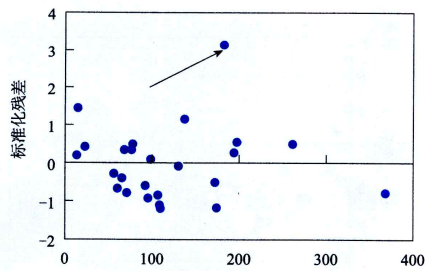

# 残差分析

在回归模型$y=\beta_0 + \beta_1 x + \epsilon$中，假定$\epsilon$是期望值为0、方差相等且服从正态分布的一个
随机变量。确定有关$\epsilon$假定是否成立的方法之一就是进行残差分析(residual analysis)。

在回归算法中, 我们假设残差(residual errors, $\hat{y} - y$)是随机服从正态分布的, 所以:
- 残差表示一个线性模型
- 标准差(残差的标准离差, standard deviation of the residuals)不会随着$X$的变化而变化
- 残差服从正态分布
- 没有$X$离群值影响
- 没有残差离群值影响

## 残差与残差图

残差(residual)是因变量的观测值$y_i$与根据估计的回归方程求出的预测值$\hat{y}_i$之差，用$e$表示。它反映了用估计的回归方程去预测$y_i$而引起的误差。第$i$个观测值的残差可以写为：
$$
e_i = y_i - \hat{y}_i
$$

可以通过对残差图的分析来判断对误差项$\epsilon$的假定是否成立。

### 残差图

关于$x$的残差图是用横轴表示自变量$x$的值，用纵轴表示对应的残差$e=y-\hat{y}$,每个$x$的值与对应的残差用图上的一个点来表示。
使用三个图来分析残差:
1. 散点图, 真实值和回归线
2. 散点图, 残差图
3. 直方图, 残差的分布

- 合理的模型

    残差是随机的, 拟合的是一条直线, 直方图是钟型. 而且没有离群值$X$和离群残差.

    

- 随$X$变化为变化

    在$X$较小时, 残差为正, 在$X$较大时, 残差为负. 这表示需要用非线性模型来拟合.

    

- 异方差性

    在$X$较小时, 残差的离差较小, 在$X$较大时, 残差的离差较大. 这种现象被称为异方差性(heteroscedasticity). 需要对数据进行变化来找到更合适的模型

    

    - 随自己正负变化

    当残差为正时 ,离差较大, 当残差为负时离差较小.

    

- 离群值1

    看似线性拟合, 且残差服从正态分布, 但是(16,51)对$X$来说是一个离群值(extrem outlier), 可能会对模型产生不利影响.

    

- 离群值2

    看似线性拟合, 且残差服从正态分布, 但是(7,40)是一个离群值, 可能对模型产生不利影响.

    

## 标准化残差

对$\epsilon$正态性假定的检验，也可以通过对标准化残差的分析来完成。标准化残差(standardized residual)是残差除以它的标准差后得到的数值，也称为Pearson残差或半学生化残差(semi-studentized residuals),用$Z_e$表示。第$i$个观测值的标准化残差可以表示为：
$$
Z_{e_i}= \frac{e_i}{S_e} = \frac{y_i-\hat{y}_i}{S_e}
$$
其中, $S_e$是残差的标准差的估计

如果误差项$\epsilon$服从正态分布这一假定成立，那么标准化残差的分布也应服从正态分布。因此，在标准化残差图中，大约有95%的标准化残差在`-2~2`之间。

## 参考
- 统计学第8版238页
- [Residual_Analysis](https://stats.libretexts.org/Bookshelves/Introductory_Statistics/Inferential_Statistics_and_Probability_-_A_Holistic_Approach_(Geraghty)/14%3A_Correlation_and_Linear_Regression/14.09%3A_Residual_Analysis)

