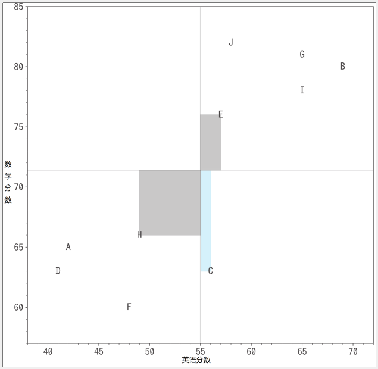

# 协方差

如果英语分数越高的人数学分数也越高, 那么英语和数学的分数就成正相关. 相反, 如果英语分数越高的人数学分数越低, 那么英语和数学分数就是负相关. 另外, 英语的分数对数学的分数没有产生线性影响, 那么英语和数学的分数就是不相关.


```python
import pandas as pd
import numpy as np

en_scores = np.array([42,69,56,41,57,48,65,49,65,58])
ma_scores = np.array([65, 80, 63, 63, 76, 60, 81, 66, 78, 82])
index = pd.Index(['A', 'B', 'C', 'D', 'E', 'F', 'G', 'H', 'I', 'J'],name='学生')


scores_df = pd.DataFrame(
    {'英语':en_scores,'数学':ma_scores},
    index=index
)
scores_df
```

上图是将"英语分数"做横轴, "数学分数"做纵轴的散点图. 比如学生A的英语分数是42分, 数学分数是65分. 中间的纵线和横线分别表示英语分数和数学分数的平均值. 可以看出英语分数越高的人数学分数也越高, 这两者之间存在着一种线性关系, 正相关.
协方差就是量化这种相关性的指标.

与方差不同的是, 纵轴和横轴的数据不同, 因此偏差值之间形成的图形不一定是正方形, 也可以是负面积. 如果是方差, 即使偏差是负的, 面积也是平方值, 所以总是正的. 


但是在协方差中, 因为考虑到纵向和横向上不同数据的偏差, 所以如果一个偏差是正的另外一个时负的话, 面积就会变成负的. 对于我们这个数据, E和H是正面积, C是负面积.

我们发现面积为正的情况是英语和数学都比平均分高或者逗比平均分低, 所以很好体现了分数的相关性. 因此, 这些带符号的面积的平均值就是相关的指标, 这就是协方差.

```python
summary_df = scores_df.copy()
summary_df['英语分数的偏差'] =\
    summary_df['英语'] - summary_df['英语'].mean()
summary_df['数学分数的偏差'] =\
    summary_df['数学'] - summary_df['数学'].mean()
summary_df['偏差值之间的乘积'] =\
    summary_df['英语分数的偏差'] * summary_df['数学分数的偏差']
summary_df
"""
    英语  数学  英语分数的偏差  数学分数的偏差  偏差值之间的乘积
学生
A   42  65    -13.0     -6.4      83.2
B   69  80     14.0      8.6     120.4
C   56  63      1.0     -8.4      -8.4
D   41  63    -14.0     -8.4     117.6
E   57  76      2.0      4.6       9.2
F   48  60     -7.0    -11.4      79.8
G   65  81     10.0      9.6      96.0
H   49  66     -6.0     -5.4      32.4
I   65  78     10.0      6.6      66.0
J   58  82      3.0     10.6      31.8
"""
summary_df['偏差值之间的乘积'].mean()  # 62.800 英语分数和数学分数是正相关
```

总结如下:
两个变量之间的关系时使用的统计量叫做协方差. 其含义如下:
1. 协方差大于0, 一个变量取值越大, 另一个变量的取值也越大
2. 协方差小于0, 一个变量取值越大, 另一个变量的取值却越小
3. 协方差等于0, 两个变量不相关

公式如下:
$$
S_{XY}= \frac{1}{n}\sum^n_{i=1}(X_i-\overline X)(Y_i-\overline Y)
$$
对照方差的公式:
$$
S^2 = \frac{1}{n}\sum^n_{i=1}(X_i-\overline X)^2
$$
方差是自己乘自己, 协方差是自己乘别人.


## 协方差矩阵

```python
## 1. 手动实现协方差
### 读取数据的列
x = en_scores
y = ma_scores

### 求样本容量
N = len(en_scores)

### 求各变量均值
mu_x = sp.mean(x)
mu_y = sp.mean(y)
### 样本协方差
cov_sample = sum((x - mu_x) * (y - mu_y)) / N
cov_sample
```

使用Numpy时, 协方差可以通过cov函数求出. 但是, 其返回值不是协方差, 而是协方差矩阵(covariance matrix), 或者说是方差-协方差矩阵(variance-covariance matrix)的矩阵

```python
cov_mat = np.cov(en_scores, ma_scores, ddof=0)
cov_mat
"""
array([[ 86.  ,  62.8 ],
       [ 62.8 ,  68.44]])
"""
cov_mat[0, 1], cov_mat[1, 0]  # (62.800, 62.800)
cov_mat[0, 0], cov_mat[1, 1]  # (86.000, 68.440)
np.var(en_scores, ddof=0), np.var(ma_scores, ddof=0)  # (86.000, 68.440)
```


## 皮尔逊相关系数
通过计算协方差, 能够表示数据的相关性. 但是协方差会带有单位, 比如($分数^2$). 如果从学生升高和考试分数的相关性来看, 协方差的单位是$cm \times 分数$. 此时就需要一个与单位无关的相关指标, 可以通过除以各数据的标准差来定义一个不依赖单位的指标.
$$
r_{XY} = \frac{S_{XY}}{S_XS_Y} = \frac{1}{n}\sum_{i=1}^n(\frac{X_i-\overline{X}}{S_X})(\frac{Y_i-\overline{Y}}{S_Y})
$$
其中, $r_{XY}$被称为相关系数(correlation coefficient).相关系数一定位于区间[-1,1], 数据正相关, 则相关系数越接近于1;数据负相关, 则相关系数接近于-1;为0表示不相关. 另外相关系数为-1或1时, 数据成直线排列.


```python
## 1. 手动计算相关系数
### 计算两个变量的方差
sigma_2_x = np.var(x, ddof = 1)
sigma_2_y = np.var(y, ddof = 1)

### 计算相关系数
rho = cov / np.sqrt(sigma_2_x * sigma_2_y)
rho  # 0.759

### 计算两个变量的方差
sigma_2_x_sample = np.var(x, ddof = 0)
sigma_2_y_sample = np.var(y, ddof = 0)

### 计算相关系数
cov_sample / np.sqrt(sigma_2_x_sample * sigma_2_y_sample)

```

使用numpy的时候, 可以使用`corrcoef`函数计算相关系数, 返回值是一个相关矩阵(correlation matrix).
```python
np.corrcoef(en_scores, ma_scores)
"""
array([[ 1.   ,  0.819],
       [ 0.819,  1.   ]])
"""
```


参考:
