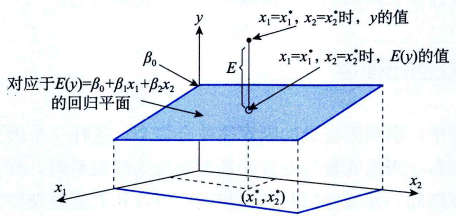

# 多元线性回归模型

## 多元回归模型与回归方程

设因变量为$y,k$个自变量分别为$x_1,x_2,...,x_k$,描述因变量$y$如何依赖于自变量$x_1,x_2,...,x_k$和误差项$\epsilon$的方程称为多元回归模型(multiple regression model)。其一般形式可表示为：

$$
y = \beta_0 + \beta_1x_1 + \beta_2x_2 + ... + \beta_kx_k + \epsilon
$$

其中, $\beta_0,\beta_1,...,\beta_k$是模型参数, $\epsilon$是误差项.$y$是$x_1,x_2,...,x_k$的线性函数($\beta_0+\beta_1x_1+\beta_2x_2+...+\beta_kx_k$部分)加上误差项$\epsilon$。误差项反映了除$x_1,x_2,...,x_k$与$y$的线性关系之外的随机因素对$y$的影响，是不能由$x_1,x_2,...,x_k$与$y$之间的线性关系所解释的变异性。

与一元线性回归类似，在多元线性回归模型中，对误差项$\epsilon$同样有三个基本假定：

- 误差项$\epsilon$是一个期望值为0的随机变量，即$E(\epsilon)=0$。这意味着对于给定$x_1,x_2,...,x_k$的值，$y$的期望值为$E(y)=\beta_0 + \beta_1x_1 + \beta_2x_2 + ... + \beta_kx_k$.
- 对于自变量$x_1,x_2,...,x_k$的所有值，$\epsilon$的方差$\sigma^2$都相同。
- 误差项$\epsilon$是一个服从正态分布的随机变量，且相互独立，即$\epsilon \sim N(0,\sigma^2)$。独立
性意味着自变量$x_1,x_2,...,x_k$的一组特定值所对应的$epsilon$与$x_1,x_2,...,x_k$任意一组其他值所对应的$\epsilon$不相关。正态性意味着对于给定的$x_1,x_2,...,x_k$的值，因变量$y$是一个服从正态分布的随机变量。

根据回归模型假定有:

$$
E(y) = \beta_0 +\beta_1x_1 + \beta_2x_2 + ... + \beta_kx_k
$$

称为多元回归方程(multiple regression equation),它描述了因变量$y$的期望值与自变量$x_1,x_2,...,x_k$之间的关系。

考虑含有两个自变量的多元回归方程，其形式为：
$$
E(y) = \beta_0 + \beta_1x_1 + \beta_2x_2
$$

在三维空间中可以将这个方程画出来，二元回归方程在三维空间中是一个平面:

## 估计的多元回归方程

回归方程中的参数$\beta_0,\beta_1,\beta_2,...,\beta_k$是未知的，需要利用样本数据去估计它们。当用样本统计量$\hat{\beta}_0,\hat{\beta}_1,\hat{\beta}_2,...,\hat{\beta}_k$去估计回归方程中的未知参数$\beta_0,\beta_1,\beta_2,...,\beta_k$时，就得到了估计的多元回归方程(estimated multiple regression equation),其一般形式为：
$$
\hat{y} = \hat{\beta}_0 + \hat{\beta}_1x_1 + ... + \hat{\beta}_kx_k
$$

式中，$\hat{\beta}_0,\hat{\beta}_1,\hat{\beta}_2,...,\hat{\beta}_k$是参数$\beta_0,\beta_1,\beta_2,...,\beta_k$的估计值；$\hat{y}$是因变量y的估计值。其中的$\hat{\beta}_0,\hat{\beta}_1,\hat{\beta}_2,...,\hat{\beta}_k$称为偏回归系数。$\hat{\beta}_1$表示当$x_2,x_3,...,x_k$不变时，$x_1$每变动一个单位因变量$y$的平均变动量

## 参数的最小二乘估计

回归方程中的$\hat{\beta}_0,\hat{\beta}_1,\hat{\beta}_2,...,\hat{\beta}_k$仍然是根据最小二乘法求得的，也就是使残差平方和:

$$
Q = \sum(y_i-\hat{y}_i)^2 = \sum(y_i - \hat{\beta}_0 - \hat{\beta}_1x_1 - ... - \hat{\beta}_kx_k)^2
$$

最小。由此可以得到求解$\hat{\beta}_0,\hat{\beta}_1,\hat{\beta}_2,...,\hat{\beta}_k$的标准方程组：

$$
\frac{\partial Q}{\partial \beta_0} \bigg|_{\beta_0=\hat{\beta}_0} \\
\frac{\partial Q}{\partial \beta_i} \bigg|_{\beta_i=\hat{\beta}_i} \\
i = 1,2,...,k
$$

## 参考
- 统计学第8版245页
