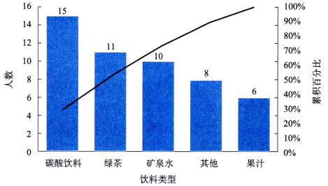
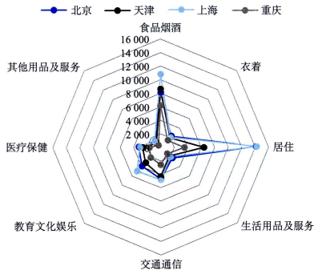

# 数据可视化

## 分类数据图示
频数(frequency)是落在某一特定类别或组中的数据个数。把各个类别及落在其中的相应频数全部列出，称为频数分布(frequency distribution)。针对一个分类变量生成的频数分布表称为简单频数表；根据两个分类变量生成的频数分布表称为列联表(contingency table)或交叉表(cross table)。

- 条形图和帕累托图
    - 条形图(bar chart)是用条形的高度或长短来表示数据多少的图形。条形图可以横置或纵置，纵置时也可以称为柱形图(column chart)。对于一个分类变量，可以绘制简单条形图；对于两个分类变量，则可以绘制簇状条形图或堆积条形图。

        
    
    - 帕累托图(Pareto chart)是以意大利经济学家帕累托(V.Pareto)的名字命名的。该图是按各类别出现的频数多少排序后绘制的条形图。通过对条形的排序，容易看出哪类数据出现的多，哪类数据出现的少。

        

- 饼图和环形图
    - 饼图(pie chart)是用圆形及圆内扇形的度数来表示数值大小的图形，它主要用于表示一个样本（或总体）中各组成部分的数据占全部数据的比例

        

    - 如果想比较男女顾客购买的饮料类型的构成状况，可以绘制环形图。它用一个环表示一个类别的构成，多个类别构成的多个环嵌套在一起，主要用于展示两个或多个分类变量的构成。

        

## 数值数据的图示
数值数据的处理:

1. 第1步：确定组数。一般情况下，数据所分的组数不应少于5组且不多于15组，即$5≤K≤15$。实际应用时，可根据数据的多少和特点及分析的要求来确定组数。

2. 第2步：确定各组的组距。组距(class width)是一个组的上限与下限的差。组距可根据全部数据的最大值和最小值及所分的组数来确定，即$组距=（最大值一最小值）÷组数$。如，对于本例数据，最大值为237，最小值为141，则$组距=(237一141)÷10=9.6$。为便于计算，组距宜取5或10的倍数，而且第一组的下限应低于最小变量值，最后一组的上限应高于最大变量值，因此组距可取10.

3. 第3步：根据分组制作频数分布表。

图形展示:

- 直方图
    
    直方图(histogram)是用于展示数值数据分布的一种图形，它是用矩形的宽度和高度（即面积）来表示频数分布的。绘制该图时，在平面直角坐标系中，用横轴表示数据分组，纵轴表示频数或频率，这样，一个组与相应的频数就形成了一个矩形，将多个矩形并列在一起就是直方图。

    

    其中，第一组的`[141,156]`表示该组含有数值141和156，即包含下限值和上限值；`（156,171]`表示该组不包含下限值156，但包含上限值171，其余依此类推。如上图，销售量的分布主要集中在171~186之间，以此为中心两侧依次减少，基本上呈对称分布，但右边的尾部比左边的尾部稍长一些，表示销售额的分布有一定程度的右偏。

- 箱形图

    制作箱型图:

    

    1. 首先，找出一组数据的中位数(median)和两个四分位数(quartiles),并画出箱子。中位数是一组数据排序后处在50%位置上的数值。四分位数是一组数据排序后处在25%位置和75%位置上的两个分位数值，分别用$Q_{25\%}$和$Q_{75\%}$表示。$Q_{25\%}-Q_{75\%}$称为四分位差或四分位距(quartile deviation),用IQR表示。

    2. 其次，计算出内围栏和相邻值，并画出须线。内围栏(inter fence)是与$Q_{25\%}$和$Q_{75\%}$的距离等于1.5倍四分位差的两个点，其中$Q_{25\%}-1.5*IQR$称为下内围栏，$Q_{75\%}+1.5*IQR$称为上内围栏。上下内围栏一般不在箱形图中显示，只是作为确定离群点的界限。然后找出上下内围栏之间的最大值和最小值（即非离群点的最大值和最小值），称为相邻值(adjacent value),其中$Q_{25\%}-1.5*IQR$范围内的最小值称为下相邻值，$Q_{75\%}+1.5*IQR$范围内的最大值称为上相邻值。用直线将上下相邻值分别与箱子连接，称为须线(whiskers)

    3. 最后，找出离群点，并在图中单独标出。离群点(outlier)是大于上内围栏或小于下内围栏的数值，也称外部点(outside value),在图中用“○”单独标出。

    通过箱形图的形状可以看出数据分布的特征:

    

- 散点图

    散点图(scatter diagram)是展示两个数值变量之间关系的图形，它是横轴代表变量x,纵轴代表变量y,每组数据$(x_i,y_i)$在坐标系中用一个点表示，$n$组数据在坐标系中形成的$n$个点称为散点，由坐标及散点形成的二维数据图就是散点图。

    

- 雷达图

    雷达图(radar chart)是显示多个变量的常用图示方法，也称为蜘蛛图(spiderchart)。设有$n$组样本$s_1,s_2,...,s_m$,每个样本测得$p$个变量$x_1,x_2,...,x_p$。要绘制这$p$个变量的雷达图，具体做法是：先画一个圆，然后将圆$p$等分，得到$p$个点，令这$p$个点分别对应$p$个变量，再将这$p$个点与圆心连线，得到$p$个辐射状的半径，这$p$个半径分别作为$p$个变量的坐标轴，再将同一样本的值在$p$个坐标上的点连线。这样，$n$个样本形成的$n$个多边形就是雷达图。

    

## 参考
- 统计学第8版33页
