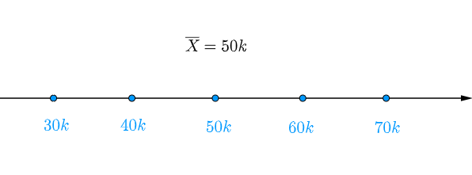
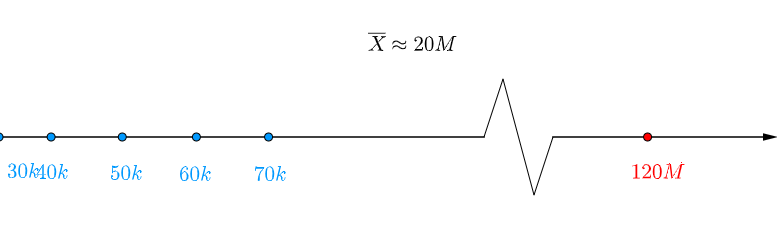
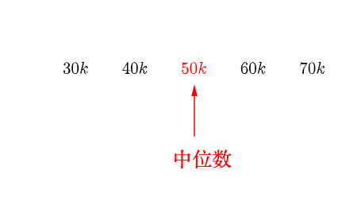
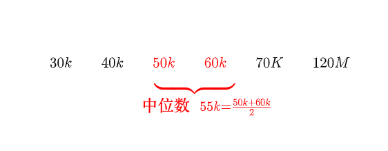

# 中位数


## 概念与公式
定义: 把数据按升序排列, 位置在最中间的数就是中位数.
理解:
五个人, 收入分别是30k,40k,50k,60k,70k, 所以他们的平均收入为50k

这时来了第六个人它的收入是120M, 这时他们的平均收入为20M

可见样本均值对于异常值反应太灵敏，导致计算出来的人均年收入不足以代表真实的情况，所以需要另外的统计量。

最开始只有五个人的时候，可以把顾客的收入从小到大排列开来，用中间的那个数字来代表这群人收入，这称为`中位数`，中位数告诉我们有一半人的收入在它之下，同样有一半的人的收入在它之上：

来了第六个人, 就把中间两个数字取算术平均作为中位数，得到的结果前后相差不大，从这里可以看出中位数不容易受到异常值的影响：


## python实现
```python
## 手动计算
data_1 = [30,40,50,60,70]
data_1 = np.sort(data_1)
n = len(data_1)
if n % 2 == 0:
    m0 = data_1[n//2 - 1]
    m1 = data_1[n//2]
    median = (m0 + m1) / 2
else:
    median = data_1[(n+1)//2 - 1]
median

## 使用函数计算
import numpy as np
data_1 = [30,40,50,60,70]
np.median(data_1)  # 50
np.mean(data_1)  # 50
```

在`data_1`里, 均值和中位数相等.一般而言, 左右对称的数据的均值和中位数相等. 而不对称的数据, 则不相同. 比如概念讲解中来了一个富豪.
```python
import numpy as np
data_2 = [30,40,50,60,70,120000000]
np.median(data_2)  # 50
np.mean(data_2)  # 20000042
```
可见均值容易受极端值的影响, 而中位数不易受极端值的影响.


参考:


