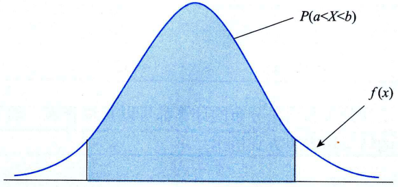
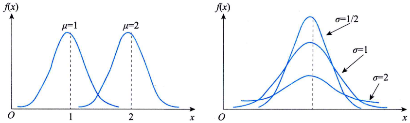

# 连续型随机变量的慨率分

## 概率密度与分布函数

当用函数$f(x)$来表示连续型随机变量时，将$f(x)$称为概率密度函数(probability density function)。概率密度函数应满足以下两个条件：

$$
f(x) \geq 0 \\
\int_{-\infty}^{+\infty}f(x)dx=1
$$

$f(x)$并不是一个概率，即$f(x) \neq P(X=x)$, $f(x)$称为概率密度函数，而$P(X=x)$在连续分布的条件下为零。

> 如何理解密度, $P(X=x)$表示概率, 概率的密度$f(x) = \frac{P(X=x)}{x}$, 由于连续, 所以$x \rightarrow 0$

在连续分布的情况下，以曲线下面的面积表示概率，如随机变量$X$在$α$与$b$之间的概率可以写成：

$$
P(a<X<b)=\int_a^b f(x)dx
$$

连续型随机变量的概率也可以用累积分布函数$F(x)$来表示，分布函数定义为：
$$
F(x)=P(X \leq x) = \int_{-\infty}^x f(t)dt, -\infty < x < + \infty
$$

因此$P(a<X<b)$也可以写成:
$$
\int_a^b f(x)dx = F(b) - F(a)
$$

显然, 连续型随机变量的概率密度是其分布函数的导数, 即
$$
f(x) = F'(x)
$$

连续型随机变量的期望值与方差分别为:
$$
E(X) = \int_{-\infty}^{+\infty} x f(x) dx = \mu \\
D(X) = \int_{-\infty}^{+\infty} [x - E(x)]^2 f(x) dx = \sigma^2
$$

## 正态分布(normal distribution)
如, 某地区同年龄组儿童的发育特征，如身高、体重、肺活量

### 正态分布的定义及图形特点
如果随机变量$X$的概率密度为：
$$
f(x)=\frac{1}{\sqrt{2\pi}\sigma }exp(-\frac{(x-\mu)^2}{2\sigma^2}),(-\infty < x < \infty)
$$
称$X$服从正态分布, 记作$X \sim N(\mu, \sigma^2)$, 其中$-\infty < \mu < +\infty, \sigma > 0$, $\mu$为随机变量$X$的均值, $\sigma$为随机变量$X$的标准差, 它们是正态分布的两个参数.

正态分布图的特点:
- $f(x) \geq 0$，即整个概率密度曲线都在x轴的上方。
- 曲线$f(x)$相对于$x = \mu$对称, 并达到最大值, $f(\mu)=\frac{1}{\sqrt{2\pi}\sigma}$
- 曲线的陡缓程度由$\sigma$决定，$\sigma$越大，曲线越平缓；$\sigma$越小，曲线越陡峭。
- 当$x$趋于无穷时，曲线以$x$轴为其渐近线。

### 标准正态分布

我们称$\mu=0、\sigma=1$时的正态分布$N(0,1)$为`标准正态分布`。
通常记标准正态变量为Z(Z Score)，记标准正态分布的概率密度函数为$\phi(x)$，累积分布函数为$\Phi(x)$，即：
$$
\phi(x)=\frac{1}{\sqrt{2\pi}}e^{-\frac{x^2}{2}},\quad -\infty < x < +\infty
$$
$$
\Phi(x)=\frac{1}{\sqrt{2\pi}}\int_{-\infty}^{x}e^{-\frac{t^2}{2}}\mathrm{d}t
$$
标准正态分布代数形式很清爽，是最简单的正态分布，图像上是关于纵轴对称的偶函数.

标准正态分布的重要性在于，任何一个一般的正态分布都可以通过线性变换转化为标准正态分布。

设$X \sim N(\mu, \sigma^2)$, 则
$$
Z=\frac{X-\mu}{\sigma} \sim N(0, 1)
$$

### 正态分布表

只要将一般正态分布转化为标准正态分布，通过查表就可解决正态分布的概率计算问题。对于负值，可采用以下公式：

$$
\Phi(-x) = 1 - \Phi(x)
$$

### 正态分布在质量管理中的应用

$$
P(\mu - 3\sigma < X < \mu + 3\sigma) = \Phi(3) - \Phi(-3) =0.9973
$$

这表明当某质量特性$X \sim N(4,\sigma^2)$时，其特性值落在区间$(\mu - 3\sigma，\mu + 3\sigma)$外的概
率仅为0.27%。这是一个小概率事件，通常在一次试验中是不会发生的，一旦发生就认为质量发生了异常，质量检验和过程控制就是利用这一思想。当今风靡全球的六西格玛质量管理体系也是在正态分布原理基础上建立的。当上下公差不变时，6。的质量水准就意味着产品合格率达到99.9999998%，即

$$
P(\mu - 6\sigma < X < \mu + 6\sigma) = \Phi(6) - \Phi(-6) =0.999999998
$$

其特性值落在区间$(\mu - 6\sigma，\mu + 6\sigma)$外的概率仅为十亿分之二

## 参考
- 统计学第8版89页

