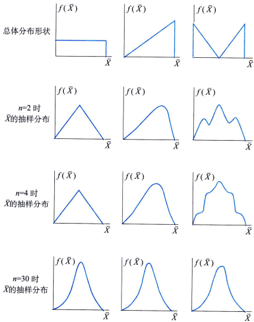

# 样本均值的分布与中心极限定理

## 样本均值分布
当总体分布为正态分布$N(\mu, \sigma^2)$时，可以得到下面的结果：

$\overline{X}$的抽样分布(sampling distribution)仍为正态分布，$\overline{X}$的数学期望为$\mu$，方差为$\sigma^2/n$, 则

$$
\overline{X} \sim N(\mu, \frac{\sigma^2}{n})
$$

上面的结果表明，$\overline{X}$的期望值与总体均值相同，而方差则缩小为总体方差的$\frac{1}{n}$。这说明当用样本均值$\overline{X}$去估计总体均值$\mu$时，平均来说没有偏差（这一点称为无偏性）；当$n$越来越大时，$\overline{X}$的离散程度越来越小，即用$\overline{X}$估计以越来越准确。

然而在实际问题中，总体的分布并不总是正态分布或近似正态分布，此时$\overline{X}$的分布将取决于总体分布的情况。值得庆幸的是，当抽样个数$n$比较大时，人们证明了如下的中心极限定理。该定理告诉我们不管总体的分布是什么，样本均值$\overline{X}$的分布总是近似正态分布，只要总体的方差$\sigma^2$有限。因为无论是什么总体分布，设总体均值为$\mu$，总体方差为$\sigma^2$,总有

$$
E(\overline{X}) = E(\frac{1}{n} \sum_{i=1}^n X_i) = \frac{1}{n} \sum_{i=1}^n E(X_i) = \mu \\
D(\overline{X}) = D(\frac{1}{n} \sum_{i=1}^n X_i) = \frac{1}{n^2} \sum_{i=1}^n D(X_i) = \frac{\sigma^2}{n}
$$

所以当$n$比较大时, $\overline{X}$近似服从$N(\mu, \frac{\sigma^2}{n})$, 等价地有$\frac{\overline{X}-\mu}{\sigma/\sqrt{n}} \sim N(0, 1)$

## 中心极限定理

中心极限定理(central limit theorem):设从均值为$\mu$、方差为$\sigma^2$（有限）的任意一个总体中抽取样本量为$n$的样本，当$n$充分大时，样本均值$\overline{X}$的抽样分布近似服从均值为$\mu$、方差为$\sigma^2/n$的正态分布。

中心极限定理要求$n$必须充分大，那么多大才叫充分大呢？这与总体的分布形状有关。总体偏离正态越远，则要求越大。然而在实际应用中，总体的分布未知。此时，我们常要求$n \geq 30$。顺便指出，大样本、小样本之间并不是以样本量大小来区分的。在样本量固定的条件下所进行的统计推断、问题分析，不管样本量有多大，都称为小样本问题；而在样本量$n \approx \infty$的条件下进行的统计推断、问题分析则称为大样本问题。一般统计学中的$n \geq 30为大样本，$n < 30$为小样本只是一种经验说法。

## 参考
- 统计学第8版103页