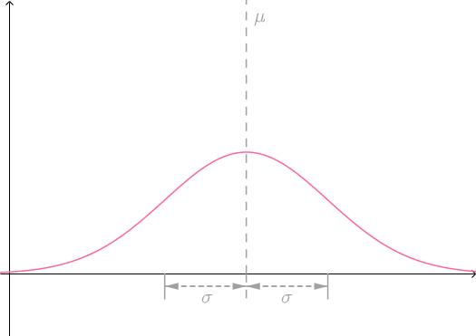
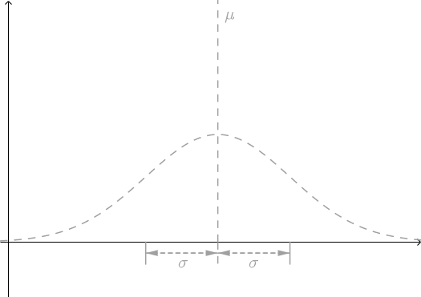
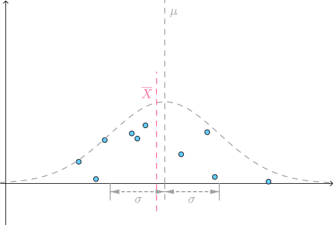
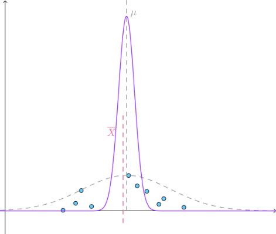

# 统计量分布

## 样本均值的分布
统计量本身也是随机变量，所以也是具有分布的.

### 样本均值的随机性
先来看个具体的例子，假设某大学女生的身高服从正态分布N(\mu,\sigma^2)，借用之前的数学语言就是，该总体服从正态分布，也可以简称为\color{Salmon}{正态总体}，概率密度函数的图像如下：

大家要记得一点，在统计中总体是未知的，是需要通过样本来推断的，所以用虚线和灰色来表示（总体的分布未知，总体的参数$\mu、\sigma^2$也未知）：

下面根据该正态总体的分布，随机生成十个点（这十个点的横坐标代表随机的身高，纵坐标是随便取的，目的是为了把这些点分开，便于观察），组成一个样本，算出对应的$\overline{X}$，可以看到它和总体的$\mu$是有偏差的：

不同样本对应的\overline{X}是不断变化的. 可想而知，因为抽取样本具有随机性，所以统计量样本均值\overline{X}是有随机性的，是一个随机变量。

### 样本均值的分布
$\overline{X}$的随机性带来一个问题，$\overline{X}$作为$\mu$的逼近靠不靠谱？虽然根据大数定理有：
$$
\lim_{n\to \infty}P\left(\left|\overline{X}-\mu\right| < \epsilon \right) = 1
$$
但这说的是在样本容量n足够大的时候，$\overline{X}$会无限接近于$\mu$。而现实中n往往不会特别大，此时就需要通过以下定理来判断$\overline{X}$对$\mu$的逼近效果：

> 设$X_1,X_2,\cdots,X_n$为取自某总体的简单随机样本，对应的样本均值为$\overline{X}$，则`样本均值的分布`为：
$\quad（1）$若总体分布的为$N(\mu, \sigma^2)$，则：
$$
\overline{X}\sim N(\mu, \frac{\sigma^2}{n})\quad 或\quad \frac{\overline{X}-\mu}{\sigma/\sqrt{n}}\sim N(0,1)
$$
$\quad（2）$若总体分布不是正态分布，$E(X)=\mu，Var(X)=\sigma^2$，则：
$$
\overline{X}\stackrel{\cdot}{\sim} N(\mu, \frac{\sigma^2}{n})
$$
其中$\sim$表示的是当n足够大时，差不多服从于$N(\mu, \frac{\sigma^2}{n})$的意思。

不管上面的定义看着多复杂，可以简单的理解为始终有：
$$
\overline{X}\sim N(\mu, \frac{\sigma^2}{n})
$$

知道了样本均值的分布，也就可以预测$\overline{X}$的随机性。下面的紫色正态分布曲线就是$\overline{X}$的分布，可以看到$\overline{X}$基本上被限制在较窄的范围（根据正态分布的性质，可知n越大，这个范围越窄）：

### 当整体的$\sigma$未知时

之前说了，对于样本均值$\overline{X}$的分布基本上是：
$$
\overline{X}\sim N(\mu, \frac{\sigma^2}{n})
$$
但是这有一个问题，需要知道总体方差$\sigma^2$为多少？实践中这往往办不到啊，好在有下面的定理：
$$
设X_1,X_2,\cdots,X_n为取自正态总体N(\mu,\sigma^2)的简单随机样本，则有：
\frac{\overline{X}-\mu}{S/\sqrt{n}}\sim t(n-1)
$$
根据这个定理，在研究正态总体的时候，我们就不需要知道总体方差$\sigma^2$（大大增加了实用性），只需要算出样本方差S^2就可以知道这两者的差值：
$$
\overline{X}-\mu
$$
被限制在自由度为n-1的t分布范围内（从刚才的图像看t分布和正态分布差不多），也就可以量化用样本均值$\overline{X}$逼近总体数学期望$\mu$的靠谱程度了。

## 样本方差分布
设$X_1,X_2,\cdots,X_n$为取自正态总体$N(\mu,\sigma^2)$的简单随机样本，其样本方差为：
$$
S^2=\frac{1}{n-1}\sum_{i=1}^{n}\left(X_i-\overline{X}\right)^2
$$
则有：
$$
\overline{X}与S^2独立  \\
\frac{(n-1)S^2}{\sigma^2}\sim \chi^2(n-1)
$$

根据这个定理，在研究正态总体的时候，我们就可以知道样本方差$S^2$的具体分布了，也可以知道样本方差与总体方差之间的比例：
$$
S^2\ :\ \sigma^2
$$
被限制在自由度为$n-1$的卡方分布的范围内了，这样也就可以量化用样本方差$S^2$逼近总体方差$\sigma^2$的靠谱程度了。

### 样本方差的比例

有分别取自两个正态总体$N(\mu_1,\sigma_1^2)$和$N(\mu_2,\sigma_2^2)$的两个简单随机样本：
$$
X_1,X_2,\cdots,X_n \qquad Y_1,Y_2,\cdots,Y_m
$$
这两个样本相互独立（即两个多维随机向量$(X_1,X_2,\cdots,X_n)$与$(Y_1,Y_2,\cdots,Y_m)$相互独立），其样本均值为：
$$
\overline{X}=\frac{1}{n}\sum_{i=1}^{n}X_i,\quad \overline{Y}=\frac{1}{m}\sum_{i=1}^{m}Y_i
$$
样本方差为：
$$
S_X^2=\frac{1}{n-1}\sum_{i=1}^{n}(X_i-\overline{X})^2,\quad S_Y^2=\frac{1}{m-1}\sum_{i=1}^m(Y_i-\overline{Y})^2
$$
则有：
$$
\frac{S_X^2/\sigma_1^2}{S_Y^2/\sigma_2^2}=\frac{S_X^2/S_Y^2}{\sigma_1^2/\sigma_2^2}\sim F(n-1, m-1)
$$
参考:
马同学