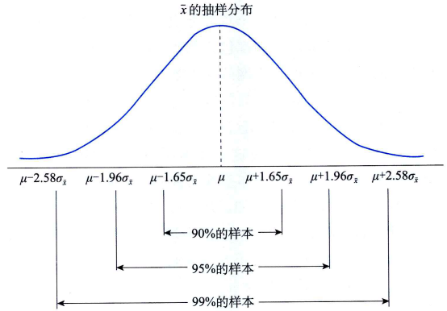
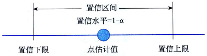
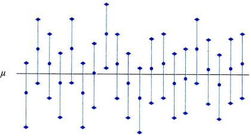
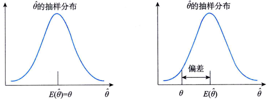
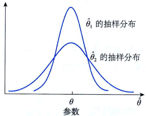
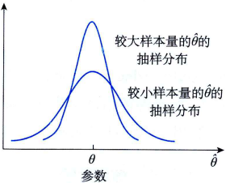

# 参数估计的基本原理

## 估计量与估计值

参数估计(parameter estimation)就是用样本统计量去估计总体的参数。如，用样本均值$x$估计总体均值$\mu$, 用样本比例$p$估计总体比例$\pi$，用样本方差$s^2$估计总体方差$\sigma^2$。

在参数估计中，用来估计总体参数的统计量称为估计量(estimator),用符号$\hat{\theta}$表示。样本均值、样本比例、样本方差等都可以是一个估计量。根据一个具体的样本计算出来的估计量的数值称为估计值(estimated value)。如，要估计一个班学生考试的平均分数，从中抽取一个随机样本，全班的平均分数是不知道的，称为参数，用$\theta$表示，根据样本计算的平均分数$\overline{x}$就是一个估计量，用$\hat{\theta}$表示。假定计算出来的样本平均分数为80分，这个80分就是估计量的具体数值，称为估计值。

## 点估计与区间估计

参数估计的方法有点估计和区间估计两种。

### 点估计

点估计(point estimate)就是用样本统计量$\hat{\theta}$的某个取值直接作为总体参数$\theta$的估计值。如，用样本均值$\overline{x}$直接作为总体均值$\mu$的估计值，用样本比例$p$直接作为总体比例$\pi$的估计值，用样本方差$s^2$直接作为总体方差$\sigma^2$的估计值，。假定要估计一个班学生考试成绩的平均分数，根据抽出的一个随机样本计算的平均分数为80分，用80分作为全班平均考试分数的一个估计值，这就是点估计。

虽然在重复抽样条件下点估计的均值有望等于总体真值(比如，$E(\overline{x})=\mu$), 但由于样本是随机的，抽出一个具体的样本得到的估计值很可能不同于总体真值。在用点估计值代表总体参数值的同时，还必须给出点估计值的可靠性，也就是说，必须能说出点估计值与总体参数的真实值接近的程度。因此就不能完全依赖于一个点估计值，而是围绕点估计值构造总体参数的一个区间，这就是区间估计。

### 区间估计

区间估计(interval estimate)是在点估计的基础上，给出总体参数估计的一个区间范围和置信程度，该区间通常由样本统计量加减估计误差得到。

由样本均值的抽样分布可知，在重复抽样或无限总体抽样的情况下，样本均值的数学期望等于总体均值，即$E(\overline{x})=\mu$，样本均值的标准误差为$\sigma_{\overline{X}} = \sigma/\sqrt{n}$, 由此可知样本均值$\overline{x}$落在总体均值$\mu$的两侧各为1个抽样标准差范围内的概率为0.6827；落在2个抽样标准差范围内的概率为0.9545；落在3个抽样标准差范围内的概率为0.9973。

实际上，可以求出样本均值$\overline{x}$落在总体均值$\mu$的两侧任何一个抽样标准差范围内的概率。但实际估计时，情况恰好相反。$\overline{x}$是已知的，而$\mu$是未知的，也正是将要估计的。由于$\overline{x}$与$\mu$的距离是对称的，如果某个样本的平均值落在$\mu$的2个标准差范围之内，反过来，$mu$也就被包含在以x为中心左右2个标准差的范围之内。因此约有95%的样本均值会落在$\mu$的2个标准差的范围之内。也就是说，约有95%的样本均值所构造的2个标准差的区间会包含$\mu$。

通俗地说，如果抽取100个样本来估计总体均值，由100个样本所构造的100个区间中，约有95个区间包含总体均值，另外5个区间则不包含总体均值。

在区间估计中，由样本统计量所构造的总体参数的估计区间称为置信区间(coidence interval), 其中，区间的最小值称为置信下限，最大值称为置信上限。由于统计学家在某种程度上确信这个区间会包含真正的总体参数，所以给它取名为置信区间。比如说抽取100个样本，根据每个样本构造一个置信区间，这样，由100个样本构造的总体参数的100个置信区间中，有95%的区间包含总体参数的真值，有5%没包含，则95%这个值称为置信水平。一般地，如果将构造置信区间的步骤重复多次，置信区间中包含总体参数真值的次数所占的比例称为置信水平(cofidence level), 也称为置信度或置信系数(confidence coefficient)。

在构造置信区间时，可以用所希望的任意值作为置信水平。比较常用的置信水平及正态分布曲线下右侧面积为$\alpha/2$时的z值$z_{\alpha/2}$

$z_{\alpha/2}$常用的置信水平:

置信水平|$\alpha$|$\alpha/2$|$z_{\alpha/2}$
--|--|--|--
90%|0.10|0.05|1.645
95%|0.05|0.025|1.96
99%|0.01|0.005|2.58

置信区间的概念可以理解为:

- 当样本量给定时，置信区间的宽度随着置信系数的增大而增大。从直觉上说，区间比较宽时，才会使这一区间有更大的可能性包含参数的真值；
- 当置信水平固定时，置信区间的宽度随样本量的增大而减小，换言之，较大的样本所提供的有关总体的信息要比较小的样本多。

对置信区间的理解，有以下几点需要注意：

- 如果用某种方法构造的所有区间中有95%的区间包含总体参数的真值，5%的区间不包含，那么，用该方法构造的区间称为置信水平为95%的置信区间。

- 总体参数的真值是固定的、未知的，而用样本构造的区间则是不固定的。若抽取不同的样本，可以得到不同的区间，从这个意义上说，置信区间是一个随机区间，它会因样本的不同而不同，而且不是所有的区间都包含总体参数的真值。一个置信区间就像是为捕获未知参数而撒出去的网，不是所有撒网的地点都能捕获到参数。

- 在实际问题中，进行估计时往往只抽取一个样本，此时所构造的是与该样本相联系的一定置信水平（比如95%）下的置信区间。由于用该样本所构造的区间是一个特定的区间，而不再是随机区间，所以无法知道这个样本所产生的区间是否包含总体参数的真值。我们只能希望这个区间是大量包含总体参数真值的区间中的一个，但它也可能是少数几个不包含参数真值的区间中的一个。如，从一个总体中抽取20个随机样本，得到总体均值$\mu$的20个估计区间。下图中每个区间中间的点表示$\mu$的点估计值，即样本均值。可以看出20个区间中只有第8个区间没有包含总体均值$\mu$。如果这是95%的置信区间，那么只有5%的区间没有包含$\mu$。

    

如，用95%的置信水平得到某班学生考试成绩的置信区间为60～80分，我们不能说60～80分这个区间以95%的概率包含全班学生平均考试成绩的真值，或者说全班学生的平均考试成绩以95%的概率落在60～80分之间，这类表述是错误的，因为总体均值$\mu$是一个常数，而不是一个随机变量。$\mu$要么落在这个范围内，要么不落在这个范围内，这里并不涉及概率。我们只是知道，在多次抽样中有95%的样本得到的区间包含全班学生平均考试成绩的真值。它的真正意义是如果做了100次抽样，大概有95次找到的区间包含真值，有5次找到的区间不包含真值。假定全班考试成绩平均数的真值为70分，60～80分这个区间一定包含真值，如果全班考试成绩平均数的真值为50分，那么区间6080分就绝对不包含真值，无论做多少次试验。因此，这个概率不是用来描述某个特定的区间包含总体参数真值的可能性，而是针对随机区间而言的。一个特定的区间“总是包含”或“绝对不包含”参数的真值，不存在“以多大的概率包含总体参数”的问题。但是，用概率可以知道在多次抽样得到的区间中大概有多少个区间包含参数的真值。

## 评价估计量的标准

参数估计是用样本估计量$\hat{\theta}$作为总体参数$\theta$的估计。实际上，用于估计$\theta$的估计量有很多，如，可以用样本均值作为总体均值的估计量，也可以用样本中位数作为总体均值的估计量。那么，究竟用样本的哪种估计量作为总体参数的估计呢？自然要用估效果最好的那种估计量。什么样的估计量才算是一个好的估计量呢？这就需要有一定的价标准。

### 无偏性

无偏性（unbiasedness）是指估计量抽样分布的数学期望等于被估计的总体参数。设总体参数为$\theta$，所选择的估计量为$\hat{\theta}$，如果$E(\hat{\theta})=\theta$，则称$\hat{\theta}$为$\theta$的无偏估计量。

样本均值$\overline{x}$, 样本比例$p$, 样本方差$s^2$分别是总体均值$\mu$, 总体比例$\pi$, 总体方差$\sigma^2$的无偏估计量, 即:
$$
E(\overline{x})=\mu \\
E(p) = \pi \\
E(s^2) = \sigma^2
$$

### 有效性
一个无偏的估计量并不意味着它就非常接近被估计的参数，它还必须与总体参数的离散程度较小。有效性（efficiency）是指用于估计同一总体参数的两个无偏估计量，有更小标准差的估计量更有效。

假定有两个用于估计总体参数的无偏估计量，分别用$\hat{\theta_1}$和$\hat{\theta_2}$表示，它们的抽样分布的方差分别用$D(\hat{\theta_1})$和$D(\hat{\theta_1})$表示，如果$\hat{\theta_1}$的方差小于$\hat{\theta_2}$的方差，即$D(\hat{\theta_1})$<$D(\hat{\theta_2})$，就称$\hat{\theta_1}$是比$\hat{\theta_2}$更有效的一个估计量。在无偏估计的条件下，估计量的方差越小，估计就越有效。

下图说明了两个无偏估计量$\hat{\theta_1}$和$\hat{\theta_2}$的抽样分布。可以看到，$\hat{\theta_1}$的方差比$\hat{\theta_2}$的方差小，因此$\hat{\theta_1}$的值比$\hat{\theta_2}$的值更接近总体的参数，即$\hat{\theta_1}$比$\hat{\theta_2}$更有效，是一个更好的估计量。

### 一致性

一致性（consistency）是指随着样本量的增大，估计量的值越来越接近被估计总体的参数。换言之，一个大样本给出的估计量要比一个小样本给出的估计量更接近总体的参数。根据样本均值的抽样分布可知，样本均值抽样分布的标准差为$\sigma_{\overline{x}}=\sigma/\sqrt{n}$。由于$\sigma_{\overline{x}}$与样本量大小有关，样本量越大，的值就越小，因此可以说，大样本量给出的估计量更接近总体均值$\mu$。从这个意义上说，样本均值是总体均值的一个一致估计量。

## 参考
- 统计学第8版109页

