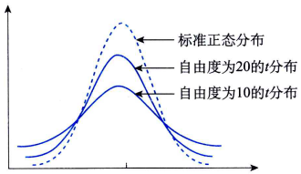

# 总体参数的区间估计

## 总体均值的区间估计

在对总体均值进行区间估计时，需要考虑总体是否为正态分布，总体方差是否已知，用于构造估计量的样本是大样本（通常要求$n \geq 30$）还是小样本（$n<30$）等几种情况。

### 正态总体、方差已知，或非正态总体、大样本

当总体服从正态分布且。$\sigma^2$已知时，或者总体不是正态分布但为大样本时，样本均值$\overline{x}$的抽样分布均为正态分布，其数学期望为总体均值$\mu$，方差为$\sigma^2/n$。而样本均值经过标准化以后的随机变量服从标准正态分布，即

$$
z = \frac{\overline{x}-\mu}{\sigma/\sqrt{n}} \sim N(0, 1)
$$

总体均值$\mu$在$1-\alpha$置信水平下置信区间为:
$$
\overline{x} \pm z_{\alpha/2}\frac{\sigma}{\sqrt{n}}
$$

其中:
- $\overline{x} - z_{\alpha/2}\frac{\sigma}{\sqrt{n}}$称为置信下限
- $\overline{x} + z_{\alpha/2}\frac{\sigma}{\sqrt{n}}$称为置信上限
- $\alpha$是事先确定的概率值, 也称风险值, 指总体均值不包含在置信区间内的概率；
- $1-\alpha$是置信水平
- $z_{\alpha/2}$是标准正态分布右侧面积为$\alpha/2$时的$z$值
- $z_{\alpha/2}\frac{\sigma}{\sqrt{n}}$是估计总体均值时的估计误差（estimate error）。

这就是说，总体均值的置信区间由两个部分组成：点估计值和描述估计量精度的$\pm$值，这个$\pm$值称为估计误差。

如果总体服从正态分布但未知，或总体并不服从正态分布，只要是在大样本条件下，总体方差$\sigma^2$就可以用样本方差$s^2$代替，这时总体均值$\mu$在$1-\alpha$置信水平下的置信区间可以写为：
$$
\overline{x} \pm z_{\alpha/2}\frac{s}{\sqrt{n}}
$$

题目2:
一家食品生产企业以生产袋装食品为主，每天的产量大约为8000袋。按规定每袋的重量应为100克。为对产品重量进行监测，企业质检部门经常要进行抽检，以分析每袋重量是否符合要求。现从某天生产的一批食品中随机抽取25袋，测得均值为105.36g. 已知产品重量服从正态分布，且总体标准差为10克。试估计该天产品平均重量的置信区间，置信水平为95%。

解: 已知$\sigma=10, n = 25$, 置信水平$1-\alpha=25\%$, 查标准正态分布表可得$z_{\alpha/2}=1.96$. 

则$\overline{x} \pm z_{\alpha/2}\frac{\sigma}{\sqrt{n}}=105.36 \pm 1.96 * \frac{10}{\sqrt{25}}=105.36 \pm 3.92 = (101.44, 109.28)$

题目2:
一家保险公司收集到由36位投保人组成的随机样本，得到平均年龄为39.5, 标准差为7.77, 试建立投保人平均年龄的90%的置信区间。

解: 已知$n=36, 1-\alpha=90\%, z_{\alpha/2}=1.645$. 由于总体方差未知, 但为大样本, 可用样本方差来替代总体方差.

则$\overline{x} \pm z_{\alpha/2}\frac{s}{\sqrt{n}}=39.5 \pm 1.645 * \frac{7.77}{\sqrt{36}}=39.5 \pm 2.13 = (37.4, 41.6)$

### 正态总体、方差未知、小样本

如果总体服从正态分布，则无论样本量如何，样本均值$\overline{x}$的抽样分布都服从正态分布。这时，只要总体方差$\sigma^2$已知，即使是在小样本的情况下，也可以建立总体均值的置信区间。但是，如果总体方差$\sigma^2$未知，而且是在小样本情况下，则需要用样本方差$s^2$代替$\sigma^2$，这时，样本均值经过标准化以后的随机变量服从自由度为$n一1$的$t$分布，需要采用t分布来建立总体均值以的置信区间。即
$$
t = \frac{\overline{x}-\mu}{s/\sqrt{n}} \sim t(n-1)
$$
$t$分布是类似正态分布的一种对称分布，它通常要比正态分布平坦和分散。一个特定的$t$分布依赖于称为自由度的参数。随着自由度的增大，$t$分布逐渐趋于正态分布:

根据$t$分布建立的总体均值$\mu$在$1-\alpha$置信水平下的置信区间为：

$$
\overline{x} \pm t_{\alpha/2}\frac{\sigma}{\sqrt{n}}
$$

题目:
已知某种灯泡的寿命服从正态分布，现从一批灯泡中随机抽取16个，测得其使用平均寿命1490小时, 标准差为24.77小时, 试建立该批灯泡平均使用寿命的95%的置信区间。

解: 已知$n=16, \overline{x}=1490, s = 24.77, \alpha = 0.05$, 查$t$分布表可得$t_{\alpha/2}(n-1)=t_{0.025}(15)=2.131$

则$\overline{x} \pm t_{\alpha/2}\frac{s}{\sqrt{n}}=1490 \pm 2.131 * \frac{24.77}{\sqrt{16}}=1490 \pm 13.2 = (1476.8, 1503.2)$

### 总体均值的空间估计总结

总体分布|样本量|$\sigma$已知|$\sigma$未知
--|--|--|--
正态分布|小样本($n \lt 30$)|$\overline{x} \pm z_{\alpha/2}\frac{\sigma}{\sqrt{n}}$|$\overline{x} \pm t_{\alpha/2}\frac{s}{\sqrt{n}}$
正态分布|大样本($n \gt 30$)|$\overline{x} \pm z_{\alpha/2}\frac{\sigma}{\sqrt{n}}$|$\overline{x} \pm z_{\alpha/2}\frac{s}{\sqrt{n}}$
非正态分布|大样本|$\overline{x} \pm z_{\alpha/2}\frac{\sigma}{\sqrt{n}}$|$\overline{x} \pm z_{\alpha/2}\frac{s}{\sqrt{n}}$

## 总体比例的区间估计

## 总体方差的区间估计

## 参考
- 统计学第8版114页
