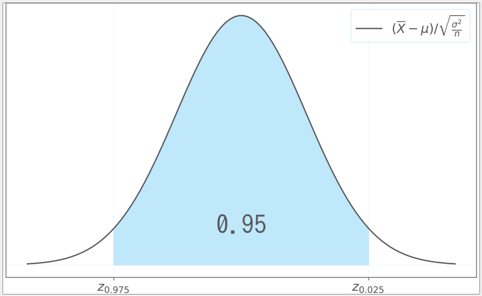
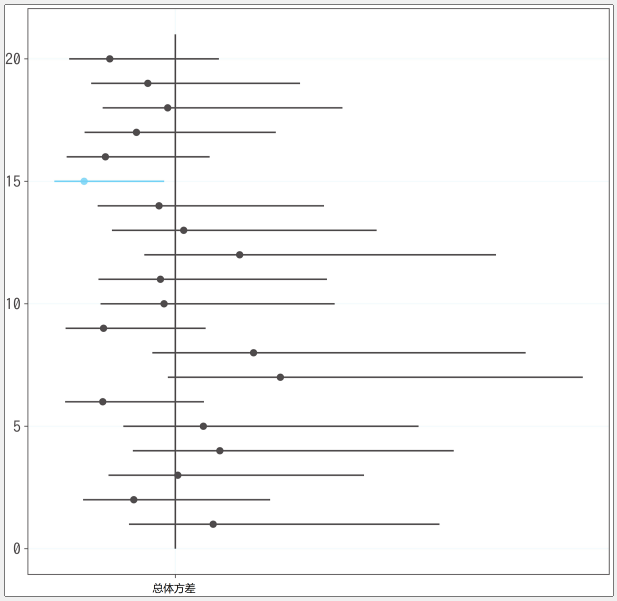

# 区间估计

本平均值和无偏方差分别为总体平均值和总体方差的优良估计量. 但是由于样本平均值和无偏方差都是随机变量, 所以`即便性质再好, 如果偶然抽到了有偏差的样本, 也有可能会出现错误的估计值`. 因此, 如果能`对假设的误差进行估算`, 得出总体平均值在这个误差允许范围内的结论, 就能得出更好的估计, 这个`就是区间估计`.


## 正态分布的总体平均值(总体方差已知)的区间估计


首先是总体平均值的区间估计, 在此假设总体服从正态分布, 且总体方差已知.

假设总体呈正态分布, 样本平均值$\overline{X}$服从$N(\mu,\sigma^2/n)$分布. 也就是说, 尽管样本平均值这个估计量的期望值与总体平均值$\mu$是一样的, 但是其标准差$\sqrt{\sigma^2/n}$, 与总体标准差不一样, 是总体标准差的平均. 这种估计量的标准差被称为标准误差(standard error). 在总体方差$\sigma^2$已知的情况下, 可以计算标准误差$\sqrt{\sigma^2/n}$, 从而可以估算估计量的误差.

由于样本平均值$\overline{X}$服从$N(\mu,\sigma^2/n)$分布, 所以可以通过$Z=(\overline{X}-\mu)/\sqrt{\frac{\sigma^2}{n}}$的标准化可以转换为`标准正态分布`, 然后就可以使用100$\alpha$%区间.

在这里考虑95%的区间, 关于$(\overline{X}-\mu)/\sqrt{\frac{\sigma^2}{n}}$, 可以建立:

$$
P(Z_{0.975} \leq (\overline{X}-\mu)/\sqrt{\frac{\sigma^2}{n}} \leq Z_{0.025} = 0.95)
$$

这个公式表示随机变量$(\overline{X}-\mu)/\sqrt{\frac{\sigma^2}{n}}$进入区间$[Z_{0.975},Z_{0.025}]$的概率为95%, 如图:



进一步变换这个公式, 使P的内容时关于$\mu$的不等式, 得到

$$
P(\overline{X}-Z_{0.025}\sqrt{\frac{\sigma^2}{n}}) \leq \mu \leq \overline{X}-Z_{0.975}\sqrt{\frac{\sigma^2}{n}} = 0.95
$$

这个式子可以理解为下面的空间:

$$
[\overline{X}-Z_{0.025}\sqrt{\frac{\sigma^2}{n}},\overline{X}-Z_{0.975}\sqrt{\frac{\sigma^2}{n}}]
$$

包含总体平均值$\mu$的概率为95%. 而且, 这个区间正是我们想通过区间估计得出的结果, 所以被称为置信度为95%的`置信区间(confidence interval, CI)`, 或者称95%置信区间. 置信区间的上限和下限分别是`置信上限(upper confidence limit)`和`置信下限(lower confidence limit)`. 更一般的说, 100(1-$\alpha$)%置信区间公式如下, 估计量的标准误差$\sqrt{\sigma^2/n}$决定了区间的宽度:

$$
设X_1,...,X_n \sim^{iid} N(\mu,\sigma^2) \\
如果总体方差\sigma^2已知, 则总体平均值的置信度为100(1-\alpha)\%的置信区间由 \\

[\overline{X}-Z_{\alpha/2}\sqrt{\frac{\sigma^2}{n}},\overline{X}-Z_{1-\alpha/2}\sqrt{\frac{\sigma^2}{n}}]
$$
给出.

使用python来实现:

```python
rv = stats.norm()
lcl = s_mean - rv.isf(0.025) * np.sqrt(p_var/n)
ucl = s_mean - rv.isf(0.975) * np.sqrt(p_var/n)

lcl, ucl  # (64.100, 76.700)
```


由此可知总体平均值的95%置信区间为[64.1,76.7]. 总体平均值时69.53分, 可以看出它包含在这个区间内.
虽然顺利的求出了置信区间, 但是置信区间的解释有点难以理解. 如果95%置信区间是[64.1,76.7], 一般认为总体平均值以95%的概率进入区间[64.1, 76.7], 但事实并非如此, 按照这个解释, 如果继续进行[64.1,76.7]的区间估计, 没100次就有95次含有总体平均值. 实际上, 即使进行了100次[64.1, 76.7]的区间估计, 总体平均值也只有一个真值, 因此结果只能是包含或者包含100次总体平均值, 或者1次也不包含总体平均值.
对95%置信区间[64.1,76.7]的正确解释是, 若用同样的方法多次抽样进行区间估计, 其中95%的区间估计中包含了总体平均值. 一定要注意的是, 有概率变动的是区间, 而不是总体平均值.

这里实验性地计算了20次置信区间, 并图示齐总有多少次包含了总体平均值. 中间的纵线是总体平均线, 不包含总体平均线的区间估计显示为蓝色:
```python
fig = plt.figure(figsize=(10, 10))
ax = fig.add_subplot(111)

rv = stats.norm()
n_samples = 20
ax.vlines(p_mean, 0, 21)
for i in range(n_samples):
    sample_ = samples[i]
    s_mean_ = np.mean(sample_)
    lcl = s_mean_ - rv.isf(0.025) * np.sqrt(p_var/n)
    ucl = s_mean_ - rv.isf(0.975) * np.sqrt(p_var/n)
    if lcl <= p_mean <= ucl:
        ax.scatter(s_mean_, n_samples-i, color='gray')
        ax.hlines(n_samples-i, lcl, ucl, color='gray')
    else:
        ax.scatter(s_mean_, n_samples-i, color='b')
        ax.hlines(n_samples-i, lcl, ucl, color='b')
ax.set_xticks([p_mean])
ax.set_xticklabels(['总体平均值'])

plt.show()
```
20次区间估计中有1次不包含总体平均, 这才是95%置信区间的含义.
下面计算1万次置信区间, 模拟一下置信区间中包含总体平均值.


### 正态分布的总体方差的区间估计
接下来进行总体方差的区间估计. 假设总体服从正态分布, 总体平均值未知.
在进行总体方差区间估计时, 想要达到的目标是:
$$
P(x \leq \sigma^2 \leq) = 0.95
$$
的形式.
为此, 正如通过标准化将样本平均值$\overline{X}$转换为服从正态分布的随机变量一样, 无偏方差$s^2$也需要进行一些换算, 构造出服从常见概率分布的随机变量.
此时使用的概率分布为卡方分布, 将无偏方差$s^2$变换为$Y=(n-1)s^2/\sigma^2$, 既可以得到$Y \sim \chi^2(n-1)$分布. 下面用python来确认一下. 首先, 从准备好的1万组样本数据中构造Y的样本数据.
```python
sample_y = sample_u_vars * (n-1) / p_var
sample_y
```
一起看一下Y的样本数据直方图和$\chi^2(n-1)$的密度函数图像:
```python
fig = plt.figure(figsize=(10, 6))
ax = fig.add_subplot(111)

xs = np.linspace(0, 40, 100)
rv = stats.chi2(df=n-1)
ax.plot(xs, rv.pdf(xs), color='gray')
hist, _, _ = ax.hist(sample_y, bins=100,
                     range=(0, 40), density=True)

plt.show()
```
测试分数的分布于正态分布并不完全一致, Y的直方图也有点参差不齐, 但大致匹配$\chi^2(n-1)$.因为知道了总体平均的区间估计, 可以按照与总体平均区间估计时相同的步骤来进行总体方差的区间估计.

现在计算总体方差95%置信区间, 首先计算$\chi^2(n-1)$的95%区间.
$$
P(\chi^2_{0.975}(n-1) \leq \frac{(n-1)s^2}{\sigma^2}\leq\chi^2_{0.025}(n-1))=0.95
$$
将公式进行变换, 使得P的内容是关于$\sigma^2$的不等式:
$$
P[\frac{(n-1)s^2}{\chi^2_{0.025}(n-1)} \leq \sigma^2 \leq \frac{(n-1)s^2}{\chi^2_{0.975}(n-1)}]=0.95
$$
总体方差$\sigma^2$的置信度为95%的置信区间可以由:
$$
[\frac{(n-1)s^2}{\chi^2_{0.025}(n-1)},\frac{(n-1)s^2}{\chi^2_{0.975}(n-1)}]
$$
得到.
把上述过程总结如下:
设$X_1,...,X_n \sim^{iid}N(\mu,\sigma^2)$, 当总体平均$\mu$未知时, 总体方差的置信度100(1-$\alpha$)%的置信区间由:
$$
[\frac{(n-1)s^2}{\chi^2_{\alpha/2}(n-1)},\frac{(n-1)s^2}{\chi^2_{1-\alpha/2}(n-1)}]
$$
使用python, 实现95%的置信区间:
```python
rv = stats.chi2(df=n-1)
lcl = (n-1) * u_var / rv.isf(0.025)
hcl = (n-1) * u_var / rv.isf(0.975)

lcl, hcl  # (91.525, 337.596)
```
总体方差的95%置信区间为[91.525, 337.596]. 总体方差是206.669, 可以确认区间内包含总体方差.
为了更加明确总体方差95%的含义, 我们进行20次置信区间的估计, 并图示说明包含了多少次总体方差. 因为卡方分布是向右偏斜的分布, 右边的宽度比无偏方差场, 可以看出无偏方差越大, 区间估计的宽度越长.
```python
fig = plt.figure(figsize=(10, 10))
ax = fig.add_subplot(111)

rv = stats.chi2(df=n-1)
n_samples = 20
ax.vlines(p_var, 0, 21)
for i in range(n_samples):
    sample_ = samples[i]
    u_var_ = np.var(sample_, ddof=1)
    lcl = (n-1) * u_var_ / rv.isf(0.025)
    ucl = (n-1) * u_var_ / rv.isf(0.975)
    if lcl <= p_var <= ucl:
        ax.scatter(u_var_, n_samples-i, color='gray')
        ax.hlines(n_samples-i, lcl, ucl, 'gray')
    else:
        ax.scatter(u_var_, n_samples-i, color='b')
        ax.hlines(n_samples-i, lcl, ucl, 'b')
ax.set_xticks([p_var])
ax.set_xticklabels(['总体方差'])

plt.show()
```


关于现在计算超1万次置信区间, 模拟置信区间包含总体样本方差的比例:
```python
rv = stats.chi2(df=n-1)
cnt = 0
for sample_ in samples:
    u_var_ = np.var(sample_, ddof=1)
    lcl = (n-1) * u_var_ / rv.isf(0.025)
    ucl = (n-1) * u_var_ / rv.isf(0.975)
    if lcl <= p_var <= ucl:
        cnt += 1
        
cnt / len(samples)  # 0.964
```
可以确认约96%的置信区间包含总体方差.

### 正态分布的总体平均值(总体方差未知)的区间估计
我们知道总体方差的情况下, 如何求正态分布的总体平均值的区间估计. 但是, 只知道总体方差而不知道总体平均值的情况并不多, 在实际应用中, 更多的是在不知道总体方差的情况下, 需要进行总体平均值的区间估计.

接下来是不知道总体方差的情况下进行总体平均值的区间估计. 在总体方差未知的情况下, 区间估计似乎变得更复杂, 但事实并非如此. 虽然使用的概率分布不同, 但可以和总体方差已知的情况一样进行区间估计.

在总体方差$\sigma^2$已知的情况下, 我们可以通过样本平均值$X$的标准误差$\sqrt{\sigma^2/n}$进行区间估计. 总体方差$\sigma^2$未知的难点在于无法计算该标准误差$\sqrt{\sigma^2/n}$. 因此, 这里用无偏方差$s^2$来替代$\sigma^2$, 这样标准误差就可以由$\sqrt{s^2/n}$计算.

和已知总体方差一样, 使用$\sqrt{s^2/n}$对样本平均值$\overline{X}$进行如下变换:
$$
t = \frac{\overline{X}-\mu}{\sqrt{s^2/n}}
$$

这是一个与标准化类似的变换, 但是hi没有使用真正的标准误差, 此时t不服从标准正态分布. 与标准正态分布$Z=(\overline{X}-\mu)/\sqrt{\frac{\sigma^2}{n}}$相比, $t=Z/\sqrt{\frac{s^2}{\sigma^2}}$好像产生了偏$\sqrt{\frac{s^2}{\sigma^2}}$.

已知卡方分布的关系式$Y = (n-1)s^2 /\sigma^2$, 做一下变换即可得到$\frac{s^2}{\sigma^2}=Y/(n-1)$.

也就是说, t可以通过标准正态分布Z和自由度n-1的卡方分布Y表示为:
$$
t = \frac{Z}{\sqrt{Y/(n-1)}}
$$
就是t分布, 也就是说t服从自由度为n-1的t分布.

现在我们知道$t=(\overline{X}-\mu/\sqrt{\frac{s^2}{n}})$服从t(n-1), 所以可求总体均值95%置信区间. 首先计算t(n-1)的95%区间:
$$
P(t_{0.975}(n-1) \leq (\overline{X}-\mu)/\sqrt{\frac{s^2}{n}} \leq t_{0.025}(n-1)) = 0.95
$$
变换这个公式, 使P的内容时关于$\mu$的不等式:
$$
P(\overline{X}-t_{0.025}(n-1)\sqrt{\frac{s^2}{n}} \leq \mu \overline{X}-t_{0.975}(n-1)\sqrt{\frac{s^2}{n}})=0.95
$$
因此, 总体平均值$\mu$的置信度为95%的置信区间, 可以由:
$$
[\overline{X}-t_{\alpha/2}(n-1)\sqrt{\frac{s^2}{n}} \leq \mu \overline{X}-t_{1-\alpha/2}(n-1)\sqrt{\frac{s^2}{n}}]
$$
求出.
与已知总体方差时相比, 使用概率分布从标准正态分布标称为自由度n-1的t分布, 置信区间公式几乎相同.
设$X_1,...,X_n \sim^{iid} N(\mu,\sigma^2)$, 总体方差$\sigma^2$未知时, 总体平均值的置信度100(1-$\alpha$)%的置信区间可以由
$$
[\overline{X}-t_{\alpha/2}(n-1)\sqrt{\frac{s^2}{n}} \leq \mu \overline{X}-t_{1-\alpha/2}(n-1)\sqrt{\frac{s^2}{n}}]
$$
给出.
使用python来验证:
```python
rv = stats.t(df=n-1)
lcl = s_mean - rv.isf(0.025) * np.sqrt(u_var/n)
ucl = s_mean - rv.isf(0.975) * np.sqrt(u_var/n)

lcl, ucl  # (64.512, 76.288)
```
总体平均值的95%的置信区间是[64.512, 76.288]. 总体的平均值是69.53分. 可以确认是包含在区间内的.


### 伯努利分布的总体区间估计
我们使用考试分数这个总体上可以假定服从正态分布的数据进行了区间估计. 但是, 并不是所有的数据都可以假定为正态分布. 例如, 要估算政府的支持率和国民的吸烟率等占总体的概率p. 此时的样本数据是通过实际调查和街头问卷得到的"支持"和"不支持","吸"或"不吸"这样的二值变量, 无法用正态分布拟合.

从实际调查和结构问卷中得到的二值变量的样本, 可以被认为是服从Bern(p)的随机变量, 其中p是总体概率. 由于Bern(p)的期望值为p, 因此可以在与总体平均值推断相同框架下推断总体的概率p. 这个推断也被称为总体的概率推断.

这里使用数据是在全国进行的一个"知道某企业推出的商品A吗"的街头问卷调查数据, 这份调查得到了1000人的回答, 使用这个数据调查全体国民对商品A的认知度p.
```python
enquete = np.array([1,0,1,1,1,1,1,0,0,1,0,1,1,0,1,1,1,0,0,0,0,0,1,0,1,1,1,0,1,1,1,0])
n = len(enquete)
```
1表示知道商品A, 0表示不知道商品A. 将各自的数据设为$X_1,...,X_n$, 则这些数据将相互独立的服从Bern(p). 由于Bern(p)的期望值为p, 方差为p(1-p), 因此该样本平均值$\overline{X}$的期望值为p, 方差为$\frac{p(1-p)}{n}$.
首先考虑点估计. 样本平均值是总体平均值的优良估计量.
```python
s_mean = enquete.mean()
s_mean  # 0.709
```
商品A的认知度推断为70.9%.
接下来求一下总体平均值的95%置信区间. 和之前的方法一样, 样本平均值$\overline{X}$使用:
$$
P(x \leq p \leq x) =0.95
$$
的形式, 但是我们不知道伯努利分布的样本平均值服从怎样的分布.

这时中心极限定理就发挥作用了. 根据该定理, 样本平均值$\overline{X}$近似服从$N(p,\frac{p(1-p)}{n})$.将该正态分布标准化, 即转换为$Z=(\overline{X}-p)/\sqrt{\frac{p(1-p)}{n}}$, 则可以认为Z服从标准正态分布:
$$
\begin{align*}
    0.95 =& P[Z_{0.975} \leq (\overline{X}-p)/\sqrt{\frac{p(1-p)}{n}} \leq Z_{0.025}]  \\
    =&P[\overline{X}-Z_{0.025}\sqrt{\frac{p(1-p)}{n}} \leq p \leq \overline{X}-Z_{0.975}\sqrt{\frac{p(1-p)}{n}}]  \\
    \approx &[\overline{X}-Z_{0.025}\sqrt{\frac{\overline{X}(1-\overline{X})}{n}} \leq p \leq \overline{X}-Z_{0.975}\sqrt{\frac{\overline{X}(1-\overline{X})}{n}}]
\end{align*}
$$
第一行是根据中心极限定理, 第3行是将p(1-p)近似为$\overline{X}(1-\overline{X})$. 用一般化的形式将上诉过程总结如下:
设$X_1,...,X_n \sim^{iid} Bern(p)$, 总体平均值的置信度100(1-$\alpha$)的置信区间可以由:
$$
[\overline{X}-Z_{0.025}\sqrt{\frac{\overline{X}(1-\overline{X})}{n}}, \overline{X}-Z_{0.975}\sqrt{\frac{\overline{X}(1-\overline{X})}{n}}]
$$
给出.
使用python实现:
$$
rv = stats.norm()
lcl = s_mean - rv.isf(0.025) * np.sqrt(s_mean*(1-s_mean)/n)
ucl = s_mean - rv.isf(0.975) * np.sqrt(s_mean*(1-s_mean)/n)

lcl, ucl  # (0.681, 0.737)
$$

### 泊松分布的总体平均值的置信区间
使用过去72小时内每小时对每个网站的访问量数据, 来估计这个网站每个小时的平均访问量.
```python
n_access_df = pd.read_csv('../data/ch10_access.csv')
n_access = np.array([10,11,9,9,18,13,4,10,10,8,10,11,16,9,12,12,7,8,11,7,11,10,6,11,7,13,14,12,8,8,8,11,10,8,6,8,11,13,12,7,11,9,12,13,14,14,12,17,9,12,11,6,11,11,11,15,9,13,6,6,13,9,12,12,10,7,13,12,6,11,16,10])
n = len(n_access)
```

可以使用泊松分布计算某事件在单位时间内发生的次数. 如果将每小时的数据设为$X_1,...,X_n$, 则这些数据响度独立的服从$Poi(\lambda)$, 它的期望和方差都是$\lambda$, 因此, 其样本平均值为$\overline{X}$的期望值为$\lambda$, 方差为$\frac{\lambda}{n}$. 首先对总体平均值$\lambda$进行点估计:
```python
s_mean = n_access.mean()
s_mean  # 10.444
```
估计每小时平均访问量为10.444次.
接下来考虑区间估计. 因为不知道泊松分布的样本平均值服从怎样的概率分布, 所以使用中心极限定理. 根据中心极限定理, 样本平均值$\overline{X}$近似地服从$N(\lambda, \frac{\lambda}{n})$, 将该正态分布标准化, 即$Z=(\overline{X}-\lambda)/\sqrt{\frac{\lambda}{n}}$, z将被视为服从正态分布.
下面试着计算总体平均值$\lambda$的95%置信区间.
$$
\begin{align*}
    0.95 \approx & P[Z_{0.975} \leq (\overline{X}-\lambda)/\sqrt{\frac{\lambda}{n}} \leq Z_{0.025}]  \\
    = & P[\overline{X}-Z_{0.025}\sqrt{\frac{\lambda}{n}} \leq \lambda \leq \overline{X}-Z_{0.975}\sqrt{\frac{\lambda}{n}}]  \\
    \approx & P[\overline{X}-Z_{0.025}\sqrt{\frac{\overline{X}}{n}} \leq \lambda \leq \overline{X}-Z_{0.975}\sqrt{\frac{\overline{X}}{n}}]
\end{align*}
$$

第1行是中心极限定理, 第3行是将$\lambda$近似为$\overline{X}$, 用一般化的形式表示如下:
设$X_1,...,X_n \sim^{iid} Poi(\lambda)$, 总体平均值的置信度为100(1-$\alpha$)$的置信区间可以由:
$$
[\overline{X}-Z_{\alpha/2}\sqrt{\frac{\overline{X}}{n}} \leq \lambda \leq \overline{X}-Z_{1-\alpha/2}\sqrt{\frac{\overline{X}}{n}}]
$$
给出.
使用python实现:
```python
rv = stats.norm()
lcl = s_mean - rv.isf(0.025) * np.sqrt(s_mean/n)
ucl = s_mean - rv.isf(0.975) * np.sqrt(s_mean/n)

lcl, ucl  # (9.698, 11.191)
```


### 置信区间的求解细节
下面介绍区间估计的传统方法, 区间估计的计算顺序如下:
1. 计算自由度为n的t分布的97.5%分位数
   1. 将t分布97.5%分位数记作$t_{0.975}$
   2. t分布相对于均值左右对称, 那么2.5%分位数就是$-t_{0.975}$
   3. 服从t分布的变量落在$-t_{0.975}$和$t_{0.975}$之间的概率为95%
2. "样本均值-$t_{0.975}$ \times 标准误差" 为下置信界限
3. "样本均值+t_{0.975} \times 标准误差" 为上置信界限

下面结合数学公式理解以上步骤的含义.
首先回顾以下t值的计算公式:
$$
t值=\frac{\hat{\mu}-\mu}{\hat{se}}
$$
其中, $\hat{\mu}$为样本均值e, $\mu$为总体均值, $\hat{se}$为样本的标准误差.
t值处于$-t_{0.975}$和$t_{0.975}$之间的概率为95%:
$$
P(-t_{0.975} \leq \frac{\hat{\mu}-\mu}{\hat{se}} \leq t_{0.975})=95\%
$$
求解总体均值$\mu$,得到
$$
P(\hat{\mu}-t_{0.975} \times \hat{se} \leq \mu \leq \hat{\mu}+t_{0.975} \times \hat{se})=95\%
$$
使用python验证:
```python
## 97.5% 分位数
t_975 = stats.t.ppf(q = 0.975, df = df)
t_975  # 2.262
## 下置信界限
lower = mu - t_975 * se
lower  # 3.597
## 上置信界限
upper = mu + t_975 * se
upper  # 4.777

```


### 决定置信区间大小的因素
样本的方差大, 就表明数据更偏离均值, 相应地均值就更不可信, 从而导致置信区间更大. 用程序验证, 先把样本标准差变为原来的10倍, 再计算95%置信区间, 可以看到这个区间编的很大:
```python
## 样本方差越大, 置信区间越大
se2 = (sigma*10) / sp.sqrt(len(fish))
stats.t.interval(
    alpha = 0.95, df = df, loc = mu, scale = se2)  # (-1.713, 10.087)
```
这个现象, 比较直观的理解是, 置信区间越大, 真正的总体均值的位置越难以确定.

而样本容量越大, 样本均值就越可信, 进而置信区间就越小. 同样也使用程序来验证. 设样本容量为原来的10倍. 可以看到, 样本容量越大, 自由度就越大, 标准误差就越小:
```python
## 样本容量越大, 置信区间越小
df2 = (len(fish)*10) - 1
se3 = sigma / sp.sqrt(len(fish)*10)
stats.t.interval(
    alpha = 0.95, df = df2, loc = mu, scale = se3)  # (4.023, 4.351)
```

如果使用完全相同的数据, 那么置信水平越大, 为确保安全, 置信区间就会越大. 99%置信区间的计算如下:
```python
## 99% 置信区间
stats.t.interval(
    alpha = 0.99, df = df, loc = mu, scale = se)  # (3.339, 5.035)
```


### 区间估算结果的解读
使用程序验证: "置信水平95%"中的95%是像下面这样获得的:
1. 从真正的总体中抽样
2. 计算95%的置信区间
3. 反复进行前两步的操作
4. 所有试验所得的区间中包含真正的参数的概率为95%


```python
## 如果置信区间包含总体均值 (4) 就取 True
be_included_array = np.zeros(20000, dtype = "bool")
be_included_array

## 执行 20,000 次求 95% 置信区间的操作
## 如果置信区间包含总体均值 (4) 就取 True
np.random.seed(1)
norm_dist = stats.norm(loc = 4, scale = 0.8)
for i in range(0, 20000):
    sample = norm_dist.rvs(size = 10)
    df = len(sample) - 1
    mu = sp.mean(sample)
    std = sp.std(sample, ddof = 1)
    se = std / sp.sqrt(len(sample))
    interval = stats.t.interval(0.95, df, mu, se)
    if(interval[0] <= 4 and interval[1] >= 4):
        be_included_array[i] = True
sum(be_included_array) / len(be_included_array)  # 0.948
```