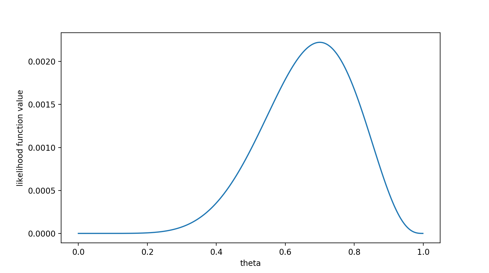
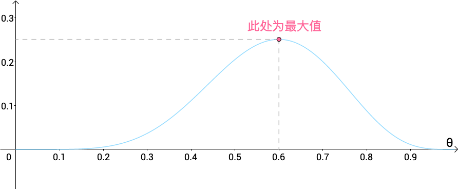
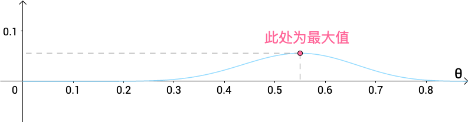

# 最大似然估计

## 似然

当参数为某值时抽到特定样本的概率(密度)叫做似然. 似然的英文是Likelihood, 常用首字母$\zeta$表示.
以投掷两次硬币的结果作为样本, 其中第一次为正面, 第二次为反面. 假设投出正面的概率为1/2, 则1/2为参数, 上述样本的概率, 即似然, 就是 $1/2 \times 1/2 = 1/4$

## 似然函数
给定参数时计算似然的函数叫做似然函数. 仍以投硬币为例, 得到正面的概率为参数, 用$\theta$表示, 通过参数$\theta$计算似然的似然函数就是$\zeta(\theta)$. 在硬币的例子中, 似然函数如下:
$$
\zeta(\theta) = \theta \times (1 - \theta)
$$

## 对数似然
似然取对数就是对数似然, 去对数的目的主要是简化后续的计算.
### 指数
形如$2^3$就是指数.它的含义是$2 \times 2 \times 2 = 8$. 也就是说2的3次方就是3个2相乘.

### 对数
指数逆运算.
$$
\log_2^8 = 3
$$
对应的就是2的三次方等于8. 2叫做对数的底. 自然对数的底$e$, 它的值约为2.7. 自然对数的底可以简化一些计算. x的自然对数$\log_ex$可以写作$\ln e$

#### 性质1 单调递增
函数$f(x)=\log_ax(a>0,且a \neq 1$中, 当$a>1$时, x越大, 则$\log_a x$越大.

#### 性质2 乘法转化为加法
取对数可以吧乘法运算转化为加法运算.
考察乘法公式:
$$
2 \times 4 = 8
$$
两边取对数:
$$
\log_2(2\times 4) = \log_2 8
$$
将左边的乘法运算提到log运算符外侧, 乘法运算就变成了加法运算:
$$
\log_2 2 + \log_2 4 = \log_2 8
$$
一般来说, 下式是成立的:
$$
\log_a(xy) = log_a x + log_a y
$$
下面换一个比较复杂的运算.
先回顾以下用于求和的$\sum$符号:
$$
\sum_{i=1}^5 i = 1 + 2 +3 +4 +5
$$
现在导入新的运算符$\prod$, 它代表求积:
$$
\prod_{i=1}^5 i = 1 \times 2 \times3 \times 4 \times 5
$$
求积运算取对数就会变成求和运算:
$$
\begin{align*}
    &\log_a(\prod_{i=1}^5 i)  \\
    =&\log_a(1 \times 2 \times 3 \times 4 \times 5)  \\
    =&\log_a 1+\log_a 2 + \log_a 3 + \log_a 4 + \log_a 5  \\
    =&\sum_{i=1}^5\log_a i
\end{align*}
$$

#### 性质3: 绝对值没有过小
去对数可以避免绝对值过小. 在计算机上进行计算时这一点非常重要. 一般来说`0.000000000000001`这样的数, 在计算机中多会变成0.
设有绝对值很小的数, 约为0.001:
$$
\frac{1}{1024}
$$
对这个数取以2位底的对数, 得到:
$$
\log_2\frac{1}{1024} = -10
$$
因为$2^{10}=1024$, 所以上式的值就是-10, 绝对值变大了. 这样一来, 计算机就不会把很小的数看做0了.

### 最大似然法
求使得似然或对数似然最大的参数, 并把这个参数作为参数估计值的方法就是最大似然法.
以投掷硬币为例, 当参数$\theta$为$1/2$时, 似然为1/4; 当参数$\theta$为1/3时, 似然为2/9. 1/4 > 2/9, 所以1/2是比较适合$\theta$的值.
通过最大似然估计法估计得到的参数叫做最大似然估计量. 为了表明他是一个估计量, 在其符号上面加个帽子, 记作$\hat{\theta}$.
最大似然估计量对应的对数似然叫做最大对数似然, 记作$\ln\zeta(\hat{\theta})$

### 服从正态分布的数据的似然
假设总体服从正态分布时最大似然法的计算过程.
首先介绍无解释比那辆的空模型的参数估计方法.
设啤酒的销售额为$y$, $y$服从均值为$\mu$, 方差为$\sigma^2$的正态分布:
$$
y \sim N(\mu, \sigma^2)
$$
虽然说样本容量越大越好, 但为了计算简便, 这里不妨设样本容量为2.
出现样本值$y_1$的概率密度为$N(y_1|\mu,\sigma^2)$, 出现样本值$y_2$的概率密度为$N(y_2|\mu,\sigma^2)$. 此时似然计算式如下:
$$
\zeta = N(y_1|\mu,\sigma^2) \times N(y_2|\mu, \sigma^2)
$$
接下来只要求出使$\zeta$最大的参数$\mu$和$\sigma^2$即可.

### 多余参数
与问题没有直接关系的参数叫做多余参数. 正态分布的参数有两个, 分别为均值和方差. 由于方差可以由均值求得, 所以只要估计出均值, 就可以间接得到方差. 此时, 方差按已知看待, 无须再考虑.
假设总体服从正态分布, 在最大似然法中, 方差$\sigma^2$就是多余参数. 在对空模型进行估算时, 只估计$\mu$的值即可.

### 正态线性模型的似然
以啤酒销售额模型来讲解最大似然法的参数估计. 这里假设响应变量服从正态分布, 所以这个模型为正态线性模型:
$$
啤酒销售额 \sim N(\beta_0 + \beta_1 \times 气温, \sigma^2)
$$
下面计算已知系数$\beta_0$和$\beta_1$时的似然.
设样本容量为2, 啤酒销售额为$y$, 当日的气温为$x$. 似然的计算公式如下:
$$
\zeta = N(y_1|\beta_0 + \beta_1x_1,\sigma^2) \times N(y_2|\beta_0+\beta_1x_2,\sigma^2)
$$
其中, $\sigma^2$为多余参数.
当样本容量为n时, 样本似然的计算公式如下:
$$
\zeta = \prod_{i=1}^nN(y_i|\beta_0+\beta_1x_1, \sigma^2)
$$
两边取对数, 将求积转化为求和, 得到:
$$
\ln\zeta = \sum_{i=1}^n \ln(N(y_i|\beta_0 + \beta_1x_1,\sigma^2))
$$
在最大似然法中, 是的对数似然最大的参数$\beta_0, \beta_1$被用作参数估计值. 求使得某函数最大的参数时, 运算符为 arg max, 其数学公式如下:
$$
\begin{align*}
    &\argmax_{\beta_0,\beta_1}\ln\zeta  \\
    &=\argmax_{\beta_0,\beta_1}\sum_{i=1}^n\ln(N(y_i|\beta_0+\beta_1x_i,\sigma^2))
\end{align*}
$$
把$N()$换为正态分布的概率密度公式, 就可以计算对数似然了
$$
\begin{align*}
    &\argmax_{\beta_0,\beta_1}\ln\zeta  \\
    &=\argmax_{\beta_0,\beta_1}\sum_{i=1}^n\ln(N(y_i|\beta_0+\beta_1x_i,\sigma^2))  \\
    &=\argmax_{\beta_0,\beta_1}\sum_{i=1}^n\ln(\frac{1}{\sqrt{2\pi\sigma^2}}exp(-\frac{(y_i-(\beta_0+\beta_1x_i))^2}{2\sigma^2}))  \\
    &=\argmax_{\beta_0,\beta_1}\sum_{i=1}^n(ln(\frac{1}{\sqrt{2\pi\sigma^2}})-\frac{(y_i-(\beta_0+\beta_1x_i))^2}{2\sigma^2})
\end{align*}
$$
其中, 对数的底为$e$, $e^x$形式不够清晰, 所以此处记为$exp(x)$.

### 最大似然法计算举例
通过求导可以得到相关值的解析解. 如果模型中还有解释变量, 数学公式会变得很复杂. 这里就以空模型为例来估计参数$\mu$:
$$
啤酒的销售额 \sim N(\mu,\sigma^2)
$$
它的对数似然的计算式为:
$$
\begin{align*}
    &\argmax_{\mu}\ln\zeta  \\
    &=\argmax_{\mu}\sum_{i=1}^n\ln(N(y_i|\mu,\sigma^2))  \\
    &=\argmax_{\mu}\sum_{i=1}^n(\ln(\frac{1}{\sqrt{2\pi\sigma^2}})-\frac{(y_i-\mu)^2}{2\sigma^2})
\end{align*}
$$
要想求得最大值,就要找到使得导数为0的点.
在上式中, 要求使得对数似然最大的$\mu$的值,就要先以$\mu$为变量求对数似然的导函数, 再求当导数为0时$\mu$的值.
求导之后即可清理杂项:
$$
\sum_{i=i}^n\frac{2(y_i-\mu)}{2\sigma^2}=0
$$
$\sigma^2$为多余参数, 令他为常量, 则上式可继续化简为:
$$
\sum_{i=1}^n(y_i-\mu)=0
$$
提取$\mu$,得到
$$
\sum_{i=1}^ny_i-n\mu =0
$$
最后得到:
$$
\mu= \frac{1}{n}\sum_{i=1}^ny_i
$$

## 马同学

## 什么是最大似然估计
概率（probabilty）和统计（statistics）看似两个相近的概念，其实研究的问题刚好相反。
概率研究的问题是，已知一个模型和参数，怎么去预测这个模型产生的结果的特性. 举个例子，我想研究怎么养猪（模型是猪），我选好了想养的品种、喂养方式、猪棚的设计等等（选择参数），我想知道我养出来的猪大概能有多肥，肉质怎么样（预测结果）。
统计研究的问题则相反。统计是，有一堆数据，要利用这堆数据去预测模型和参数。仍以猪为例。现在我买到了一堆肉，通过观察和判断，我确定这是猪肉（这就确定了模型。在实际研究中，也是通过观察数据推测模型是／像高斯分布的、指数分布的、拉普拉斯分布的等等），然后，可以进一步研究，判定这猪的品种、这是圈养猪还是跑山猪还是网易猪，等等（推测模型参数）

一句话总结：概率是已知模型和参数，推数据。统计是已知数据，推模型和参数。
似然（likelihood）这个词其实和概率（probability）是差不多的意思，Colins字典这么解释：The likelihood of something happening is how likely it is to happen. 你把likelihood换成probability，这解释也读得通。但是在统计里面，似然函数和概率函数却是两个不同的概念

对于$P(x|\theta)$, 输入有两个:
1. x表示具体数据
2. $\theta$表示模型的参数

如果$\theta$已知, x是变量, 则这个函数叫概率函数(probability function), 描述不同样本点x的出现概率是多少.
如果x已知,$\theta$是变量,则这个函数叫似然函数(likelihood function), 描述使得该样本点最大可能性出现的$\theta$值.

类似的表示还有幂函数和指数函数.
$$
f(x,y)=x^y
$$
如果x是已知, y未知, 则是指数函数, $f(x,y)=2^y$
如果y是已知, x未知, 则是幂函数, $f(x,y)= x^2$

同一个数学形式, 不同变量角度观察, 可以有不同的名字.

### 扔硬币例子1
假设有一个造币厂生产某种硬币，现在我们拿到了一枚这种硬币，想试试这硬币是不是均匀的。即想知道抛这枚硬币，正反面出现的概率（记为$\theta$）各是多少？
这是一个统计问题，回想一下，解决统计问题需要什么？ 数据！
于是我们拿这枚硬币抛了10次，得到的数据($x_0$)是：反正正正正反正正正反。
那么，出现实验结果$x_0$（即反正正正正反正正正反）的似然函数是多少呢？
$$
f(x_0,\theta) \\
=(1-\theta)\times\theta\times\theta\times\theta\times\theta\times(1-\theta)\times\theta\times\theta\times\theta\times(1-\theta) \\
=f(\theta)
$$
注意，这是个只关于θ \thetaθ的函数。而最大似然估计，顾名思义，就是要最大化这个函数。我们可以画出f ( θ ) f(\theta)f(θ)的图像:

求导可得在$\theta = 0.7$时，似然函数取得最大值。

### 扔硬币2
相比`扔硬币1`, `扔硬币2`加入了组合的系数${10\choose 6}$, 注意组合系数并不影响最后的结果.
有一枚未知硬币（未知指不清楚它正面出现的概率p为多少）扔十次，假设随机变量为：
$$
X=“扔十次出现正面的次数”
$$
那么该随机变量服从p未知的二项分布：
$$
X\sim b(10,p)
$$
我们把这枚硬币真正抛了十次，得到六次正面，也就是得到了一个该二项分布的样本（此样本的容量为1），要借此推断未知参数p为多少。首先列出得到六次正面的概率：
$$
P(X=6)={10\choose 6}p^6(1-p)^4
$$
假如说p=0.5，那么上述概率为：
$$
P(X=6)={10\choose6}0.5^{6}(1-0.5)^{4}\approx0.21
$$
而如果p=0.6，上述概率为：
$$
P(X=6)={10\choose6}0.6^{6}(1-0.6)^{4}\approx0.25
$$
根据最大似然的思想，p=0.6的可能性更大，所以应该认为p=0.6更接近于事实。

当然，我们应该比较所有p，也就是$0\le p\le 1$，对应的二项分布的概率，并找出其中最大的概率。只需要p看作自变量$\theta$，可以得到一个函数，该函数的值域即所有p对应的二项分布的概率：
$$
L(\theta)={10\choose 6}\theta^6(1-\theta)^4,\quad 0 \le \theta \le 1
$$
那么该函数的最大值即最大的概率，可见在$\theta=0.6$时取得最大值（$\frac{\mathrm{d}}{\mathrm{d}\theta}L(\theta)=0$时取得最大值）：

所以$\theta=0.6$，就是最大似然估计给出的对p的估计值。

### 扩大样本容量
刚才的样本容量只有1，具有很大的随机性，所以应该进一步扩大样本容量来增加估计的确定性。
比如说连续扔了n个十次硬币，分别得到的正面为$X_1、X_2、\cdots、X_n$，这些个体对应的概率相乘可以得到`样本的联合分布`：
$$
P(X=X_1)P(X=X_2)\cdots P(X=X_n)=\prod_{i=1}^{n}P(X=X_i)
$$

后面的还是要举例来说明才容易说清楚，比如做了两次实验，一次得到6次正面，一次得到5次正面，对应的概率分别为：
$$
P(X=6)={10\choose 6}p^6(1-p)^4
$$
$$
P(X=5)={10\choose 5}p^5(1-p)^5
$$
两者相乘可以得到样本联合分布：
$$
P(X=6)P(X=5)={10\choose 6}p^6(1-p)^4\cdot {10\choose 5}p^5(1-p)^5
$$
将未知参数p作为自变量\theta，可以得到一个函数：
$$
L(\theta)={10\choose 6}\theta^6(1-\theta)^4\cdot {10\choose 5}\theta^5(1-\theta)^5
$$

该函数在\theta=0.55时取得最大值，也就是说，样本扩大之后\theta=0.55是p的最大似然估计量（$\frac{\mathrm{d}}{\mathrm{d}\theta}L(\theta)=0$时取得最大值）：

## 严格的定义
若总体X为离散型随机变量，其分布律为：
$$
P(X=x)=p(x;\theta),\quad \theta\in\Theta
$$
其中，$\theta$表示某未知参数，$\Theta$表示$\theta$的可能取值范围。

设$X_1，X_2，\cdots，X_n$为X的一个简单随机样本，$x_1，x_2，\cdots，x_n$为来自该样本的具体数值，则样本联合分布为：
$$
\prod_{i=1}^{n}p(x_i;\theta)
$$
若以$\theta$为变量则有：
$$
L(x_1,x_2,\cdots,x_n;\theta)=\prod_{i=1}^{n}f(x_i;\theta)
$$
该函数称为样本的`似然函数`（注意该函数中$x_1，x_2，\cdots，x_n$都是已知的样本值，它们都是常数）。令该函数取得最大值的$\hat\theta$：
$$
L(x_1,x_2,\cdots,x_n;\hat\theta)=\max_{\theta\in\Theta}L(x_1,x_2,\cdots,x_n;\theta)
$$
称这个$\hat\theta$为参数$\theta$的最大似然估计值，因为这个$\hat\theta$只与$x_1，x_2，\cdots，x_n$有关，所以也记作$\hat\theta(x_1,x_2,\cdots,x_n)$。对应的统计量$\hat\theta(X_1,X_2,\cdots,X_n)$称为最大似然估计量。

很多情况下，$p(x;\theta)$和$f(x;\theta)$都关于$\theta$可微，所以可通过方程：
$$
\frac{\mathrm{d}}{\mathrm{d}\theta}L(\theta)=0
$$
求出最大似然估计值$\hat\theta$，又因为$L(\theta)$和$\ln L(\theta)$在同一个$\theta$处取得极值，所以也可以通过解：
$$
\frac{\mathrm{d}}{\mathrm{d}\theta}\ln L(\theta)=0
$$
求出最大似然估计值$\hat{\theta}$，由于对数可以将乘法转为加法，所以求解该方程可能会简单些。$\ln L(\theta)$也称为\color{Salmon}{对数似然函数}。

还需要补充一下，首先，最大似然估计值$\hat{\theta}$往往（符合某些条件时，在实践中可以认为基本都是符合条件的）是一致的，因此是可以接受的估计量；其次，似然函数和概率函数最大的不同，前者的自变量为参数，参数是确定的值，并非是随机变量，而概率函数的自变量为随机变量。

## 参考:
- 马同学
- https://blog.csdn.net/u011508640/article/details/72815981
- https://zhuanlan.zhihu.com/p/36824006
