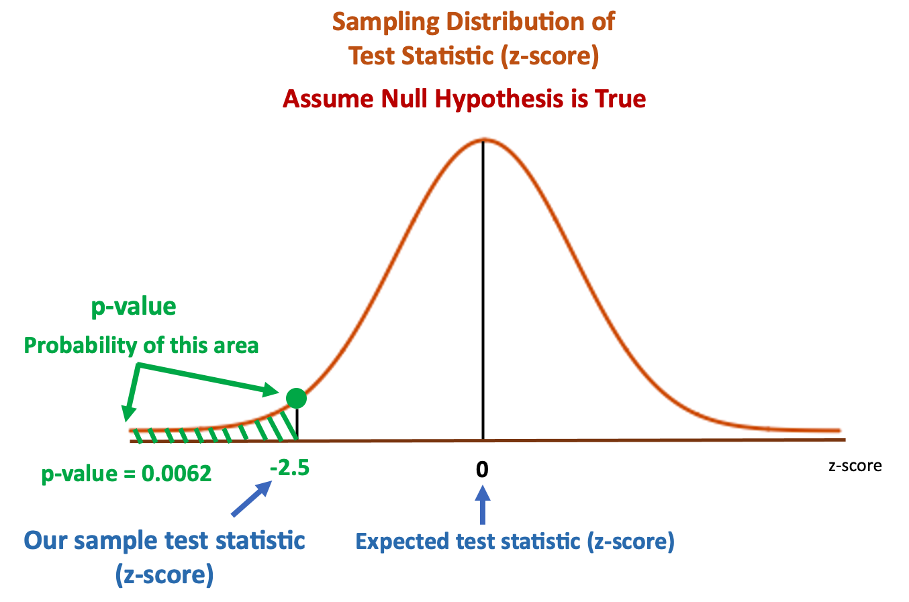

# 假设检验


## 概念
`统计假设检验(statistical hypothesis testing)`是一种统计学框架, 即建立关于总体参数的两个假设, 利用从样本中计算出的统计量来判断哪一个假设正确.

## 理解假设检验的入门案例

饼干店老板声称他家的饼干一袋的平均重量($\mu$)是500g. 由于是流水线生产, 所以每袋饼干的标准差($\sigma$)为30g. 所以可得如下的分布:


这个店的老板会不会撒谎?我们如何确定平均重量是不是500g呢?这就需要假设检验(hypothesis testing)出场了.


### 提出假设
1. 先假设店老板是诚实的(H0, null hypothesis), 如果我们想检查他的饼干是不是少于500g, 我们需要搜集证据来支持我们的猜测(H1, alternative hypothesis):

	1. H0: 每袋的重量$\mu$=500g
	2. H1: 每袋的重量$\mu$<500g

由于我们不知道整体的分布(population distribution), 所以使用虚线来表示. 如果店老板是诚实的, 那么分布就应该是左边的图片. 如果是小于500g, 则是右边的图片的某一个.


### 推断统计(Inferential Statistics)

我们无法得到所有饼干的重量, 既无法计算整体的分布. 所以我们可以通过抽样来估算.

1. 首先我们从整体中抽样得到抽样数据(sample), 计算出统计量(statistics), 如样本均值, 样本方差
2. 然后通过统计量估算除整体(population)的参数(parameters), 如整体的均值, 整体方差

Examples of parameters and statistics:
- parameters: population mean (μ), population standard deviation (σ)
- statistics: sample mean (x̄), sample standard deviation (s)


### 抽样分布
如果我们多次从整体中抽样, 我们可以获得多个抽样数据集. 我们计算每个抽样数据集的均值($\overline{X}$),  通过这些均值可以画出抽样的均值分布.由于这个分布, 是由抽样统计得来, 所以我们称之为: Sampling Distribution of sample mean ($\overline{X}$). 如下图, 使用棕色来代表样本分布曲线(sampling distribution curve).


### 验证假设(Testing Hypothesis Statements)

1. 获得样本数据集, 我们获得25袋饼干, 计算其mean weight (x̄)=485g
2. 假设$H_0$为真, 既一袋饼干的整体分布为500g, 根据`中心极限定律`(Central Limit Theorem,) 我们可以得到抽样均值(x̄)的分布.


假设, 我们的抽样均值为485g, 相对于期望($H_0$假设)的(500g)低了15g(485-500=-15).


但是"15g"只是一个数字, 并不能作为解释. 另外我们想计算曲线下方的概率, 但是直接计算会非常的低效, 因为不同的曲线对应了不同的值.所以我们要对其进行标准化(standardize), 这样分布的均值为0.


如果`H0`成立, 则`population mean =500g, sample mean = 500g`.而在这次抽样中, 我们的`sample mean = 485g`, 计算后的`test statistic = -2.5`. 表示样本均值有2.5个`标准差相对于期望值`(expected value,$H_0$).

在这个场景中, 由于我们感兴趣的是均值, 而且假设整体是已知标准差(σ)的正态分布. 根据这些前提, 我们选择了`z-test`. 那么在$H_0$为真时, 获得这样的样本数据集的概率是多少呢?

首先这个概率值,我们称为`p-value`, 是下图中绿色的面积, 通过查询`z-table`, 得到`p-value`为0.0062



这是一个非常小的值, 它意味着在$H_0$为真的条件下(整体的均值为500), 如果我们从整体中采样1000次, 有6.2次的机会获得这个样本集合(sample mean = 485g), 或者sample mean < 485g.


换句话说: 如果我们获得一个mean=485g的采样数据集, 他们的解释有两个:

1. population mean=500g(H0是正确的), 我们很"幸运"的获得了这个采样的数据集(P=0.0062)
2. H0是错误的, 这个mean=485g的采样数据集可能来自于其他的分布, 当然很可能是来自于mean = 485g 的分布.


至于是使用第一个解释还是第二个解释,需要引入新的概念: 显著性水平(`significant level (α)`).这个值是再假设检验之前设置的, 它就是评判`p-value`的阈值:

1. if p-value ≤ significant level (α), we reject the null hypothesis (H0).
2. if p-value > significant level (α), we accept the null hypothesis (H0).

我们设置显著性水平为0.05.如果p-value在红色区域, 我们就拒绝H0的假设;如果p-value大于红色区域, 我们就接收H0的假设.显著性水平是我们主观设置的阈值.


在这个场景中, 我们的p-value=0.0062, 小于significant level (α)=0.05. 所以我们就拒绝了假设$H_0$, 而接受了$H_1$.


## python实操的一个案例


A经常去便利店买红薯. 这份薯条标明的平均重量为130g. 有一天, A称了一下薯条的重量, 发现只有122.02g. A怀疑便利店的薯条实际平均重量达不到130g, 于是他连续两周每天都去买薯条并称重. 两周后, 他计算出这14个样本的平均值为128.451g. A认为14个样本的平均值明显低于130g, 便去便利店投诉. 但是便利店以这只是偶然情况拒绝了A的投诉. 那么14个样本的平均值128.451g比标重130g小真的只是偶然嘛?使用**统计检验**可以方便地判断其是否是偶然的.

首先使用python创建数据集:

```python
import numpy as np
import pandas as pd
from scipy import stats
sample = np.array([122.02,131.73,130.6,131.82,132.05,126.12,124.43,132.89,122.79,129.95,126.14,134.45,127.64,125.68])
s_mean = np.mean(sample)  # 128.451
```

### 统计假设检验的基础
A想确认薯条的总体平均值是否比130g少, 为此, `先假设薯条的重量服从正态分布`, 总体方差为9, 则方差为$\frac{9}{14}$

首先假设总体平均值为130g. 在这个假设下, 薯条的14个样本服从$X_1,X_2,...,X_{14} \sim^{iid}N(130,\frac{9}{14})$, 样本平均值$\overline{X}$服从$N(130,\frac{9}{14})$. 因为样本平均值$\overline{X}$是随机变量, 我们可以看到它可能低至125g, 也可能达到135g.
在此考虑样本平均值$\overline{X}$满足$P(\overline{X} \leq x)= 0.05$的$x$.

```python
rv = stats.norm(130, np.sqrt(9/14))
rv.isf(0.95)  # 128.681
```

从$P(\overline{X} \leq 128.681)=0.05$, 可知样本平均重量低于128.681g的概率为5%. 由此可确认, A拿到的样本平均值为128.451g是只有5%的概率发生的小概率事件.


如果买到的炸薯条的样本平均值为128.451g, 肯定会有人觉得这样的事情发生的概率只有5%, 只是运气不好罢了. 但是进行假设检验的A不同意偶然这种说法, 他会觉得这个假设有问题. 也就是说, 样本平均值为128.451g, 在"总体平均值为130g"这个假设之下, 不能说是偶然发生了概率为5%的事件, 只能认为总体平均值低于130g, 由此可以得出总体平均值低于130g的结论. 这就是假设检验的大致流程.

验证假设的过程中, 使用了关于总体的两个假设:**零假设(null hypothesis)**$H_0$和**备选假设(alternative hypothesis)** $H_1$.

1. 备选假设主张的假设是"有差别" 或 "有效果"等内容, 
2. 零假设与备选假设相反, 是"没有差别"或"没有效果"等内容. 零假设和备选假设分别写作和.

为了验证这两个假设, 需要从个样本中计算统计量进行假设检验, 得到的结论是"**拒绝零假设**"(reject the null hypothesis)或者"**接受零假设**"(accept the null hypothesis).

拒绝或接受零假设的判断, 是在假定零假设正确的基础上, 从样本中计算出的统计量取值是否为小概率事件来决定的. 是否为小概率事件是通过显著性水平来判断的, 这是一个主观的值.

备选假设是"总体平均值低于130g", 而零假设主张的是"总体均值是130g". 这个假设检验可能得到的结论是"拒绝零假设", 即认为"总体平均值低于130g", 或者"接受零假设", 即认为"总体平均值不低于130g". 请注意, 在假定零假设正确的情况下, 不能得出"总体平均值为130g"的结论.

如果样本平均值低于128.681g, 则拒绝零假设, 如果高于这个值, 则接受零假设. 像这样, 零假设被拒绝的区间称为`拒绝域`(rejectio region), 被接受的区间称为`接受域`(acceptance region). 上图中, 蓝色区间为拒绝域, 非蓝色区间为接受域, 而`拒绝域的面积就是进入拒绝域的概率`,  所以在假设检验中先确定这个概率再进行检验. 这个概率被称为`显著性水平`(level of significance), 进入拒绝域的阈值被称为`临界值`(critical value). 另外, 用于检验的统计量被称为`检验统计量`(test statistic). 在薯条的例子中, 显著性水平为5%, 检验统计量是样本均值, 临界值为128.681.

检验统计量小于临界值的情况如下图所示, `临界值左侧区域`的面积是`显著性水平`, 同样, `检验统计量左侧区域`的面积被称为`p值`(p-value).假设检验不仅可以`通过比较检验统计量和临界值进行`, 也可以`通过比较p值和显著性水平来进行`. 在这种情况下, 当p值低于显著性水平时, 将拒绝零假设, 否则将接受零假设.


下面再来考虑一下薯条重量平均值的假设检验问题. 假设零假设"总体平均值为130g"正确, A买的`14分炸薯条`相互独立的服从N(130,9), `样本平均值`$\overline{X}$服从$N(130,9/14)$. 刚才在检验统计量中使用样本平均值$\overline{X}$, 在这里将检验过程一般化, 使用样本平均值$\overline{X}$的标准化变量$Z=(\overline{X}-130)/\sqrt{\frac{9}{14}}$. 通过标准化变换, 其上侧100$\alpha$\%分位点可以用$Z_\alpha$来表示, 临界值就是满足$P((\overline{X}-130)/\sqrt{\frac{9}{14}}\leq x)=0.05$的$x$, 即$x=z_{0.95}$.

在这个假设检验中, 当检验统计量比临界值小时就会拒绝零假设, 反之, 会接受零假设, 总结如下:

1. 若$(\overline{X}-130)/\sqrt{\frac{9}{14}} < z_{0.95}$
2. 若$(\overline{X}-130)/\sqrt{\frac{9}{14}} \ge z_{0.95}$

用python来计算:
```python
z = (s_mean - 130) / np.sqrt(9/14) # 检验统计量
rv = stats.norm()
rv.isf(0.95)  # -1.645 计算临界值
```
比较检验统计量和临界值, 发现检验统计量比临界值小. 由此可以得出结论: 拒绝零假设, 认为总体平均值低于130g.
使用p值的假设检验也要确认, 首先从检验统计量中求出p值, p值可以使用累积分布函数:
```python
rv.cdf(z)  # 0.027
```
p值为0.027, 明显小于显著性水平0.05, 所以拒绝零假设. 以p值为基准的假设检验也得到了与之前相同的结论.将以p值为基准的假设检验流程汇总为下图:


### 单侧检验和双侧检验

因为A只对薯条的平均值是否低于130g有兴趣, 所以以"总体平均值比130g少"的备选假设进行假设检验. 除此之外, 也可以将"总体平均值不是130g"设为备选假设进行假设检验. 这种情况下, 总体平均值不仅可以低于130g, 也可以高于130g. 这种检验叫做双侧检验. 另外像A那样只是在一侧进行的检验叫做单侧检验.

单侧检验和双侧检验的拒绝域不同. 即使是对同等显著性水平$\alpha$的检验, 从同一侧来看, 单侧检验的拒绝域范围更广. 因此单侧检验比双侧检验更容易拒绝零假设.


```python
z = (s_mean - 130) / np.sqrt(9/14)  # -1.932
rv = stats.norm()
rv.interval(0.95)  # (-1.960, 1.960)
```

通过比较临界值和检验统计量, 可以发现体验统计量进入了接受域. 也就是说, 双侧检验不能拒绝零假设. 请记住这样有个事实: 单侧检验与双侧检验相比, 单侧检验更容易拒绝零假设.
双侧检验的p值需要考虑上和下两部分的面积, 所以需要将累积分布函数的值设为原来的2倍.

```python
rv.cdf(z) * 2  # 0.053
```


## 一些常见的检验方法


1. Normality Tests: 用来检测数据集是否是Gaussian distribution.

	1. Shapiro-Wilk Test: 数据集是否是Gaussian distribution.

		1. Assumptions: independent and identically distributed (iid).独立同分布

		2. Interpretation

			- H0: 数据集是Gaussian distribution.
			- H1: 数据集不是Gaussian distribution.
			
			```python
			from scipy.stats import shapiro
			data = [0.873, 2.817, 0.121, -0.945, -0.055, -1.436, 0.360, -1.478, -1.637, -1.869]
			stat, p = shapiro(data)
			print('stat=%.3f, p=%.3f' % (stat, p))
			if p > 0.05:
				print('Probably Gaussian')
			else:
				print('Probably not Gaussian')
			```

	2. D’Agostino’s K^2 Test
		1. Assumptions: independent and identically distributed (iid).独立同分布
		2. Interpretation

			- 0: 数据集是Gaussian distribution.
			- 1: 数据集不是Gaussian distribution.

			```python
			from scipy.stats import normaltest
			data = [0.873, 2.817, 0.121, -0.945, -0.055, -1.436, 0.360, -1.478, -1.637, -1.869]
			stat, p = normaltest(data)
			print('stat=%.3f, p=%.3f' % (stat, p))
			if p > 0.05:
				print('Probably Gaussian')
			else:
				print('Probably not Gaussian')
			```

	1. Anderson-Darling Test
		1. Assumptions: independent and identically distributed (iid).独立同分布
		1. Interpretation
			- H0: 数据集是Gaussian distribution.
			- H1: 数据集不是Gaussian distribution.

			```python
			from scipy.stats import anderson
			data = [0.873, 2.817, 0.121, -0.945, -0.055, -1.436, 0.360, -1.478, -1.637, -1.869]
			result = anderson(data)
			print('stat=%.3f' % (result.statistic))
			for i in range(len(result.critical_values)):
				sl, cv = result.significance_level[i], result.critical_values[i]
				if result.statistic < cv:
					print('Probably Gaussian at the %.1f%% level' % (sl))
				else:
					print('Probably not Gaussian at the %.1f%% level' % (sl))
			```

1. Correlation Tests: 测试两个样本集是否是相关的(related)

	1. Pearson’s Correlation Coefficient: 测试两个样本集是否是线性关系(linear relationship)

		1. Assumptions
			1. independent and identically distributed (iid). 独立同分布
			2. normally distributed. 正太分布
			3. same variance. 相同的方差

		2. Interpretation

			- H0: the two samples are independent.
			- H1: there is a dependency between the samples.

			```python
			from scipy.stats import pearsonr
			data1 = [0.873, 2.817, 0.121, -0.945, -0.055, -1.436, 0.360, -1.478, -1.637, -1.869]
			data2 = [0.353, 3.517, 0.125, -7.545, -0.555, -1.536, 3.350, -1.578, -3.537, -1.579]
			stat, p = pearsonr(data1, data2)
			print('stat=%.3f, p=%.3f' % (stat, p))
			if p > 0.05:
				print('Probably independent')
			else:
				print('Probably dependent')

			```


	1. Spearman’s Rank Correlation: 测试两个样本集是否是monotonic relationship.
		1. Assumptions
			1. independent and identically distributed (iid). 独立同分布
			2. sample can be ranked. 样本可排序

		2. Interpretation
			- H0: the two samples are independent.
			- H1: there is a dependency between the samples.

			```python
			from scipy.stats import spearmanr
			data1 = [0.873, 2.817, 0.121, -0.945, -0.055, -1.436, 0.360, -1.478, -1.637, -1.869]
			data2 = [0.353, 3.517, 0.125, -7.545, -0.555, -1.536, 3.350, -1.578, -3.537, -1.579]
			stat, p = spearmanr(data1, data2)
			print('stat=%.3f, p=%.3f' % (stat, p))
			if p > 0.05:
				print('Probably independent')
			else:
				print('Probably dependent')
			```


	1. Kendall’s Rank Correlation: 测试两个样本集是否是monotonic relationship.

		1. Assumptions
			1. independent and identically distributed (iid). 独立同分布
			2. sample can be ranked. 样本可排序

		2. Interpretation
			- H0: the two samples are independent.
			- H1: there is a dependency between the samples.

			```python
			from scipy.stats import kendalltau
			data1 = [0.873, 2.817, 0.121, -0.945, -0.055, -1.436, 0.360, -1.478, -1.637, -1.869]
			data2 = [0.353, 3.517, 0.125, -7.545, -0.555, -1.536, 3.350, -1.578, -3.537, -1.579]
			stat, p = kendalltau(data1, data2)
			print('stat=%.3f, p=%.3f' % (stat, p))
			if p > 0.05:
				print('Probably independent')
			else:
				print('Probably dependent')
			```


	1. Chi-Squared Test: 测试两个categorical variables是related or independent

		1. Assumptions
			Observations used in the calculation of the contingency table are independent.
			25 or more examples in each cell of the contingency table.

		1. Interpretation
			- H0: the two samples are independent.
			- H1: there is a dependency between the samples.

			```python
			1. Example of the Chi-Squared Test
			from scipy.stats import chi2_contingency
			table = [[10, 20, 30],[6,  9,  17]]
			stat, p, dof, expected = chi2_contingency(table)
			print('stat=%.3f, p=%.3f' % (stat, p))
			if p > 0.05:
				print('Probably independent')
			else:
				print('Probably dependent')
			```


1. Stationary Tests: 测试时间序列是stationary or not.

	1. Augmented Dickey-Fuller Unit Root Test: 测试一个time series是否有一个unit root.例如是否有某个趋势,更简单点是否是autoregressive.

		1. Assumptions
			Observations in are temporally ordered. 

		1. Interpretation
			- H0: a unit root is present (series is non-stationary).
			- H1: a unit root is not present (series is stationary).

			```python
			from statsmodels.tsa.stattools import adfuller
			data = [0, 1, 2, 3, 4, 5, 6, 7, 8, 9]
			stat, p, lags, obs, crit, t = adfuller(data)
			print('stat=%.3f, p=%.3f' % (stat, p))
			if p > 0.05:
				print('Probably not Stationary')
			else:
				print('Probably Stationary')
			```

	1. Kwiatkowski-Phillips-Schmidt-Shin: 测试时间序列是stationary or not.

		1. Assumptions: Observations in are temporally ordered. 

		1. Interpretation
			- H0: a unit root is present (series is non-stationary).
			- H1: a unit root is not present (series is stationary).

			```python
			from statsmodels.tsa.stattools import kpss
			data = [0, 1, 2, 3, 4, 5, 6, 7, 8, 9]
			stat, p, lags, crit = kpss(data)
			print('stat=%.3f, p=%.3f' % (stat, p))
			if p > 0.05:
				print('Probably not Stationary')
			else:
				print('Probably Stationary')
			```

1. Parametric Statistical Hypothesis Tests: 用来比较两个数据样本的statistical tests

	1. Student’s t-test: 比较两个独立的样本集的均值是显著不同的

		1. Assumptions
			1. independent and identically distributed (iid). 独立同分布
			2. normally distributed. 正态分布
			3. same variance. 相同的方差

		2. Interpretation
			- H0: the means of the samples are equal.
			- H1: the means of the samples are unequal.

			```python
			from scipy.stats import ttest_ind
			data1 = [0.873, 2.817, 0.121, -0.945, -0.055, -1.436, 0.360, -1.478, -1.637, -1.869]
			data2 = [1.142, -0.432, -0.938, -0.729, -0.846, -0.157, 0.500, 1.183, -1.075, -0.169]
			stat, p = ttest_ind(data1, data2)
			print('stat=%.3f, p=%.3f' % (stat, p))
			if p > 0.05:
				print('Probably the same distribution')
			else:
				print('Probably different distributions')
			```

	1. Paired Student’s t-test: Tests whether the means of two paired samples are significantly different.

		1. Assumptions

			1. independent and identically distributed (iid).
			2. normally distributed.
			3. same variance.
			4. Observations across each sample are paired. 连个样本集的数据可以两两配对
		2. Interpretation
			- H0: the means of the samples are equal.
			- H1: the means of the samples are unequal.

			```python
			from scipy.stats import ttest_rel
			data1 = [0.873, 2.817, 0.121, -0.945, -0.055, -1.436, 0.360, -1.478, -1.637, -1.869]
			data2 = [1.142, -0.432, -0.938, -0.729, -0.846, -0.157, 0.500, 1.183, -1.075, -0.169]
			stat, p = ttest_rel(data1, data2)
			print('stat=%.3f, p=%.3f' % (stat, p))
			if p > 0.05:
				print('Probably the same distribution')
			else:
				print('Probably different distributions')
			```

	1. Analysis of Variance Test (ANOVA): 两个或多个独立样本是否显著不同

		1. Assumptions
			- bservations in each sample are independent and identically distributed (iid).
			- bservations in each sample are normally distributed.
			- bservations in each sample have the same variance.
		1. Interpretation
			- H0: the means of the samples are equal.
			- H1: one or more of the means of the samples are unequal.

			```python
			1. Example of the Analysis of Variance Test
			from scipy.stats import f_oneway
			data1 = [0.873, 2.817, 0.121, -0.945, -0.055, -1.436, 0.360, -1.478, -1.637, -1.869]
			data2 = [1.142, -0.432, -0.938, -0.729, -0.846, -0.157, 0.500, 1.183, -1.075, -0.169]
			data3 = [-0.208, 0.696, 0.928, -1.148, -0.213, 0.229, 0.137, 0.269, -0.870, -1.204]
			stat, p = f_oneway(data1, data2, data3)
			print('stat=%.3f, p=%.3f' % (stat, p))
			if p > 0.05:
				print('Probably the same distribution')
			else:
				print('Probably different distributions')
			```

	1. Repeated Measures ANOVA Test: 两个或多个成对的独立样本是否显著不同
		1. Assumptions
			- Observations in each sample are independent and identically distributed (iid).
			- Observations in each sample are normally distributed.
			- Observations in each sample have the same variance.
			- Observations across each sample are paired.
		2. Interpretation
			- H0: the means of the samples are equal.
			- H1: one or more of the means of the samples are unequal.


2. Nonparametric Statistical Hypothesis Tests: 两个独立样本分布是否相同
	1. Mann-Whitney U Test: 两个独立样本分布是否相同
		1. Assumptions
			1. independent and identically distributed (iid). 独立同分布
			2. Observations in each sample can be ranked. 可以排序
		2. Interpretation
			- H0: the distributions of both samples are equal.
			- H1: the distributions of both samples are not equal.

			```python
			from scipy.stats import mannwhitneyu
			data1 = [0.873, 2.817, 0.121, -0.945, -0.055, -1.436, 0.360, -1.478, -1.637, -1.869]
			data2 = [1.142, -0.432, -0.938, -0.729, -0.846, -0.157, 0.500, 1.183, -1.075, -0.169]
			stat, p = mannwhitneyu(data1, data2)
			print('stat=%.3f, p=%.3f' % (stat, p))
			if p > 0.05:
				print('Probably the same distribution')
			else:
				print('Probably different distributions')
			```

	1. Wilcoxon Signed-Rank Test: 两个成对的独立样本集分布是否相同

		1. Assumptions
			- independent and identically distributed (iid).
			- Observations in each sample can be ranked.
			- Observations across each sample are paired.
		2. Interpretation
			- H0: the distributions of both samples are equal.
			- H1: the distributions of both samples are not equal.
			
			```python

			1. Example of the Wilcoxon Signed-Rank Test
			from scipy.stats import wilcoxon
			data1 = [0.873, 2.817, 0.121, -0.945, -0.055, -1.436, 0.360, -1.478, -1.637, -1.869]
			data2 = [1.142, -0.432, -0.938, -0.729, -0.846, -0.157, 0.500, 1.183, -1.075, -0.169]
			stat, p = wilcoxon(data1, data2)
			print('stat=%.3f, p=%.3f' % (stat, p))
			if p > 0.05:
				print('Probably the same distribution')
			else:
				print('Probably different distributions')
			```

	2. Kruskal-Wallis H Test: 两个或更多的独立样本集分布是否相同
		1. Assumptions
			- Observations in each sample are independent and identically distributed (iid).
			- Observations in each sample can be ranked.

		1. Interpretation
			- H0: the distributions of all samples are equal.
			- H1: the distributions of one or more samples are not equal.

		```python

		1. Example of the Kruskal-Wallis H Test
		from scipy.stats import kruskal
		data1 = [0.873, 2.817, 0.121, -0.945, -0.055, -1.436, 0.360, -1.478, -1.637, -1.869]
		data2 = [1.142, -0.432, -0.938, -0.729, -0.846, -0.157, 0.500, 1.183, -1.075, -0.169]
		stat, p = kruskal(data1, data2)
		print('stat=%.3f, p=%.3f' % (stat, p))
		if p > 0.05:
			print('Probably the same distribution')
		else:
			print('Probably different distributions')
		```


	1. Friedman Test: 两个或更多的成对的独立样本集分布是否相同
		1. Assumptions
			1. independent and identically distributed (iid).
			2. Observations in each sample can be ranked.
			3. Observations across each sample are paired.
		2. Interpretation
			- H0: the distributions of all samples are equal.
			- H1: the distributions of one or more samples are not equal.
			
			```python
			1. Example of the Friedman Test
			from scipy.stats import friedmanchisquare
			data1 = [0.873, 2.817, 0.121, -0.945, -0.055, -1.436, 0.360, -1.478, -1.637, -1.869]
			data2 = [1.142, -0.432, -0.938, -0.729, -0.846, -0.157, 0.500, 1.183, -1.075, -0.169]
			data3 = [-0.208, 0.696, 0.928, -1.148, -0.213, 0.229, 0.137, 0.269, -0.870, -1.204]
			stat, p = friedmanchisquare(data1, data2, data3)
			print('stat=%.3f, p=%.3f' % (stat, p))
			if p > 0.05:
				print('Probably the same distribution')
			else:
				print('Probably different distributions')
			```


## 参考
- https://machinelearningmastery.com/statistical-hypothesis-tests-in-python-cheat-sheet/
- https://www.kaggle.com/hamelg/python-for-data-24-hypothesis-testing
- https://analyticsindiamag.com/10-most-popular-statistical-hypothesis-testing-methods-using-python/
- https://inblog.in/Hypothesis-Testing-using-Python-RqrE4uDqMe
- https://towardsdatascience.com/what-is-p-value-370056b8244d