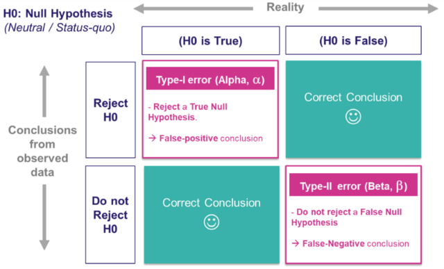
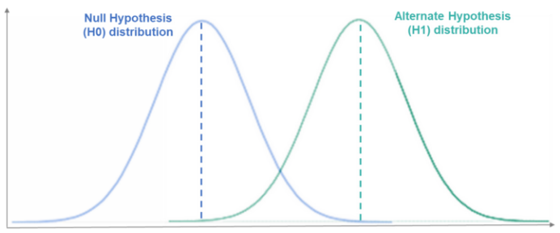
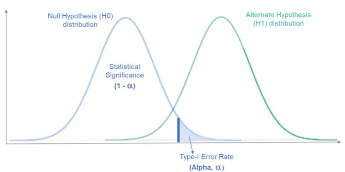
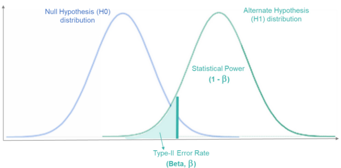
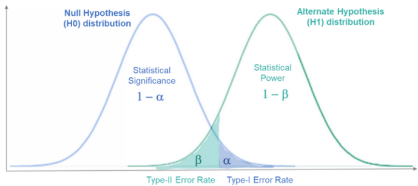

# 假设检验的两类错误

## 假设检验中中两类错误


因为假设检验是使用样本计算出结果得出结论的, 而样本具有随机性, 所以有时会做错误的判断. 假设检验中的犯错有以下两类:
1. 零假设正确而拒绝零假设
2. 备选假设正确而接受零假设




## 假设检验

假设检验是通过观察样本数据来检验总体参数，因为我们很少有整体的数据，所以只能从整体中进行抽样观察。

通常是通过从假设的中性状态（称为原假设、零假设、虚无假设）开始并根据观察到的样本数据证明或反驳这一点来完成的。

- 原假设 (H0) 是假设总体数据中的现状（无关系或无差异）的中性假设。
- H1 是 H0 的备选项，称为备择假设也被称为对立假设。

假设检验的基本思想是概率性质的反证法。根据所考察问题的要求提出原假设和备择假设，为了检验原假设是否正确，先假定原假设是正确的情况下，构造一个小概率事件，然后根据抽取的样本去检验这个小概率事件是否发生。


假设检验过程如下：
假设 H0 → 观察样本数据 → 拒绝或不拒绝 H0

1. 根据观察到的样本数据，我们计算观察到的统计量和观察到的 P 值；
2. 然后将该观察到的 P 值与预先确定的显著性水平（或 Alpha 值）进行比较。 此 Alpha 值充当阈值，超过该阈值会认为观察到的结果具有统计显着性。基于观察到的 P 值与预先选择的阈值 alpha 值的比较，就可以就假设的 H0 得出结论：
    - 观察到的 P 值 ≤ 预选 Alpha 级别 → 拒绝 H0
    - 观察到的 P 值 > 预选的 Alpha 级别 → 不拒绝 H0

由于观察到的 P 值是一个概率，因此总是有可能对“拒绝”或“不拒绝”原假设做出错误的判断。

在下图 1 中，左侧是假设的原假设 (H0) 总体分布，右侧是备择假设 (H1) 总体分布。（两者都是未知的和假设的，因为没有整体的数据，只是根据抽样的样本判断）。如果分布没有重叠，我们将永远不会在结论中观察到错误。 但是在实际情况中，它们几乎总是重叠的。Type-I 和 Type-II 错误发生在这两个分布重叠的地方。




### 假设检验：可能性
实际上，H0 只有两个选项——它可以是 True 或 False。同样，根据观察到的数据，我们只能得出两个可能的结论——我们可以拒绝 H0 或不拒绝 H0。

其实这就变成了一个二分类的问题，H0是正确的还是错误的: 

- H0 是真，拒绝 H0(错误结论, FP, Type-I Error,)
- H0 是真，接受 H0(正确结论, TP)
- H0 是假，拒绝 H0(正确结论, TN)
- H0 是假，接受 H0(错误结论, FN, Type-II Error)

注意, H0一般假设的没病这样的通常情况, 所以是False. H0为真, 就指的是没病, 既False. 而不能把H0理解为True.

### Type-I 第一类错误
Type-I错误是指当原假设实际上为真时拒绝原假设的场景。

如上所述，“拒绝”或“不拒绝”零假设取决于观察到的 P 值和预先确定的 alpha 值。所以在某些情况下，真实的原假设将被拒绝，因为观察到的 P 值将小于预先选择的 Alpha 水平。这就是Type-I错误的内容： False-Positive

对于Type-I错误场景：

- 真实情况H0 对总体为真
- 观察结论拒绝H0


对于对总体正确的原假设，如果我们反复采样，可以得到原假设分布曲线，显示所有可能观察到的样本结果的概率。（下图2左侧H0分布）

当我们观察一个样本时，我们拒绝 H0，这意味着这个观察到的样本必须位于 H0 分布曲线的最右侧，与 H1 分布曲线重叠。下图 2 表示这种情况：



Type-I错误的区域，称为临界区域，表示在零假设分布曲线的右尾端。这是由我们预先选择的 Alpha 值决定的。

如果我们观察到的结果落在这个区域，我们将拒绝零假设（对于这些场景，观察到的 p 值 < Alpha）。由于 H0 在现实中是正确的，我们会得出False-Positive结论。


### Type-II 第二类错误

Type-II错误是指当原假设实际上是错误的时不拒绝它的场景。根据我们观察到的数据得出的结论是，观察到的结果在实际上并不具有统计学意义，但是我们认为它是有意义的。 Type-II错误：False-Negative

这可能由于缺乏证据而发生，即我们的研究可能没有足够的统计能力来检测一定的效应大小。

犯Type-II错误的概率用 Beta 表示。统计研究的功效（Power ）定义为，Power = 1 - Beta

所以可以通过确保的研究具有较高的统计功效来减少犯Type-II错误的机会。

对于 Type-II 错误：

- H0 对总体为假
- 观察结论不拒绝H0

对于对总体错误的零假设，如果我们反复从总体中抽取样本，我们将得到一条备择假设分布曲线，显示所有可能观察到的样本结果的概率。（下图3右侧H1分布）

由于我们正在观察一个样本，因此我们没有证据拒绝 H0。这意味着这个观察到的样本必须位于 H1 分布曲线的最左侧，与 H0 分布曲线重叠（请参见下面的图3 代表这种情况）



Beta 是 Type-II错误率，由左侧的阴影区域表示。 右边的剩余区域代表统计功效（Power）。

如果观察到的结果落在该区域内，将无法拒绝零假设，即使我们知道 H0 对于总体而言是错误的。所以得出一个False-Negative结论。

### 几个例子
1、测试新药以帮助治疗疾病：H0新药无效、 H1新药有效

Type-I 错误 → 断定新药有效，但实际上无效。(False-Positive)
Type-II 错误 → 断定新药无效，而实际上它对治愈疾病有效。(True-Negative)

2、刑事审判：H0无辜、 H1有罪

Type-I 错误 → 断定一个人是有罪的，而实际上他是无辜的。 （即一个无辜的人被送进监狱）
Type-II 错误 → 断定一个人是无辜的，但实际上他是有罪的。 （即释放有罪的人）


### I 和 II 错误之间的权衡
在假设检验中通过将观察值与预先确定的截止值 (Alpha) 进行比较来“拒绝”或“不拒绝”假设。所以考虑以下使 Alpha 越来越低的情况：

- 情况1：如果 Alpha变得更严格（即 Alpha 的值越小），在拒绝 H0 方面的限制就会更严格，而在不拒绝 H0 方面的限制会更小。这会导致不太可能拒绝 H0，更有可能不拒绝 H0。

    - 在真实情况中 H0 为True的情况下，拒绝 H0 的可能性较小会导致Type-I错误比以前更少。
    - 在真实情况中 H0 为 False 的情况下，更可能不拒绝 H0 将导致比以更多的 Type-II 错误。


- 情况2：如果 Alpha 级别变得不那么严格（即更高的 Alpha 值），在拒绝 H0 方面的限制将更少，而在不拒绝 H0 方面的限制更大。这会导致更有可能拒绝 H0，不太可能不拒绝 H0。

    - 在真实情况中 H0 为True的情况下，更有可能拒绝 H0 将导致以更多的 Type-I错误。
    - 在真实情况中 H0 为 False 的情况下，不太可能不拒绝 H0 将导致Type-II错误比以前更少。

因此显然存在二者的权衡，因为2类的错误是相关的，当一个增加另一个减少时，反之亦然。从下图可以看出，如果 Alpha 增加，则 Beta 减少，如果 Beta 减少，则 Alpha 将增加。



哪个类的错误更糟糕呢？没有简单的答案，因为都取决于被检验的假设和做出错误结论的成本评估：如果Type-I 的成本较高，则应尽量避免如果制作Type-II成本高，也应该优先考虑。

但是通常认为Type-I误会产生更多后果，因为 Type-I错误意味着违背现状（H0）的假设，并可能导致引入新的变化，现有的状况产生更坏的影响。 而 Type-II 错误意味着无法拒绝对现状 (H0) 的假设，并且可能只会导致错失机会。


### 总结
假设检验是数据科学中一个非常重要的概念。统计的力量使我们能够对总体做出假设，观察数据样本以使我们能够拒绝或不拒绝我们的假设并得出结论。
假设检验有两种可能的错误——Type-I错误和Type-II错误。

假设检验过程：假设一个中性 H0 → 观察数据（将观察到的 P 值与预先确定的 alpha 水平进行比较）→ 拒绝或不拒绝 H0。

Type-I错误：False-Positive

Type-II错误：False-Negative

Type-I 和 Type-II 错误相互影响相反。减少一个总是增加另一个，反之亦然。一般来说，Type-I 错误被认为Type-II 错误更重要。


## 新冠例子说明

$H_0$：没病
$H_1$: 有病 

--|H0：没病（为真）|H1：有病（为真）
--|--|--
拒绝H0/reject H0|没病但说你有病（Type I error）/α|有病且说你有病（正确）
接受H0/accept H0|没病且说你没病（正确）/1-α|有病但说你没病（Type II error）/β

想触发第一类错误前提条件必须`拒绝H0`；想触发第是二类错误前提条件必须`接受H0`。

显著性水平（Level of significance）, 
- 在零假设为真的情况下，犯第一类错误的概率α, 也是我们在假设检验中得到p值之后进行对比的一个标准。
- 这个量通常我们设定为5%，1%等, 这个值的设置标准是: 
    - 如果第一类错误严重，那么我们可以选取更小的显著性水平，比如从5%变成1%。

        如果对于实验者来说没病被说成有病，极大的伤害了人的自尊心，还要面临被拉去隔离的风险，这种后果显然对于个人来讲更严重。那么我们就要尽可能的减少犯第一类错误的概率，措施就是把α减小。

        假如我们在检验的过程中计算出的p值是4%。如果此时α选为5%，那么我们要拒绝H0；如果我们选取α为1%，那我们要接受H0。于是当我们把α从5%减小到1%后，我们就在具有相同的p值的情况下，有更高的概率去接受H0。从上面的表格中可以看到，接受H0这一列只有两个情况：一个是没病说你没病（正确），一个是有病说你没病（Type II error）。这两种情况都不会触发结果更为严重的第一类错误，因为第一类错误被触发的前提条件就是需要拒绝H0（上面第二层基调），因此减小α可以有效的减小第一类错误发生的概率。

    - 如果第二类错误严重，那么我们可以选取更大一点的显著性水平，比如从5%变成10%。


        现在我们定义第二类错误更为严重：如果对于实验者来说有病被说成没病，这就是潜伏在人群的阳性患者啊，极大的增大传染的概率，对于社会的危害更大。那么我们就要尽可能的减少犯第二类错误的概率，第一种措施是把α调大。

        假如我们在检验的过程中计算出的p值是7%。如果此时α选取为5%，那么我们要接受H0；如果我们选取α为10%，那我们拒绝H0。于是当我们把α从5%增大到10%后，我们就可以在具有相同的p值的情况下，有更高的概率去拒绝H0。从上面的表格中可以看到，拒绝H0这一列只有两个情况：一个是没病说你有病（Type I error），一个是有病说你有病（正确）。这两种情况都不会触发结果更为严重的第二类错误，因为第二类错误被触发的前提条件就是需要接受H0（上面第二层基调），因此增大α可以有效的减小第二类错误发生的概率。

    - 教科书上的一个指导原则：比起type II，我们通常把type I设置成更严重的错误。


## python实战


### 第一类错误
薯条这个假设检验中所犯的第一类错误是, 实际上"总体平均值为130g",却得出了"总体平均值低于130g"的结论. 这是因为检测到了本来不应该检测的东西, 所以也称为"检测错误(false positive)", 假阳性.
我们试着模拟第一类错误的发生概率, 实际上"总体平均值为130g"时, 总体的概率分布是N(130,9).
```python
rv = stats.norm(130, 3)
```
从这个总体中抽出容量为14的样本并进行10000次假设检验, 计算出犯第一类错误的概率, 即"总体平均值为130g", 却得出了"总体平均值低于130g"这一结论的概率.
```python
c = stats.norm().isf(0.95)
n_samples = 10000
cnt = 0
for _ in range(n_samples):
    sample_ = np.round(rv.rvs(14), 2)
    s_mean_ = np.mean(sample_)
    z = (s_mean_ - 130) / np.sqrt(9/14)
    if z < c:
        cnt += 1
cnt / n_samples  # 0.053
```
犯第一类错误的概率是0.053, 也就是说有大约5%的概率会错误检测出"总体平均值低于130g".
犯第一类错误的概率被称为危险率, 记为$\alpha$. 危险率与显著性水平一样, 是分析者可以控制的概率. 也就是说, 如果想要将第1类错误发生的概率降低到1%, 那么分析者只要按照显著性水平1%进行假设检验就可以了.

### 第二类错误
薯条这个假设检验中所犯的第二类错误, 就是虽然实际上"总体平均值低于130g", 却无法得出"总体平均值低于130g"的结论. 这是因为没有检测出原本应该检测到的东西, 所以也称为漏检错误(false negative), 假阴性.
为了模拟犯第二类错误的概率, 需要考虑到实际情况是"总体平均值低于130g". 在这里, 假设A拿到了便利店的绝密文件, 知道薯条的平均重量是128g, 也就是总体的概率分布是N(128,9).
```python
rv = stats.norm(128, 3)
```
用和刚才一样的方式来计算, 结果尽管犯了第二类错误, 即"总体平均值低于130g", 却无法得出"总体平均值低于130g"这样的结论, 我们也无法推断出这样的概率.
```python
c = stats.norm().isf(0.95)
n_samples = 10000
cnt = 0
for _ in range(n_samples):
    sample_ = np.round(rv.rvs(14), 2)
    s_mean_ = np.mean(sample_)
    z = (s_mean_ - 130) / np.sqrt(9/14)
    if z >= c:
        cnt += 1
        
cnt / n_samples  # 0.197
```
犯第二类错误的概率是0.197, 大约有20%的概率会发生露肩错误.

犯第二类错误的概率记为$\beta$, $1-\beta$被称为功效(power). 即使同样是"总体平均值低于130g"的情况, 如果总体平均值设置为120g, 发生漏检错误的情况就会变小. 因此$\beta$的大小取决于总体信息. 这里因考虑到A拿到了绝密文件的特殊情况, 才成功计算出了$\beta$. 但是一般情况下不知道总体的信息, 所以$\beta$是分析者无法控制的一个概率.
统计假设检验中可以控制第1类错误, 却无法控制第2类错误, 因为它是非对称的.


参考:  
- [假设检验的两类错误(显著性水平α)](https://zhuanlan.zhihu.com/p/586999541)
- [假设检验中的第一类错误和第二类错误](https://zhuanlan.zhihu.com/p/495005605)