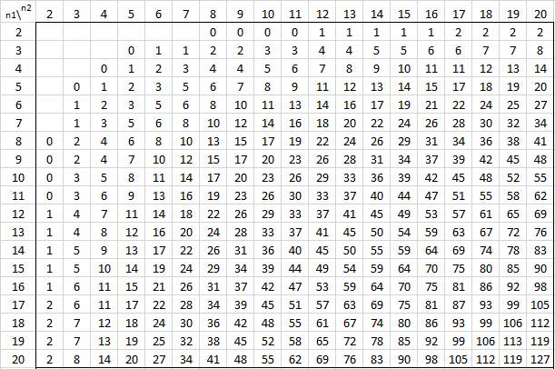

# 曼恩惠特尼U检验

## 介绍
参考:hypothesis_test_example.md

## 步骤
1. 将两个样本进行混合与编排, 遇到相同数据时, 等级值相同, 为相同值的平均值
2. 计算两个样本的等级和: R1和R2
3. 计算Mann-Whitney U的统计量U1和U2:
$$U_1=R_1-\frac{n_1(n_1+1)}{2}$$
$$U_2=R_2-\frac{n_2(n_2+1)}{2}$$
其中n是样本的大小, R是样本等级和
4. U1和U2中的最小值用于与显著校验$U_\alpha$（查Mann-Whitney Table可得具体值）相比较,如果$$U_{min} < U_\alpha$$, 拒绝H0

## 样例
样本1: [6,1,1,1,1,1]
样本2: [5,5,5,5,5,0]
合并样本: [0,1,1,1,1,1,5,5,5,5,5,6]
等级编排: [1,4,4,4,4,4,9,9,9,9,9,12]

计算:
n1=n2=6
R1=12+4*5=32
R2=9*5+1=46
U1=32-6(6+1)/2=11
U2=46-6(6+1)/2=25

当 $\alpha=0.05$时, 认为差异显著, 查Mann-Whitney Table可知$U_\alpha=5, U_1>U_\alpha$

参考:
http://www.real-statistics.com/statistics-tables/mann-whitney-table/
