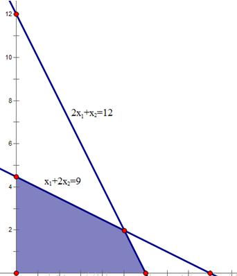
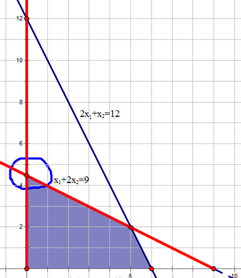

# 单纯形法

满足线性规划问题约束条件的所有点组成的集合就是线性规划的可行域。若可行域有界（以下主要考虑有界可行域），线性规划问题的目标函数最优解必然在可行域的顶点上达到最优。

单纯形法就是通过设置不同的基向量，经过矩阵的线性变换，求得基可行解（可行域顶点），并判断该解是否最优，否则继续设置另一组基向量，重复执行以上步骤，直到找到最优解。所以，单纯形法的求解过程是一个循环迭代的过程。

## 线性规划的一般形式

在约束条件下，寻找目标函数z的最大值:
$$
max\ z = x_1 + x_2 \\
s.t. = 
\begin{cases}
2x_1 + x_2 \leq 12 \\
x_1 + 2x_2 \leq 9 \\
x_1, x_2 \geq 0
\end{cases}

$$

## 线性规划的可行域

`满足`线性规划问题`约束条件`的`所有点`组成的集合就是线性规划的`可行域`。若可行域有界（以下主要考虑有界可行域），线性规划问题的目标函数最优解必然在可行域的顶点上达到最优。

单纯形法就是通过设置不同的基向量，经过矩阵的线性变换，求得基可行解（可行域顶点），并判断该解是否最优，否则继续设置另一组基向量，重复执行以上步骤，直到找到最优解。所以，单纯形法的求解过程是一个循环迭代的过程。

## 线性规划的标准形式

单纯形算法是通过线性规划的标准形来求解的。规定线性规划的标准形式为：
$$
max\ z = \sum_{j=1}^n c_j x_j \\
s.t. = 
\begin{cases}
\sum_{j=1}^n a_{ij} x_j = b_j, i = 1, 2, ..., m \\
x_j \geq 0, j = 1, 2, ..., n
\end{cases}
$$

写成矩阵的形式:
$$
max\ z = CX \\
AX = b \\
X \geq 0 \\
A = 
\begin{bmatrix} 
a_{11} & a_{12} & ... & a_{1n} \\ 
...    & ...    & ... & ...    \\
a_{m1} & a_{m2} & ... & a_{mn} \\
\end{bmatrix}

$$

标准形的形式为：
- 目标函数要求max
- 约束条件均为等式
- 决策变量为非负约束

普通线性规划化为标准形：
- 若目标函数为最小化，可以通过取负，求最大化
- 约束不等式为小于等于不等式，可以在左端加入非负松弛变量，转变为等式，比如：

    $$
    x_1 + 2x_2 \leq 9 \rightarrow
    \begin{cases}
    x_1 + 2x_2 + x_3 = 9\\
    x_3 \geq 0
    \end{cases}

    $$
    同理，约束不等式为大于等于不等式时，可以在左端减去一个非负松弛变量，变为等式。

- 若存在取值无约束的变量，可转变为两个非负变量的差，比如：

$$
- \infty \leq x_k \leq + \infty \rightarrow
\begin{cases}
x_k = x_m - x_n\\
x_m, x_n \geq 0
\end{cases}
$$

本文的线性规划问题转化为标准形为：
$$
max\ z = x_1 + x_2 \\
s.t.
\begin{cases}
2x_1 + x_2 + x_3 = 12 \\
x_1 + 2x_2 + x_4 = 9 \\
x_1, x_2, x_3, x_4 \geq 0 
\end{cases}
$$

## 单纯形法

### 几何意义
在标准形中，有$m$个约束条件（不包括非负约束），$n$个决策变量，且($n \geq m$). 首先, 选取$m$个基变量$x_j'(j = 1, 2, ..., m)$, 基变量对应约束系数矩阵的列向量线性无关。通过矩阵的线性变换，基变量可由非基变量表示：
$$
x_i' = C_i + \sum_{j=m+1}^n m_{ij} x_j'(i = 1, 2, ..., m)
$$

如果令非基变量等于0，可求得基变量的值 ：
$$
x_i' = C_i
$$

如果为可行解的话，Ci大于0. 以上述例子解释几何意义. 如果选择$x_2、x_3$为基变量，那么令$x_1、x_4$等于0，可以去求解基变量$x_2、x_3$的值。对系数矩阵做行变换，如下所示，$x2=9/2，x3=15/2$:
$$
\begin{bmatrix} 
X & x_1 & x_2 & x_3 & x_4 & b \\ 
\ & 2   & 1   & 1   & 0   & 12 \\
\ & 1   & 2   & 0   & 1   & 9 \\
C & 1   & 1   & 0   & 0   & z
\end{bmatrix}
=
\begin{bmatrix} 
X & x_1 & x_2 & x_3 & x_4 & b \\ 
\ & \frac{3}{2}   & 0   & 1   & -\frac{1}{2}   & \frac{15}{2} \\
\ & \frac{1}{2}   & 1   & 0   & \frac{1}{2}   & \frac{9}{2} \\
C & \frac{1}{2}   & 0   & 0   & -\frac{1}{2}   & z - \frac{9}{2}
\end{bmatrix}

$$
$x_1=0$表示可行解在y轴上；$x_4=0$表示可行解在$x_1+2x_2=9$的直线上。那么，求得的可行解即表示这两条直线的交点，也是可行域的顶点，如图所示：

所以，通过选择不同的基变量，可以获得不同的可行域的顶点。

### 如何判断最优
如前所述，基变量可由非基变量表示
$$
x_i' = C_i + \sum_{j=m+1}^n m_{ij} x_j'(i = 1, 2, ..., m)
$$
目标函数z也可以完全由非基变量表示：
$$
z = z_0 + \sum_{j=m+1}^n \sigma_j x_j'
$$

当达到最优解时，所有的$\sigma_j$应小于等于0。当存在$j， \sigma_j>0$时，当前解不是最优解.

当前的目标函数值为$z_0$，其中所有的非基变量值均取0。由之前分析可知，$x_j'=0$代表可行域的某个边界，$x_j'$是的最小值。如果可行解逐步离开这个边界，$x_j'$会变大，因为 $\sigma_j>0$，显然目标函数的取值也会变大，所以当前解不是最优解。需要寻找新的基变量。

### 如何选择新的基变量

如果存在多个$\sigma_j>0$，选择最大的$\sigma_j>0$对应的变量作为基变量，这表示目标函数随着$x_j'$的增加，增长的最快。

### 如何选择被替换的基变量

假如我们选择非基变量$x_s'$作为下一轮的基变量，那么被替换基变量$x_j'$在下一轮中作为非基变量，等于0。选择$x_j'$的原则：替换后应该尽量使$x_s'$值最大（因为上面已分析过，目标函数会随着$x_s'$的增大而增大）。

继续通过上面的例子来说明：
$$
\begin{bmatrix} 
X & x_1 & x_2 & x_3 & x_4 & b \\ 
\ & 2   & 1   & 1   & 0   & 12 \\
\ & 1   & 2   & 0   & 1   & 9 \\
C & 1   & 1   & 0   & 0   & z
\end{bmatrix}
=
\begin{bmatrix} 
X & x_1 & x_2 & x_3 & x_4 & b \\ 
\ & \frac{3}{2}   & 0   & 1   & -\frac{1}{2}   & \frac{15}{2} \\
\ & \frac{1}{2}   & 1   & 0   & \frac{1}{2}   & \frac{9}{2} \\
C & \frac{1}{2}   & 0   & 0   & -\frac{1}{2}   & z - \frac{9}{2}
\end{bmatrix}

$$

从最后一行可以看到，$x_1$的系数为1/2>0，所以选$x_2、x_3$为基变量并没有是目标函数达到最优。下一轮选取$x_1$作为基变量，替换$x_2、x_3$中的某个变量。

第一行是符号

第二行：若$x_1$替换$x_3$作为基变量，$x_3=0$时，$x_1=(15/2)/(3/2)=5$

第三行：若$x_1$替换$x_2$作为基变量，$x_2=0$时，$x_1=(9/2)/(1/2)=9$

显然，应该把$x_2$作为非基变量。

### 终止条件
当目标函数用非基变量的线性组合表示时，所有的系数均不大于0，则表示目标函数达到最优。
如果，有一个非基变量的系数为0，其他的均小于0，表示目标函数的最优解有无穷多个。这是因为目标函数的梯度与某一边界正交，在这个边界上，目标函数的取值均相等，且为最优。
使用单纯型法来求解线性规划，输入单纯型法的松弛形式，是一个大矩阵，第一行为目标函数的系数，且最后一个数字为当前轴值下的 z 值。下面每一行代表一个约束，数字代表系数每行最后一个数字代表 b 值。

## 参考
- [线性规划之单纯形法【超详解+图解】](https://blog.csdn.net/qq_36558948/article/details/80640768)