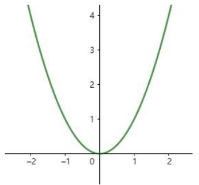
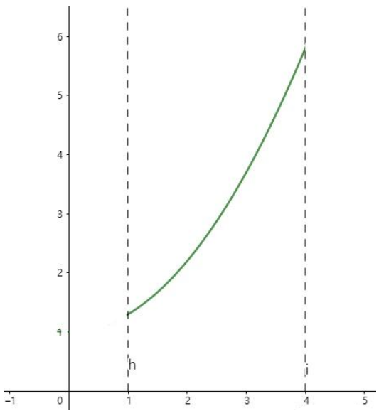
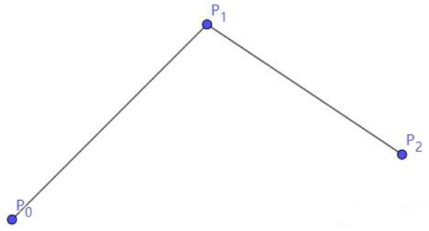
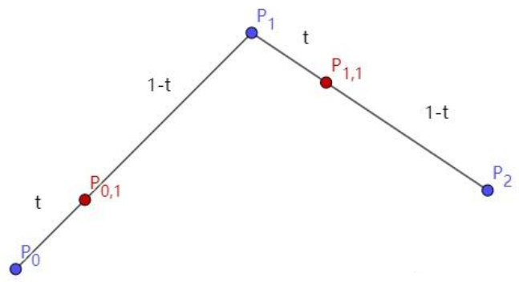
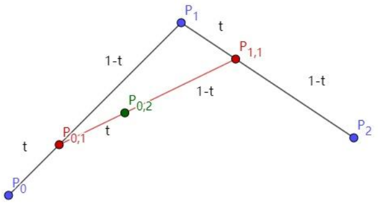
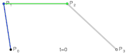
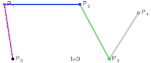
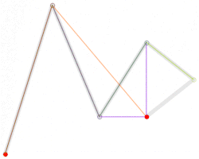

# [贝塞尔曲线(Bezier Curve)](https://zhuanlan.zhihu.com/p/366678047)

## 曲线的显示表示（Explicit representation）

$y = x^2$画出来的图是一条曲线，如下： 

这种$y = f(x)$的表达方式，我们称之为二维空间中曲线的显示表示。即以自变量（$x$）来表达因变量（$y$）的值。 
 

## 曲线的隐式表示（Implicit representation）

隐式表示，就是利用隐式方程来刻画一条曲线，在二维空间中一个隐式的曲线可以通过f(x,y)=0来表达。例如圆的隐式方程即为：$x^2 + y^2 - r^2 = 0$，用它即可表示一个半径为r的圆。

## 曲线的参数形式表示（Parametric form）

该形式也是图形学里最关心和最常用的形式。一个曲线的参数形式是通过一个自变量（参数）t 来表达曲线上每个点的空间坐标，它也可算作是显示表示的一种。
在三维空间中，我们可以用如下三个显示的函数，来表示一条空间曲线。
- $x = x(t)$
- $y = y(t)$
- $z = z(t)$

t = 0即代表曲线的起点，t = 1代表曲线的终点，因此可以用t（0 <= t <= 1）代表曲线上的任意一点P(t)，然后将t的值带入三个显示的方程，即可求出曲线上点P的坐标：$P(t) = (x(t), y(t), z(t))$

t的范围是0 - 1，每个取值即代表曲线上的一点，那么我们只需要将t的值慢慢从0变到1，点就会沿着曲线行走，我们就可以得到曲线的轨迹，容易实现曲线的绘制。

举个二维的例子，比方说我有一个$y = 0.3x^2 + 1$的曲线，其中x的取值范围为1-4，那么这个曲线如下图： 

用参数的形式来表示它，首先是x和t的关系，因为x是1到4，而t是0到1，因此我们可得到方程x = 3t + 1。然后是y，因为我们知道这个曲线是$y = 0.3x^2 + 1$的，那么我们把里面的x用x = 3t + 1来代替即可，得到$y = 0.3(3t + 1)^2 + 1 = 2.7t^2 + 1.8t + 1.3$。因此我们上诉曲线的参数形式即为：

$$
\begin{cases}
x = 3t + 1 \\
y = 2.7t^2 + 1.8t + 1.3
\end{cases}
$$

通过带入不同的t值，即可得到该曲线各个点的坐标，例如$P(0) = (1, 1.3)$，$P(1) = (4, 5.8)$。

可以把它写成一个二阶的多项式，即$at^2 + bt + c$的形式。但是其中a，b，c并不是常数，而是代表着向量，其结果为：

$P(t) = (0, 2.7)t^2 + (3, 1.8)t + (1, 1.3)$

此外我们还可以对每个点求导，即$\frac{dP(t)}{dt} = (\frac{dx(t)}{dt}, \frac{dy(t)}{dt}, \frac{dz(t)}{dt})$，得到结果被视为曲线的绘制速度，该导数指向曲线的切向。

参数形式有一个好处，例如上面的式子表达的是三维空间的曲线，如果我们删除了$z = z(t)$，那么它就变成了一个二维空间的曲线，即降维很方便。并且同样的也容易推广到高维，新增新维度对应的显示方程即可。

## 贝塞尔曲线(Bezier Curve)

相比之前的几种曲线表示方法，贝塞尔提出的是一种通过连接向量（connected vectors）来表示曲线的方法.
即在画曲线前先通过向量绘制一个多边形，代表该曲线的趋势和走向。

贝塞尔提出了如下公式用于计算曲线，将曲线表达成向量和基函数的乘积。

$$V(t)=\sum_{i = 0}^{n}f_{i,n}(t)A_{i}$$

其中$A_{i}$代表的就是向量，$f_{i,n}(t)$代表的是一个基函数，其内容如下：

$$f_{i,n}(t)=\begin{cases}
1 & i = 0 \\
\frac{(-t)^{i}}{(i - 1)!}\frac{d^{i - 1}}{dt^{i - 1}}\frac{(1 - t)^{n - 1}-1}{t} & 
\end{cases}$$

注：该基函数本质上就是一个n - 1次的多项式。

有了这个公式后，也就是说你给我一个多边形，我就可以用它算出一个曲线，从公式中我们也可发现，贝塞尔曲线属于一种参数形式（有参数t）表示曲线的方式。该公式简单了解下就行了，不需要去理解它，据说贝塞尔本人都说不清这个公式。

## 德卡斯特里奥算法（de Casteljau Algorithm）

使用一种名为de Casteljau的递归算法来求贝塞尔曲线。

如下图，我们先选取三个控制点$P_0, P_1, P_2$，并将它们前后连线。

然后我们在$P_0P_1$线段上找到点$P_{0,1}$，使得$(P_0P_{0,1}):(P_{0,1}P_1) = (t):(1 - t)$, 同理在线段$P_1P_2$上吵到点$P_{1,2}$。

接着我们连接 $ P_{0,1}P_{1,1} $ ，得到新的线段，然后在该线段上再取一点$P_{0,2}$，使得该线段被分为 $ t $ 和 $ 1 - t $ ，那么就会得到下图：

此时已经不能再连线了，而我们得到的点 $ P_{0,2} $ 就是这三个控制点对应的贝塞尔曲线在 $ t $ 位置上的点。

这样我们就可以通过使 $ t $ 从 0 变到 1，得到所有曲线上的点，从而得到曲线。这样的求曲线上任意一点方式也就是前面所说的 de Casteljau 算法。

上述以二阶贝塞尔为例, 下面总结各阶贝塞尔曲线的[绘制过程](https://en.wikipedia.org/wiki/B%C3%A9zier_curve):

1. 一阶贝塞尔曲线(Linear curves)

2. 二阶贝塞尔曲线(Quadratic curves)

3. 高阶贝塞尔曲线(Higher-order curves)

