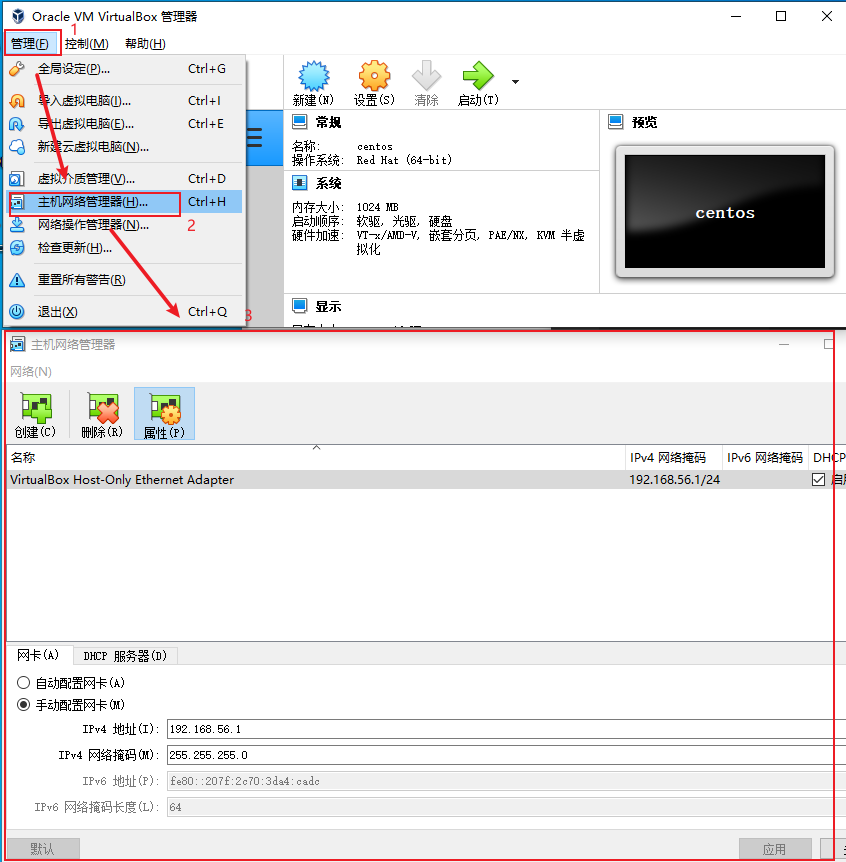
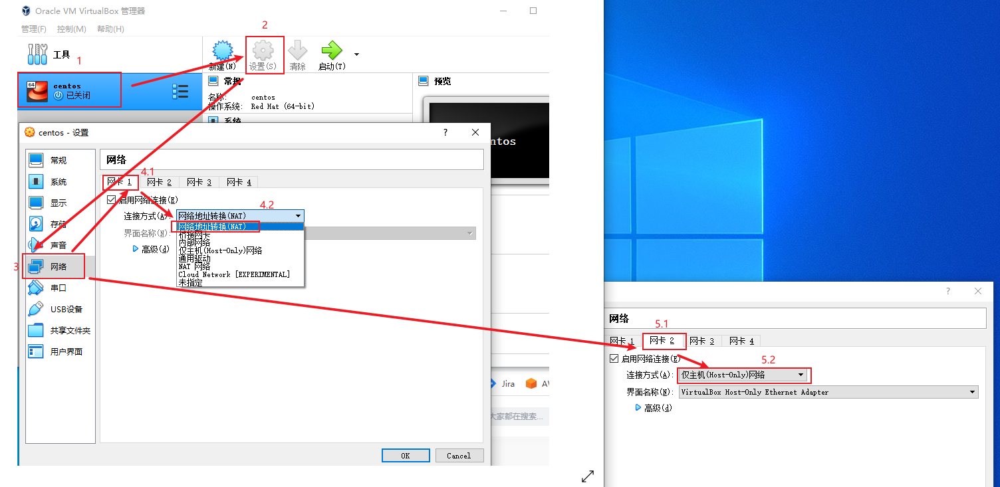

# 网络配置


## virtualBox有五种网络连接方式：

- Bridge Adapter(桥接)
- Network Address Translation(NAT, 网络地址转换)
- Host-only Adapter(内部网络)


### NAT
Network Address Translation，网络地址转换
虚拟机访问网络的所有数据都是由主机提供的，虚拟机并不真实的存在于网络上，主机和网络中的任何机器是不能查看和访问这个虚拟机的。

虚拟机与主机的关系：只能**单向**访问，虚拟机可以通过网络访问到主机，主机无法通过网络访问到虚拟机。
虚拟机与网络中其他主机的关系：只能**单向**访问，虚拟机可以访问到网络中其他主机，其他主机不能通过网络访问到虚拟机。
虚拟机与虚拟机的关系：相互**不能**访问，虚拟机与虚拟机各自完全独立，相互间无法通过网络访问彼此。
虚拟机与网络：可以访问


意味着此时虚拟机可以访问互联网，而且是可以ping通主机，但是主机ping不通虚拟机的，虚拟机之间也不可以ping通。


### 桥接网卡(Bridge Adapter)
它是通过主机网卡，架设了一条桥，直接连入到网络中了。类似于把物理主机虚拟为一个交换机，所有桥接设置的虚拟机连接到这个交换机的一个接口上，物理主机也同样插在这个交换机当中，所以所有桥接下的网卡与网卡都是交换模式的，相互可以访问而不干扰。网桥模式下的虚拟机，你把它认为是真实物理计算机就行了。

虚拟机与主机的关系：可以**双向**访问，因为虚拟机在真实网络段中有独立IP，主机与虚拟机处于同一网络段中，彼此可以通过各自IP相互访问。
虚拟机于网络中其他主机的关系：可以**双向**访问，同样因为虚拟机在真实网络段中有独立IP，虚拟机与所有网络其他主机处于同一网络段中，彼此可以通过各自IP相互访问。
虚拟机与虚拟机的关系：可以**双向**访问，原因同上。
虚拟机与网络：可以访问

### 主机模式(Host-only Adapter)
Host-Only听名字就是只和主机建立关系。这种模式是将虚拟机与外网隔开，使得虚拟机成为一个独立的系统，只与主机相互通讯。

虚拟机与主机的关系：默认**单向**相互访问，双方不属于同一IP段，host-only网卡默认IP段为192.168.56.X 子网掩码为255.255.255.0，后面的虚拟机被分配到的也都是这个网段。
虚拟机与网络主机的关系：默认**不能**相互访问，原因同上，通过设置，可以实现相互访问。
虚拟机与虚拟机的关系：默认可以**双向**访问，都是同处于一个网段。


## 实战

### 原理

`nat`来让虚拟机通过宿主机网络访问外网
`host-only`让宿主机访问虚拟机
使用`nat`和`host-only`实现
- nat(虚拟机访问互联网，使用10.0.2.x段)
- host-only(虚拟机和主机互相通信，使用192.168.56.x段)


### 步骤
1. 首先给virtualbox配置一个`host-only`全局的网卡
   
   

2. 给虚拟机配置`nat`和`host-only`网卡
   
   

3. 进入虚拟机,使用`ip addr`命令查看
   两个网卡
   - `ifcfg-enp0s3`对应`nat`
   - `ifcfg-enp0s8`对应`host-only`

4. 默认`enp0s3`是不开启的, 所以不能访问外网, 比如`ping baidu.com`, 所以修改对应的`onboot`参数, 配置文件在:`/etc/etc/sysconfig/network-scripts/`


### hostonly配置静态地址

`vi /etc/sysconfig/network-scripts/ifcfg-enp0s8`
```
TYPE=Ethernet
PROXY_METHOD=none
BROWSER_ONLY=no
BOOTPROTO=static
DEFROUTE=yes
IPV4_FAILURE_FATAL=no
IPV6INIT=yes
IPV6_AUTOCONF=yes
IPV6_DEFROUTE=yes
IPV6_FAILURE_FATAL=no
IPV6_ADDR_GEN_MODE=stable-privacy
NAME=enp0s8
UUID=4ac7e364-b251-4457-8e2f-37abaaff2496 # 使用uuidgen生成
DEVICE=enp0s8
ONBOOT=yes
IPADDR=192.168.56.101
NETMASK=255.255.255.0
GATEWAY=192.168.56.1
```

### 最终的结果
```
1: lo: <LOOPBACK,UP,LOWER_UP> mtu 65536 qdisc noqueue state UNKNOWN group default qlen 1000
    link/loopback 00:00:00:00:00:00 brd 00:00:00:00:00:00
    inet 127.0.0.1/8 scope host lo
       valid_lft forever preferred_lft forever
    inet6 ::1/128 scope host 
       valid_lft forever preferred_lft forever
2: enp0s3: <BROADCAST,MULTICAST,UP,LOWER_UP> mtu 1500 qdisc pfifo_fast state UP group default qlen 1000
    link/ether 08:00:27:06:4a:c2 brd ff:ff:ff:ff:ff:ff
    inet 10.0.2.15/24 brd 10.0.2.255 scope global noprefixroute dynamic enp0s3
       valid_lft 85790sec preferred_lft 85790sec
    inet6 fe80::4c60:ef23:88e8:2fb4/64 scope link noprefixroute 
       valid_lft forever preferred_lft forever
3: enp0s8: <BROADCAST,MULTICAST,UP,LOWER_UP> mtu 1500 qdisc pfifo_fast state UP group default qlen 1000
    link/ether 08:00:27:f9:68:90 brd ff:ff:ff:ff:ff:ff
    inet 192.168.56.101/24 brd 192.168.56.255 scope global noprefixroute enp0s8
       valid_lft forever preferred_lft forever
    inet6 fe80::a00:27ff:fef9:6890/64 scope link 
       valid_lft forever preferred_lft forever
```


#### virtualbox网络配置
使用`nat`和`host-only`实现
- nat(虚拟机访问互联网，使用10.0.2.x段)
- host-only(虚拟机和主机互相通信，使用192.168.56.x段)

   

进入虚拟机,使用`ip addr`查看, 如果未开启需要进入配置文件, 修改`onboot`参数, 配置文件在:
`/etc/etc/sysconfig/network-scripts/`
两个网卡
- `ifcfg-enp0s3`对应`nat`
- `ifcfg-enp0s8`对应`host-only`

如果需要, 再给`host-only`配置静态地址.

默认`host-only`网络的配置在中


refs:
https://www.jianshu.com/p/bdf5d72e6ba4
https://bbs.huaweicloud.com/blogs/277368
https://www.danielw7.com/virtualbox%E7%BD%91%E7%BB%9C%E9%85%8D%E7%BD%AE%E6%96%B9%E6%A1%88/