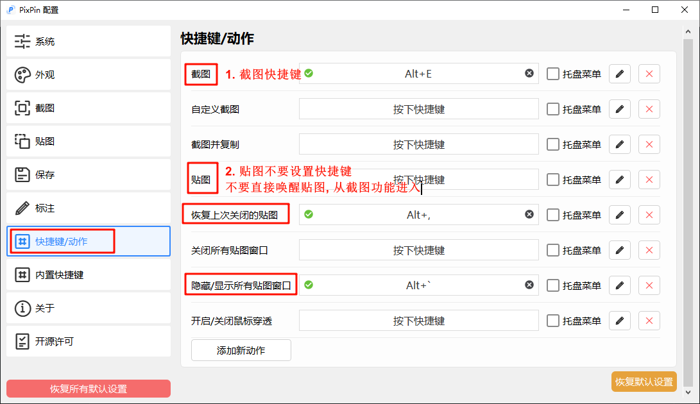
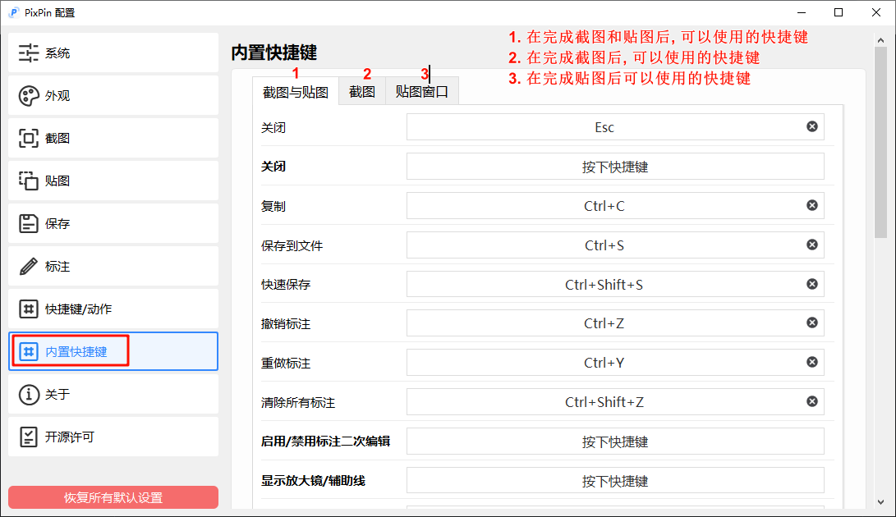

# pixpin

## 配置界面说明

## 快捷键/动作

1. 截图: `ctrl+e`
2. 贴图: `ctrl+t`
3. 隐藏/显示所有贴图: `alt+` `
 
## 内置快捷键

### 截图与贴图(截图与贴图模式下共享的快捷键)
1. 关闭: `esc`
2. 保存: `ctrl+s`
3. 撤销标注: 
    1. 撤销上次: `ctrl+z`
    2. 撤销全部: `ctrl+shift+z`
4. 标注工具:
    1. `alt+1`: 几何图形
    2. `alt+2`: 直线
    3. `alt+3`: 箭头
    4. `alt+4`: 文本

### 截图(截图模式下的快捷键)
1. 贴图: `ctrl+t`
2. 选择全屏: `ctrl+a`
3. 上一个截图记录: `,`
4. 下一个截图记录: `.`
5. 长截图: `l`
6. gif: `g`

### 贴图(贴图模式下的快捷键)
1. 锁定: `l`
2. 显示标注: `space`

