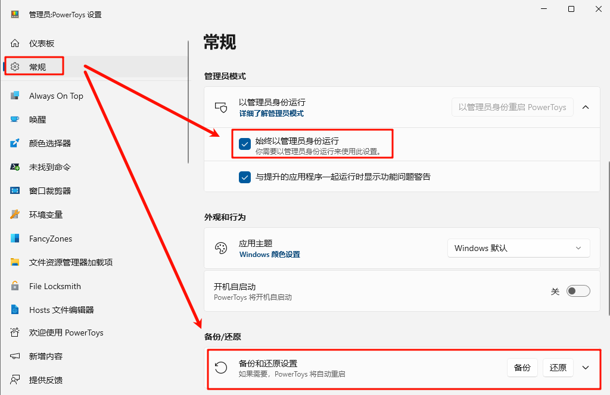
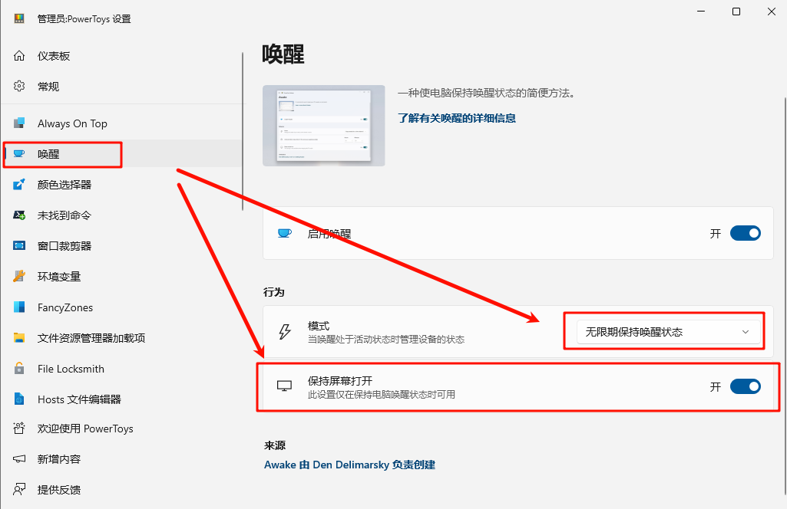
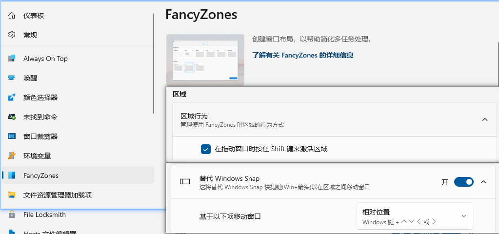
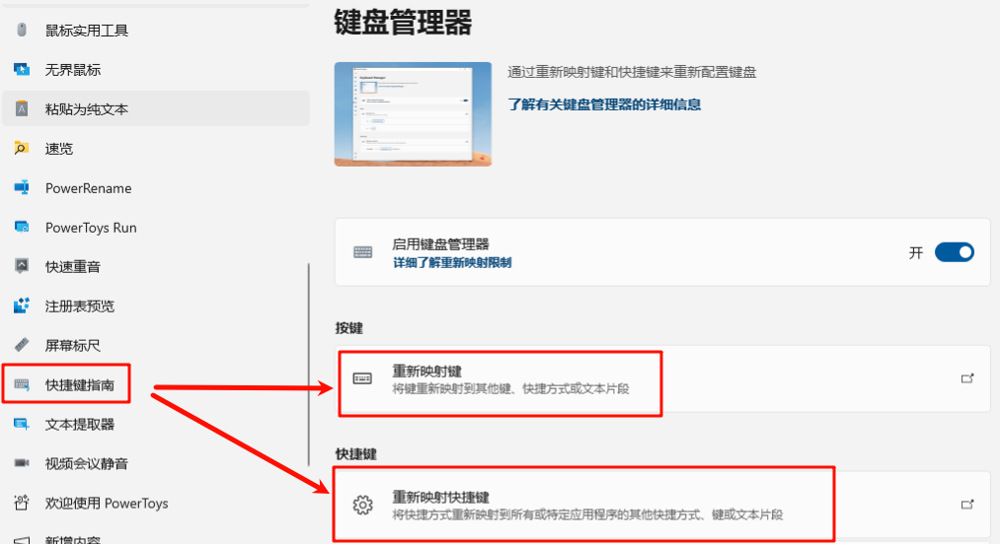
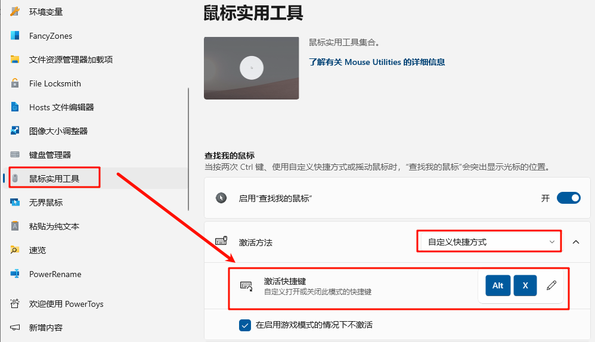

# powertoys

## 常规

1. 设置管理员身份运行
2. 进行设置的备份和还原

## awake

## fancyZones

1. `拖动+shift`布置窗口
2. `win+上下左右`布置窗口

## 热键映射

1. ctrl+g -> ctrl+h
2. ctrl+h -> left
3. ctrl+l -> right
4. ctrl+j -> down
5. ctrl+k -> Up
6. ctrl+y -> home
7. ctrl+o -> end
8. ctrl+i -> pageUp
9. ctrl+u -> pageDn

注意:
chome中:
1. ctrl+e 进入搜索框
2. f11 全屏显示
3. f12 开发者模式

## mouse
alt+x: 聚焦到鼠标

## 参考
- https://www.iplaysoft.com/powertoys.html

