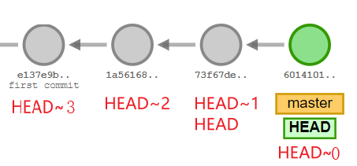
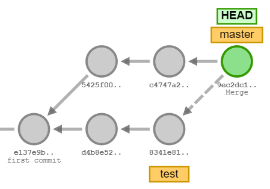
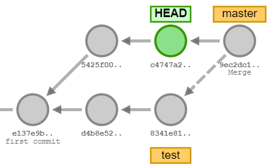
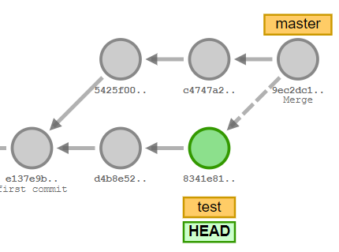
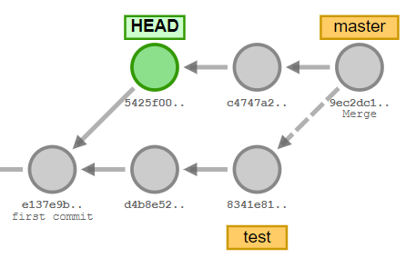
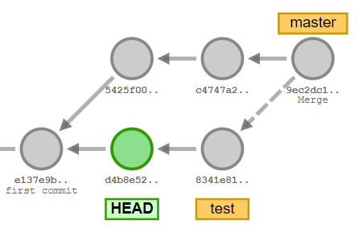

# HEAD

`HEAD`是一种指针

## `~`控制回退个数

`~`表示相对于当前`HEAD`指针的`commitId`的相对位置

- `git checkout HEAD~1` 表示当前`HEAD`指针指向`commitId`的前一个`commitId`
- `git checkout HEAD~2` 表示当前`HEAD`指针指向`commitId`的前两个`commitId`

注意: `HEAD`是等价于`HEAD~1`, 而不是`HEAD~0`

## `^`回退1步并控制方向

1. 仓库如图, `HEAD`指针指向`master`分支

    - `git checkout head^1` `^`或`^1`表示在当前的分支(`master`), 回退一个`HEAD`位置
    

    - `git checkout head^1` `^2`表示在`merge`节点, 非当前分支('test'), 回退一个`HEAD`位置
    

注意 `^1`和`^2`都只回退了一个`HEAD`, 只不过是回退的方向不同

## `^`和`~`一起使用

1. 仓库如图, `HEAD`指针指向`master`分支

2. 基于**步骤1**, `git checkout head^1~1` `^`在本分支(`master`)前移动1位, `~`再向前移动1位, 所以是在`master`分支上, 向前移动2位

3. 基于**步骤1**, `git checkout head^2~1` `^2`在非本分支,既非`master`分支(也就是`test`分支), `~`再向前移动1位, 所以是在`test`分支上, 向前移动2位

## 工具

http://git-school.github.io/visualizing-git/